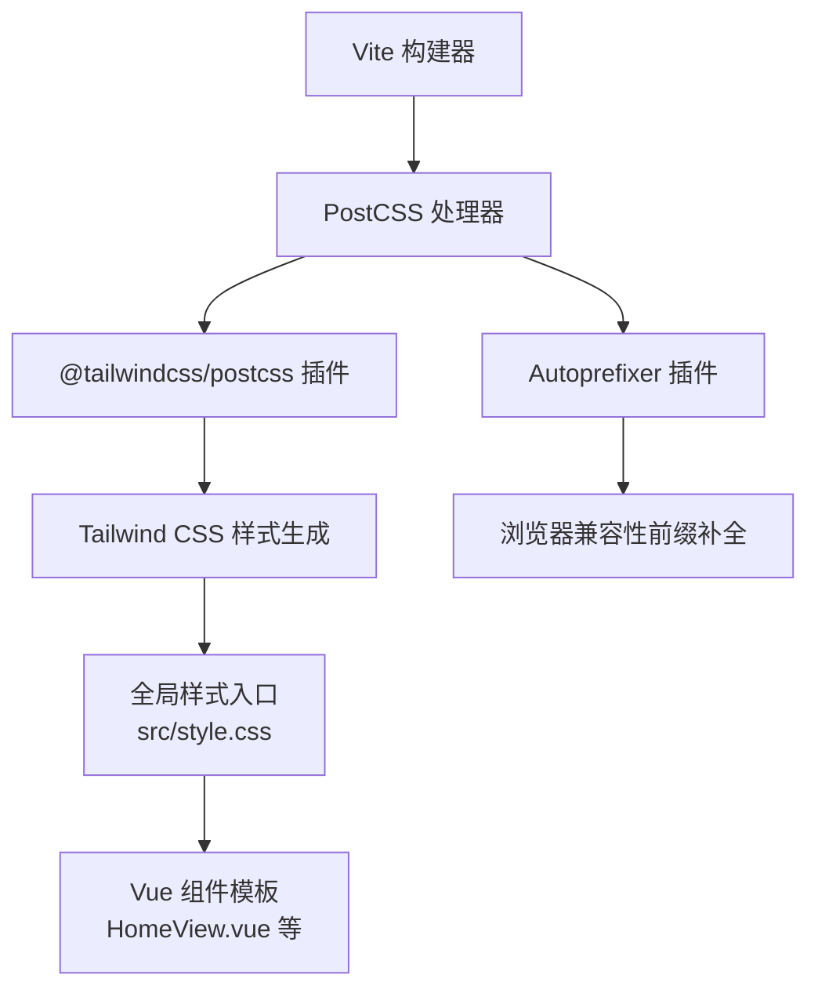
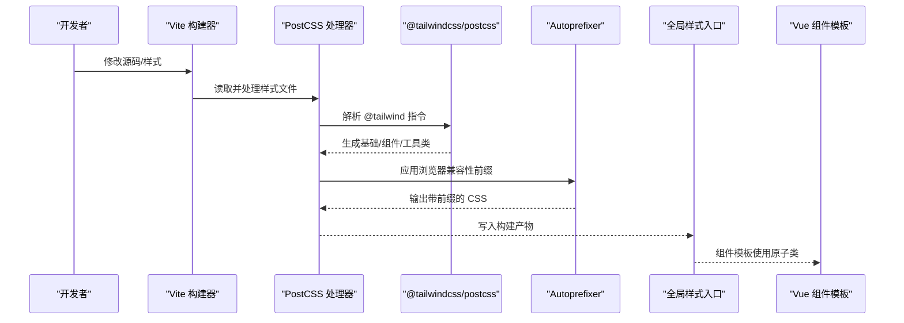
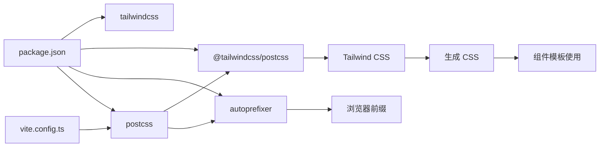

# PostCSS 与 Tailwind 配置

<cite>
**本文引用的文件**
- [tailwind.config.js](file://tailwind.config.js)
- [postcss.config.js](file://postcss.config.js)
- [package.json](file://package.json)
- [vite.config.ts](file://vite.config.ts)
- [src/style.css](file://src/style.css)
- [src/views/HomeView.vue](file://src/views/HomeView.vue)
</cite>

## 目录
1. [简介](#简介)
2. [项目结构](#项目结构)
3. [核心组件](#核心组件)
4. [架构总览](#架构总览)
5. [详细组件分析](#详细组件分析)
6. [依赖关系分析](#依赖关系分析)
7. [性能考量](#性能考量)
8. [故障排查指南](#故障排查指南)
9. [结论](#结论)
10. [附录](#附录)

## 简介
本文件围绕 ainote-web 项目中的 PostCSS 与 Tailwind CSS 集成进行系统化说明，重点解析以下内容：
- tailwind.config.js 的结构与可扩展点（theme.extend、plugins、darkMode 等）
- postcss.config.js 如何串联 Tailwind CSS 与 Autoprefixer 等插件，参与构建流程
- 如何在现有配置基础上扩展设计令牌（颜色、字体、间距等）与启用 JIT 模式
- 常见问题定位与解决思路（样式未生效、类名冲突、自定义样式覆盖）

## 项目结构
本项目采用 Vite + Vue 3 + TypeScript 技术栈，Tailwind CSS 通过 PostCSS 插件链路接入，样式入口位于全局样式文件中，组件内使用原子类与第三方 UI 组件库（Vant）组合。

图表来源
- [postcss.config.js](file://postcss.config.js#L1-L6)
- [src/style.css](file://src/style.css#L1-L4)
- [vite.config.ts](file://vite.config.ts#L1-L19)

章节来源
- [package.json](file://package.json#L1-L32)
- [vite.config.ts](file://vite.config.ts#L1-L19)
- [src/style.css](file://src/style.css#L1-L4)

## 核心组件
- Tailwind 配置文件：用于声明内容扫描路径、主题扩展与插件注册，是设计系统的“根配置”
- PostCSS 配置文件：声明插件顺序与参数，控制从源样式到最终产物的转换链路
- 全局样式入口：通过 @tailwind 指令引入基础、组件与工具类三部分
- 构建配置：Vite 默认支持 PostCSS，无需额外配置即可应用插件链

章节来源
- [tailwind.config.js](file://tailwind.config.js#L1-L12)
- [postcss.config.js](file://postcss.config.js#L1-L6)
- [src/style.css](file://src/style.css#L1-L4)
- [vite.config.ts](file://vite.config.ts#L1-L19)

## 架构总览
下图展示了从源码到浏览器样式的完整链路：Vite 调用 PostCSS，PostCSS 依次执行 Tailwind 与 Autoprefixer，最终输出带前缀的 CSS，并由 Vue 组件模板消费原子类。

图表来源
- [postcss.config.js](file://postcss.config.js#L1-L6)
- [src/style.css](file://src/style.css#L1-L4)
- [vite.config.ts](file://vite.config.ts#L1-L19)

## 详细组件分析

### Tailwind 配置（tailwind.config.js）
- 内容扫描路径：确保 Tailwind 能发现项目中使用的类名，避免无用类被移除
- 主题扩展：当前为空对象，可在此处扩展颜色、字体、间距、圆角、阴影等设计令牌
- 插件注册：当前为空数组，可按需引入官方或社区插件
- darkMode：可在该文件中开启暗色模式策略（如 class 或 media）

建议扩展方向（基于现有配置现状）：
- 在 theme.extend 中新增设计令牌，例如颜色映射、字号、行高、间距、断点等
- 若需要暗色模式，可在配置中指定 darkMode 策略
- 若需要按需生成样式，可考虑启用 JIT 模式（见下一节）

章节来源
- [tailwind.config.js](file://tailwind.config.js#L1-L12)

### PostCSS 配置（postcss.config.js）
- 插件顺序：先执行 Tailwind 插件，再执行 Autoprefixer，保证先生成原子类，再补全浏览器前缀
- 插件来源：通过包管理器安装的 @tailwindcss/postcss 与 autoprefixer
- 与 Vite 的关系：Vite 默认使用 PostCSS，无需额外配置即可生效

章节来源
- [postcss.config.js](file://postcss.config.js#L1-L6)
- [package.json](file://package.json#L14-L30)

### 全局样式入口（src/style.css）
- 使用 @tailwind 指令引入三部分：base、components、utilities
- 通过 :root 定义基础字体、行高、颜色方案等全局变量
- 组件样式可通过原子类快速组合，减少重复定义

章节来源
- [src/style.css](file://src/style.css#L1-L26)

### 构建与运行（vite.config.ts）
- Vite 默认支持 PostCSS，无需额外配置
- 项目已启用 Vue 插件与组件自动导入（Vant Resolver），与 Tailwind 协同工作

章节来源
- [vite.config.ts](file://vite.config.ts#L1-L19)

### 组件中的样式使用（示例：HomeView.vue）
- 组件模板中直接使用原子类（如布局、间距、尺寸等）
- 局部样式通过 scoped 方式避免污染全局
- 与第三方组件库（Vant）配合时，注意类名优先级与覆盖策略

章节来源
- [src/views/HomeView.vue](file://src/views/HomeView.vue#L1-L47)

## 依赖关系分析
- 包依赖：项目通过 devDependencies 引入 tailwindcss、@tailwindcss/postcss、autoprefixer、postcss 等
- 运行时依赖：Vue 生态相关依赖（Vue、Vue Router、Pinia 等）
- 构建链路：Vite -> PostCSS -> Tailwind -> Autoprefixer -> 输出 CSS

图表来源
- [package.json](file://package.json#L14-L30)
- [vite.config.ts](file://vite.config.ts#L1-L19)
- [postcss.config.js](file://postcss.config.js#L1-L6)

章节来源
- [package.json](file://package.json#L1-L32)
- [vite.config.ts](file://vite.config.ts#L1-L19)

## 性能考量
- JIT 模式：Tailwind 4 已默认启用 JIT，可显著减少初始构建体积与热更新时间；若需切换回旧版，请在配置中显式声明
- 内容扫描范围：合理限定 content 路径，避免扫描过多文件导致构建变慢
- 插件顺序：保持 Tailwind 在 Autoprefixer 之前，减少不必要的重排与重算
- 设计令牌复用：通过 theme.extend 统一管理颜色、字体、间距，降低重复计算与打包体积

## 故障排查指南
- 样式未生效
  - 检查全局样式入口是否包含 @tailwind 指令
  - 确认 Tailwind 配置中的 content 路径是否覆盖到目标组件
  - 确认 PostCSS 插件链是否正确加载
  - 参考：全局样式入口、Tailwind 配置、PostCSS 配置
  章节来源
  - [src/style.css](file://src/style.css#L1-L4)
  - [tailwind.config.js](file://tailwind.config.js#L1-L12)
  - [postcss.config.js](file://postcss.config.js#L1-L6)

- 类名冲突
  - 使用作用域样式（scoped）隔离组件局部样式
  - 合理组织原子类组合，避免过度嵌套
  - 参考：组件样式隔离方式
  章节来源
  - [src/views/HomeView.vue](file://src/views/HomeView.vue#L42-L47)

- 自定义样式覆盖
  - 将自定义样式置于组件 scoped 样式中，必要时使用更具体的选择器或 !important（谨慎使用）
  - 确保自定义样式在构建产物中后于 Tailwind 输出，避免被覆盖
  - 参考：组件样式与全局样式的优先级关系
  章节来源
  - [src/views/HomeView.vue](file://src/views/HomeView.vue#L42-L47)
  - [src/style.css](file://src/style.css#L1-L4)

- 暗色模式未生效
  - 在 Tailwind 配置中启用 darkMode 并选择合适的策略（如 class 或 media）
  - 在组件中为根元素或容器添加对应类名以触发暗色模式
  章节来源
  - [tailwind.config.js](file://tailwind.config.js#L1-L12)

- 浏览器兼容性问题
  - 确认 Autoprefixer 已正确加载并生效
  - 如需特定前缀策略，可在 PostCSS 配置中调整
  章节来源
  - [postcss.config.js](file://postcss.config.js#L1-L6)
  - [package.json](file://package.json#L14-L30)

## 结论
本项目已具备完整的 Tailwind CSS 与 PostCSS 集成基础：通过 @tailwind 指令引入基础样式、通过 PostCSS 插件链生成原子类并自动补全浏览器前缀。建议在现有配置上进一步完善主题扩展与暗色模式策略，并根据项目规模优化内容扫描范围与插件顺序，以获得更佳的开发体验与构建性能。

## 附录

### 在 tailwind.config.js 中扩展设计令牌的实践要点
- 颜色：在 theme.extend 中新增品牌色、语义色与灰阶，统一命名规范
- 字体：在 theme.extend 中新增字体族、字号、行高与字重映射
- 间距：在 theme.extend 中新增间距步进与断点，便于响应式布局
- 圆角/阴影：按组件库风格统一圆角与阴影层级
- 插件：按需引入官方或社区插件，增强功能（如 forms、line-clamp 等）
- darkMode：选择合适的策略并在模板中添加对应类名

章节来源
- [tailwind.config.js](file://tailwind.config.js#L1-L12)

### 启用 JIT 模式（Tailwind 4 默认启用）
- 若需切换回旧版，请在配置中显式声明相应选项
- 合理设置 content 路径，避免扫描无关目录
- 在开发阶段观察构建速度与内存占用，必要时缩小扫描范围

章节来源
- [tailwind.config.js](file://tailwind.config.js#L1-L12)

### PostCSS 插件链与浏览器兼容性
- 插件顺序：Tailwind 在前，Autoprefixer 在后
- Autoprefixer：自动为 CSS 属性添加浏览器前缀，提升兼容性
- 与 Vite 协作：无需额外配置，Vite 默认使用 PostCSS

章节来源
- [postcss.config.js](file://postcss.config.js#L1-L6)
- [package.json](file://package.json#L14-L30)
- [vite.config.ts](file://vite.config.ts#L1-L19)