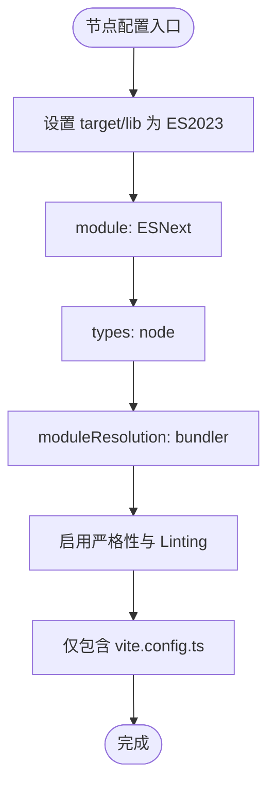

# TypeScript 配置体系

<cite>
**本文引用的文件**
- [tsconfig.json](file://tsconfig.json)
- [tsconfig.app.json](file://tsconfig.app.json)
- [tsconfig.node.json](file://tsconfig.node.json)
- [package.json](file://package.json)
- [vite.config.ts](file://vite.config.ts)
- [src/main.ts](file://src/main.ts)
- [src/App.vue](file://src/App.vue)
</cite>

## 目录
1. [引言](#引言)
2. [项目结构](#项目结构)
3. [核心组件](#核心组件)
4. [架构总览](#架构总览)
5. [详细组件分析](#详细组件分析)
6. [依赖分析](#依赖分析)
7. [性能考虑](#性能考虑)
8. [故障排查指南](#故障排查指南)
9. [结论](#结论)
10. [附录](#附录)

## 引言
本文件系统性解析 ainote-web 的 TypeScript 多配置文件架构，重点说明：
- 根配置文件 tsconfig.json 如何通过 references 协调 tsconfig.app.json 与 tsconfig.node.json 的分工；
- tsconfig.app.json 如何基于 @vue/tsconfig 的 DOM 基础配置，为前端应用提供编译选项（含 Vue SFC 支持、路径别名、严格性等）；
- tsconfig.node.json 如何为 Node.js 环境下的脚本（如 Vite 配置）提供类型检查；
- 各配置之间的继承与覆盖关系，以及如何扩展类型、添加自定义类型声明、调整严格性选项。

## 项目结构
本项目采用“根配置 + 分层子配置”的组织方式：
- 根配置：tsconfig.json 使用 references 指向两个子配置，形成复合项目结构；
- 应用配置：tsconfig.app.json 继承 @vue/tsconfig 的 DOM 基础配置，面向前端应用；
- 节点配置：tsconfig.node.json 面向 Node.js 环境脚本（如 Vite 配置），提供严格的类型检查；
- 构建脚本：package.json 中的构建命令结合 vue-tsc 与 vite，确保类型检查与打包流程协同。

图表来源
- [tsconfig.json](file://tsconfig.json#L1-L8)
- [tsconfig.app.json](file://tsconfig.app.json#L1-L20)
- [tsconfig.node.json](file://tsconfig.node.json#L1-L27)
- [package.json](file://package.json#L1-L32)

章节来源
- [tsconfig.json](file://tsconfig.json#L1-L8)
- [package.json](file://package.json#L1-L32)

## 核心组件
- 根配置 tsconfig.json：以 references 聚合应用与节点两套配置，形成复合项目，便于 IDE 与工具链统一管理。
- 应用配置 tsconfig.app.json：继承 @vue/tsconfig 的 DOM 基础配置，启用严格模式与多项 linting 选项，包含对 Vue SFC、TSX、路径别名的支持。
- 节点配置 tsconfig.node.json：面向 Node.js 环境脚本（如 Vite 配置），使用 ESNext 模块、bundler 模式解析、内置 Node 类型，启用严格性与库跳过检查。

章节来源
- [tsconfig.json](file://tsconfig.json#L1-L8)
- [tsconfig.app.json](file://tsconfig.app.json#L1-L20)
- [tsconfig.node.json](file://tsconfig.node.json#L1-L27)

## 架构总览
下图展示从根配置到子配置、再到实际编译目标的映射关系，以及与构建脚本的衔接。

图表来源
- [tsconfig.json](file://tsconfig.json#L1-L8)
- [tsconfig.app.json](file://tsconfig.app.json#L1-L20)
- [tsconfig.node.json](file://tsconfig.node.json#L1-L27)
- [package.json](file://package.json#L1-L32)
- [vite.config.ts](file://vite.config.ts#L1-L19)

## 详细组件分析

### 根配置 tsconfig.json
- 作用：通过 references 将 tsconfig.app.json 与 tsconfig.node.json 组织为复合项目，使 IDE 与工具链能同时感知应用与节点两类编译上下文。
- 影响：在多配置场景下，IDE 的智能感知、跳转、重构等能力会同时覆盖应用与节点配置所包含的文件集合。

章节来源
- [tsconfig.json](file://tsconfig.json#L1-L8)

### 应用配置 tsconfig.app.json
- 继承来源：通过 extends 引入 @vue/tsconfig 的 DOM 基础配置，确保 Vue SFC、DOM 类型、浏览器环境等基础能力可用。
- 关键编译选项：
  - 路径别名与 baseUrl：通过 paths 与 baseUrl 实现模块解析与路径简化；
  - 类型注入：types 中包含 vite/client，为 Vite 环境变量与插件 API 提供类型；
  - 严格性与 Linting：启用严格模式与多项未使用项、switch fallthrough、side effect import 等检查；
  - 构建缓存：tsBuildInfoFile 指定中间产物位置，提升增量编译效率；
  - 包含范围：include 覆盖 src 下的 TS/TSX/Vue 文件。
- 对 Vue SFC 的支持：由于继承自 DOM 基础配置且 include 包含 .vue 文件，Vue 单文件组件可被正确识别与类型检查。

图表来源
- [tsconfig.app.json](file://tsconfig.app.json#L1-L20)

章节来源
- [tsconfig.app.json](file://tsconfig.app.json#L1-L20)

### 节点配置 tsconfig.node.json
- 目标：为 Node.js 环境脚本（如 vite.config.ts）提供类型检查与模块解析；
- 关键编译选项：
  - 目标与库：target 与 lib 指向 ES2023，确保现代语法与 API 可用；
  - 模块系统：module 为 ESNext，配合 bundler 模式解析；
  - 类型注入：types 中包含 node，提供 Node 内置类型；
  - 打包器模式：moduleResolution 设为 bundler，允许导入 TS 扩展、强制模块检测、保留原始模块语法；
  - 严格性与 Linting：启用严格模式与多项 Linting 选项；
  - 包含范围：仅包含 vite.config.ts，聚焦配置脚本的类型检查。
- 与 Vite 配置的关系：vite.config.ts 在 Node 环境中运行，其类型安全由该配置保障。

图表来源
- [tsconfig.node.json](file://tsconfig.node.json#L1-L27)
- [vite.config.ts](file://vite.config.ts#L1-L19)

章节来源
- [tsconfig.node.json](file://tsconfig.node.json#L1-L27)
- [vite.config.ts](file://vite.config.ts#L1-L19)

### 构建与运行时关系
- 开发：package.json 的 dev 脚本启动 Vite，IDE 侧同时受根配置与子配置影响；
- 构建：build 脚本先执行 vue-tsc -b 进行类型检查，再执行 vite build 完成打包；
- 类型检查范围：应用配置负责 src 下的业务代码，节点配置负责 vite.config.ts 的配置脚本。

章节来源
- [package.json](file://package.json#L1-L32)
- [tsconfig.app.json](file://tsconfig.app.json#L1-L20)
- [tsconfig.node.json](file://tsconfig.node.json#L1-L27)

## 依赖分析
- 继承链：
  - tsconfig.app.json 继承自 @vue/tsconfig 的 DOM 基础配置；
  - tsconfig.node.json 为独立配置，不继承其他配置；
  - tsconfig.json 通过 references 聚合两者。
- 工具链依赖：
  - @vue/tsconfig 提供 Vue 生态的基础编译配置；
  - vue-tsc 用于类型检查与增量编译；
  - Vite 作为打包与开发服务器，其配置脚本在 Node 环境中执行。

图表来源
- [tsconfig.app.json](file://tsconfig.app.json#L1-L20)
- [tsconfig.node.json](file://tsconfig.node.json#L1-L27)
- [tsconfig.json](file://tsconfig.json#L1-L8)
- [package.json](file://package.json#L1-L32)

章节来源
- [package.json](file://package.json#L1-L32)
- [tsconfig.app.json](file://tsconfig.app.json#L1-L20)
- [tsconfig.node.json](file://tsconfig.node.json#L1-L27)
- [tsconfig.json](file://tsconfig.json#L1-L8)

## 性能考虑
- 增量编译：应用配置中的 tsBuildInfoFile 指向临时目录，有助于提升 vue-tsc 的增量检查速度；
- 严格性收益：严格模式与 Linting 选项能在早期发现潜在问题，减少运行时错误；
- 模块解析优化：bundler 模式与 verbatimModuleSyntax 有助于在现代打包器中获得更准确的类型与模块行为；
- 跳过库检查：节点配置启用 skipLibCheck，可加速类型检查过程，适合大型依赖库场景。

章节来源
- [tsconfig.app.json](file://tsconfig.app.json#L1-L20)
- [tsconfig.node.json](file://tsconfig.node.json#L1-L27)

## 故障排查指南
- 类型检查失败（应用侧）：
  - 检查 tsconfig.app.json 的 include 是否覆盖到新增文件；
  - 若涉及 Vue SFC，请确认已包含 .vue 文件；
  - 若出现路径别名相关错误，核对 baseUrl 与 paths 的配置是否匹配实际目录结构。
- 类型检查失败（节点侧）：
  - 确认 vite.config.ts 已被包含；
  - 若使用 Node 特有 API，请确保 types 中包含 node；
  - 若出现模块解析问题，检查 moduleResolution 是否为 bundler，以及是否启用了允许 TS 扩展导入的选项。
- 构建阶段报错：
  - 先执行 vue-tsc -b 独立验证类型问题，再进行打包；
  - 若 IDE 与命令行结果不一致，清理 tsbuildinfo 并重新生成。

章节来源
- [tsconfig.app.json](file://tsconfig.app.json#L1-L20)
- [tsconfig.node.json](file://tsconfig.node.json#L1-L27)
- [package.json](file://package.json#L1-L32)

## 结论
本项目通过“根配置 + 分层子配置”的方式，清晰地将前端应用与 Node.js 配置脚本的类型检查分离，既保证了 Vue 生态的完整支持，又确保了 Vite 配置脚本在 Node 环境下的类型安全。开发者应遵循以下实践：
- 在 tsconfig.app.json 中维护应用侧的严格性与路径别名；
- 在 tsconfig.node.json 中聚焦配置脚本的类型与模块解析；
- 通过根配置的 references 统一管理复合项目；
- 如需扩展类型或调整严格性，优先在各自子配置中进行局部覆盖，避免全局污染。

## 附录

### 如何扩展类型与自定义声明
- 应用侧扩展：
  - 在 tsconfig.app.json 的 include 中加入自定义声明文件路径；
  - 或在 src 目录下新增 .d.ts 文件并确保被 include 覆盖；
  - 如需注入额外类型，可在 types 数组中追加对应包的类型声明。
- 节点侧扩展：
  - 在 tsconfig.node.json 的 include 中加入自定义声明文件路径；
  - 或在 vite.config.ts 同级目录新增 .d.ts 文件并确保被包含；
  - 如需 Node 特定类型，确保 types 中包含 node。

章节来源
- [tsconfig.app.json](file://tsconfig.app.json#L1-L20)
- [tsconfig.node.json](file://tsconfig.node.json#L1-L27)
- [vite.config.ts](file://vite.config.ts#L1-L19)

### 调整严格性选项的建议
- 应用侧：保持严格模式与 Linting 选项，以提升代码质量；
- 节点侧：保持严格模式，但可根据团队规范适度放宽；
- 若需临时放宽，建议在各自子配置中进行局部覆盖，避免影响另一侧。

章节来源
- [tsconfig.app.json](file://tsconfig.app.json#L1-L20)
- [tsconfig.node.json](file://tsconfig.node.json#L1-L27)