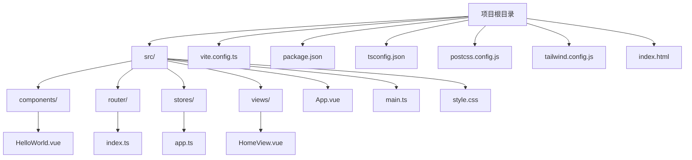
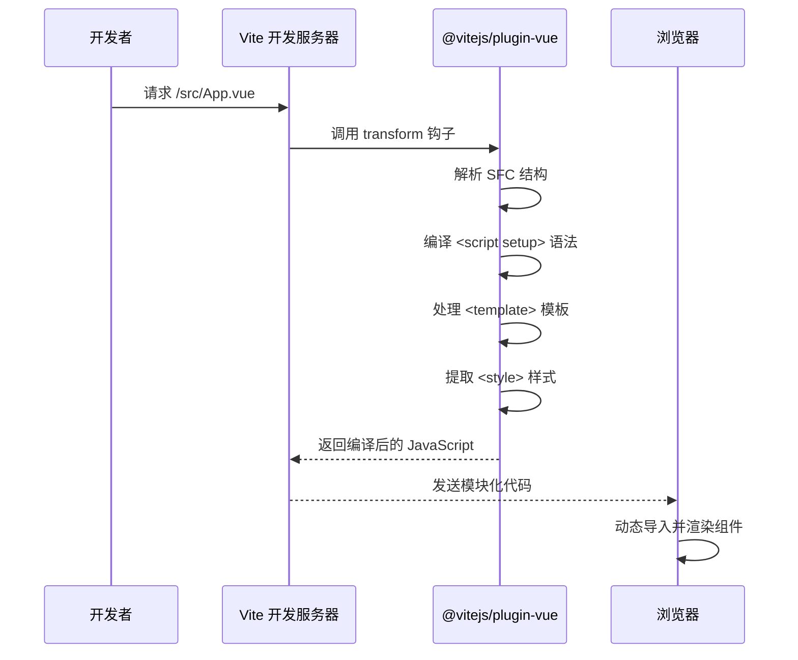
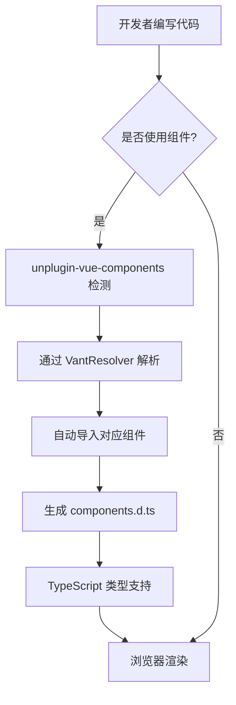
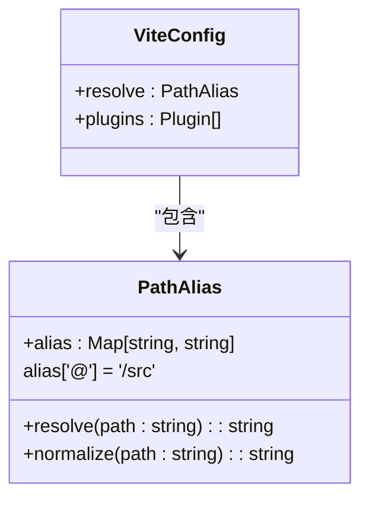
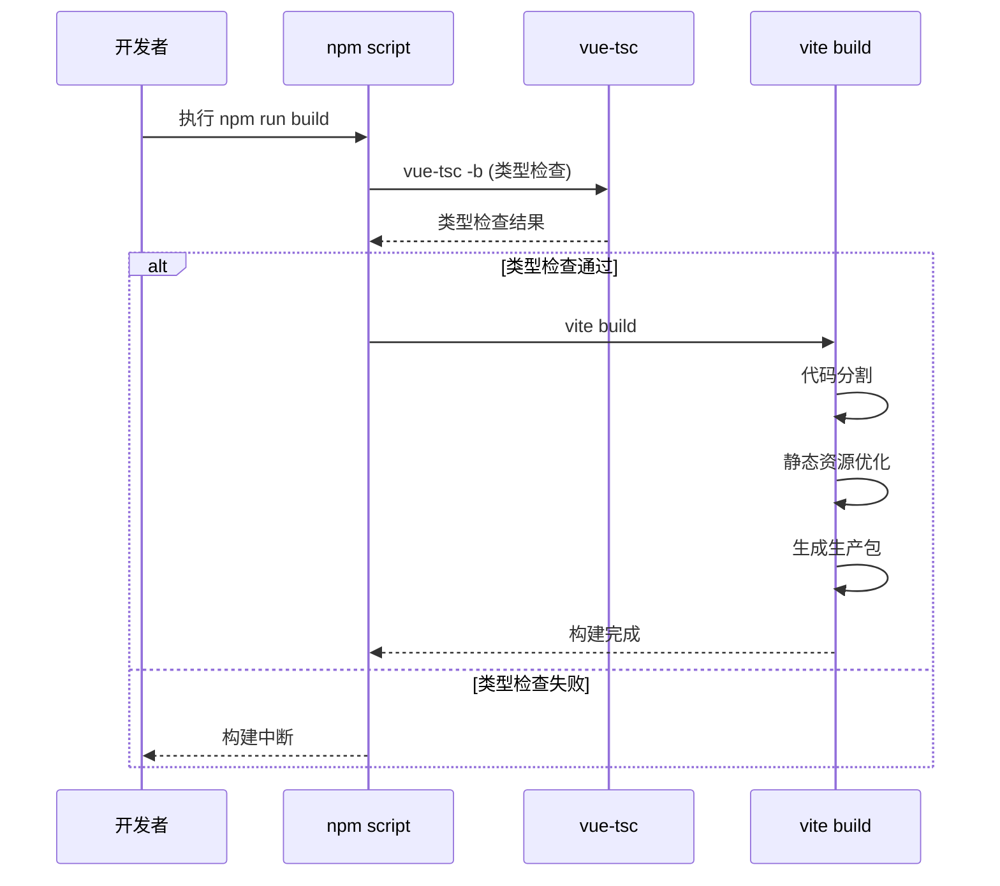
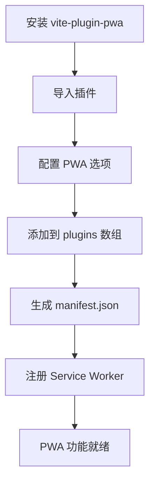
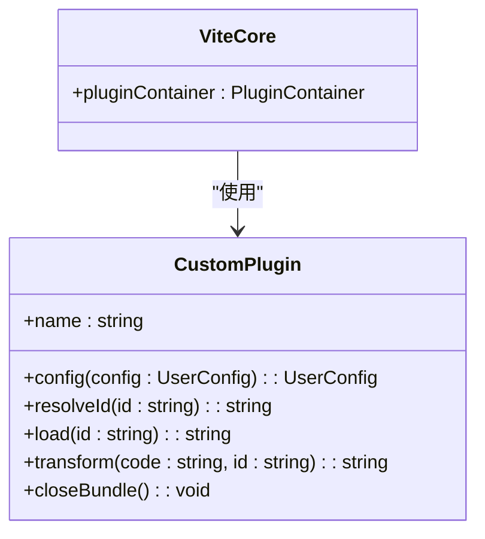
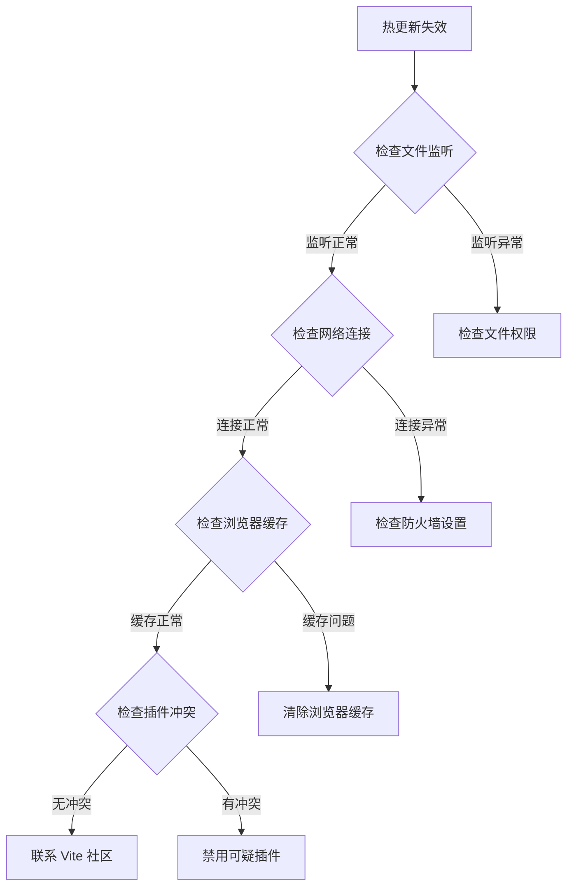
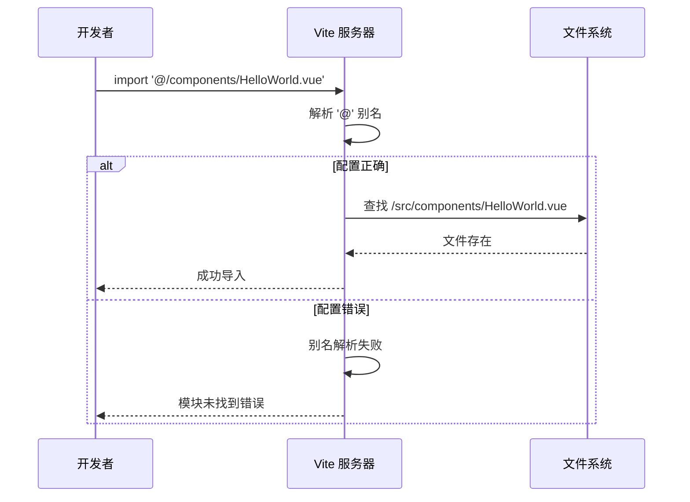

# Vite 构建配置

<cite>
**本文档引用的文件**
- [vite.config.ts](file://vite.config.ts)
- [package.json](file://package.json)
- [tsconfig.json](file://tsconfig.json)
- [tsconfig.app.json](file://tsconfig.app.json)
- [tsconfig.node.json](file://tsconfig.node.json)
- [postcss.config.js](file://postcss.config.js)
- [tailwind.config.js](file://tailwind.config.js)
- [index.html](file://index.html)
- [src/main.ts](file://src/main.ts)
- [src/App.vue](file://src/App.vue)
- [components.d.ts](file://components.d.ts)
</cite>

## 目录
1. [简介](#简介)
2. [项目结构](#项目结构)
3. [核心构建配置](#核心构建配置)
4. [Vite 插件系统分析](#vite-插件系统分析)
5. [路径别名配置原理](#路径别名配置原理)
6. [生产构建优化](#生产构建优化)
7. [扩展指南](#扩展指南)
8. [常见问题排查](#常见问题排查)
9. [性能优化建议](#性能优化建议)
10. [结论](#结论)

## 简介
本文档深入解析 ainote-web 项目的 Vite 构建配置，重点分析 `vite.config.ts` 文件中的各项配置。文档详细阐述了 Vite 插件系统的工作机制、路径别名的工程化意义、生产构建参数配置，并提供可操作的扩展指南和问题排查方案。

## 项目结构
ainote-web 项目采用标准的 Vue 3 + Vite 项目结构，遵循模块化设计原则。项目根目录包含核心配置文件和入口文件，`src` 目录组织了应用程序的源代码。



**Diagram sources**
- [vite.config.ts](file://vite.config.ts#L1-L19)
- [package.json](file://package.json#L1-L32)

## 核心构建配置
项目的核心构建配置集中在 `vite.config.ts` 文件中，定义了插件、路径别名等关键构建参数。

**Section sources**
- [vite.config.ts](file://vite.config.ts#L1-L19)

## Vite 插件系统分析

### @vitejs/plugin-vue 插件
`@vitejs/plugin-vue` 是 Vite 官方提供的 Vue 3 支持插件，负责处理 Vue 单文件组件（SFC）。该插件实现了对 `<script setup>` 语法的支持，能够高效地解析 `.vue` 文件中的模板、脚本和样式部分。



**Diagram sources**
- [vite.config.ts](file://vite.config.ts#L2)
- [src/App.vue](file://src/App.vue#L1-L6)

### unplugin-vue-components 插件
`unplugin-vue-components` 是一个强大的组件自动导入插件，结合 `@vant/auto-import-resolver` 实现了 Vant 组件的按需加载。



**Diagram sources**
- [vite.config.ts](file://vite.config.ts#L3-L4)
- [components.d.ts](file://components.d.ts#L1-L24)

**Section sources**
- [vite.config.ts](file://vite.config.ts#L3-L12)
- [components.d.ts](file://components.d.ts#L1-L24)

## 路径别名配置原理

### 别名 '@' 的配置
在 `vite.config.ts` 中配置了 `@` 别名指向 `/src` 目录，这在开发中提供了极大的便利性。



**Diagram sources**
- [vite.config.ts](file://vite.config.ts#L14-L17)

### TypeScript 配置协同
路径别名需要在 TypeScript 配置中同步定义，以确保类型检查的正确性。

```mermaid
graph LR
A[vite.config.ts] -- "resolve.alias" --> B[路径解析]
C[tsconfig.app.json] -- "compilerOptions.paths" --> D[类型检查]
B < --> E[开发服务器]
D < --> E
E --> F[开发者体验]
```

**Diagram sources**
- [vite.config.ts](file://vite.config.ts#L14-L17)
- [tsconfig.app.json](file://tsconfig.app.json#L7-L9)

**Section sources**
- [vite.config.ts](file://vite.config.ts#L14-L18)
- [tsconfig.app.json](file://tsconfig.app.json#L7-L9)

## 生产构建优化

### 构建流程分析
虽然 `vite.config.ts` 中未显式配置 build 选项，但项目通过 package.json 中的脚本定义了构建流程。



**Diagram sources**
- [package.json](file://package.json#L8)
- [vite.config.ts](file://vite.config.ts#L7-L19)

**Section sources**
- [package.json](file://package.json#L8)
- [vite.config.ts](file://vite.config.ts#L7-L19)

## 扩展指南

### 新增路径别名
要新增路径别名，需要同时修改 Vite 和 TypeScript 配置。


**Section sources**
- [vite.config.ts](file://vite.config.ts#L14-L18)
- [tsconfig.app.json](file://tsconfig.app.json#L7-L9)

### 集成 PWA 插件
集成 PWA 插件可以提升应用的离线能力和用户体验。



### 自定义插件开发
Vite 提供了丰富的插件 API，支持开发自定义构建功能。



## 常见问题排查

### 热更新失效
热更新失效是开发中常见的问题，可能由多种原因引起。



### 路径解析错误
路径解析错误通常与别名配置不一致有关。



**Section sources**
- [vite.config.ts](file://vite.config.ts#L14-L18)
- [tsconfig.app.json](file://tsconfig.app.json#L7-L9)

## 性能优化建议
1. **代码分割**：利用 Vite 的自动代码分割功能，减少初始加载体积
2. **资源压缩**：确保生产构建中启用了 Gzip/Brotli 压缩
3. **预加载策略**：合理使用 `<link rel="modulepreload">` 预加载关键模块
4. **图片优化**：使用现代图片格式（WebP/AVIF）并设置适当的尺寸
5. **依赖分析**：定期使用 bundle 分析工具检查依赖大小

## 结论
ainote-web 项目的 Vite 构建配置体现了现代前端工程化的最佳实践。通过 `@vitejs/plugin-vue` 实现了对 Vue 3 SFC 的完美支持，利用 `unplugin-vue-components` 实现了组件的自动导入和按需加载，路径别名配置提升了开发效率。建议在现有基础上进一步优化生产构建配置，添加详细的 build 选项以更好地控制输出。