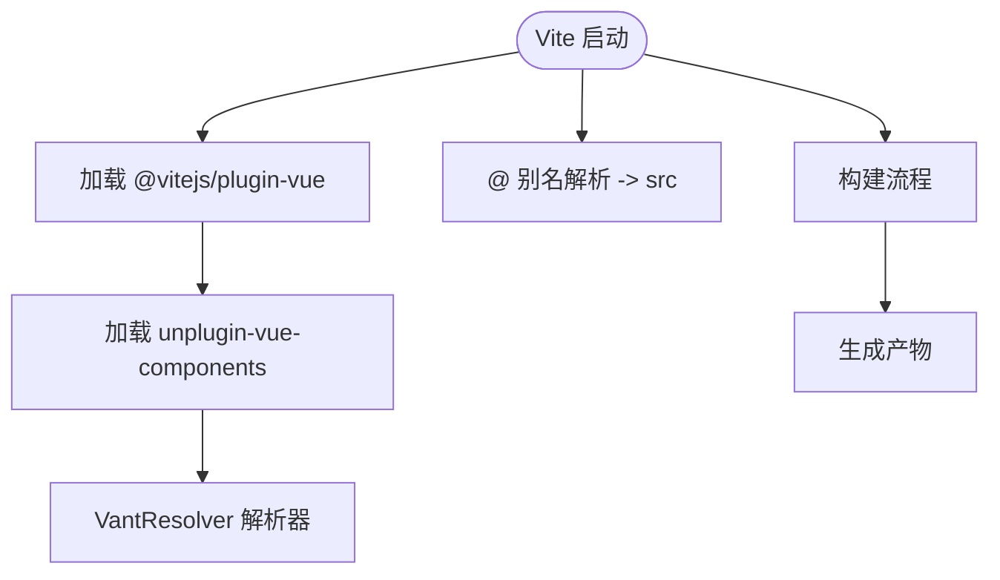

# 工程化配置

<cite>
**本文引用的文件**
- [vite.config.ts](file://vite.config.ts)
- [tsconfig.app.json](file://tsconfig.app.json)
- [tsconfig.node.json](file://tsconfig.node.json)
- [tsconfig.json](file://tsconfig.json)
- [tailwind.config.js](file://tailwind.config.js)
- [postcss.config.js](file://postcss.config.js)
- [package.json](file://package.json)
- [src/main.ts](file://src/main.ts)
</cite>

## 目录
1. [引言](#引言)
2. [项目结构](#项目结构)
3. [核心组件](#核心组件)
4. [架构总览](#架构总览)
5. [详细组件分析](#详细组件分析)
6. [依赖分析](#依赖分析)
7. [性能考虑](#性能考虑)
8. [故障排查指南](#故障排查指南)
9. [结论](#结论)
10. [附录](#附录)

## 引言
本文件系统性解析 ainote-web 的工程化配置体系，围绕以下主题展开：
- Vite 构建配置：插件体系（@vitejs/plugin-vue、unplugin-vue-components）与路径别名“@”
- Vant 组件自动导入的实现原理
- TypeScript 多配置文件分工与继承关系（tsconfig.app.json、tsconfig.node.json）
- Tailwind 与 PostCSS 配置联动（tailwind.config.js、postcss.config.js）
- 为开发者提供修改与扩展构建流程所需的完整知识

## 项目结构
该仓库采用典型的 Vue 3 + Vite + TypeScript + Tailwind 工程化布局，关键配置集中在根目录的四个配置文件中，并通过 tsconfig.json 进行多配置聚合管理。

图表来源
- [package.json](file://package.json#L1-L32)
- [vite.config.ts](file://vite.config.ts#L1-L19)
- [tsconfig.json](file://tsconfig.json#L1-L8)
- [tsconfig.app.json](file://tsconfig.app.json#L1-L20)
- [tsconfig.node.json](file://tsconfig.node.json#L1-L27)
- [tailwind.config.js](file://tailwind.config.js#L1-L12)
- [postcss.config.js](file://postcss.config.js#L1-L6)
- [src/main.ts](file://src/main.ts#L1-L12)

章节来源
- [package.json](file://package.json#L1-L32)
- [tsconfig.json](file://tsconfig.json#L1-L8)

## 核心组件
本节聚焦于四大工程化配置的核心要点及其协作方式。

- Vite 插件与路径别名
  - 使用 @vitejs/plugin-vue 提供 Vue SFC 编译支持
  - 使用 unplugin-vue-components 结合 VantResolver 实现 Vant 组件按需自动导入
  - 通过 resolve.alias 将“@”映射到 src 目录，统一模块路径解析

- TypeScript 多配置分工
  - tsconfig.app.json：面向浏览器端应用的类型检查，启用严格模式与路径映射
  - tsconfig.node.json：面向构建脚本与 Node 环境的类型检查，使用 bundler 模式解析模块
  - tsconfig.json：通过 references 聚合两个子配置，便于分层维护

- Tailwind 与 PostCSS
  - tailwind.config.js：定义 content 扫描范围与主题扩展点
  - postcss.config.js：串联 Tailwind 与 Autoprefixer，完成样式预处理与兼容性补全

章节来源
- [vite.config.ts](file://vite.config.ts#L1-L19)
- [tsconfig.app.json](file://tsconfig.app.json#L1-L20)
- [tsconfig.node.json](file://tsconfig.node.json#L1-L27)
- [tsconfig.json](file://tsconfig.json#L1-L8)
- [tailwind.config.js](file://tailwind.config.js#L1-L12)
- [postcss.config.js](file://postcss.config.js#L1-L6)

## 架构总览
下图展示从开发到构建的关键流程：Vite 读取配置 → 加载插件 → 解析模块别名 → 自动导入组件 → 类型检查 → 样式处理 → 最终产物。

图表来源
- [vite.config.ts](file://vite.config.ts#L1-L19)
- [tsconfig.app.json](file://tsconfig.app.json#L1-L20)
- [tailwind.config.js](file://tailwind.config.js#L1-L12)
- [postcss.config.js](file://postcss.config.js#L1-L6)

## 详细组件分析

### Vite 配置与插件体系
- 插件加载顺序与职责
  - @vitejs/plugin-vue：负责 Vue 单文件组件（SFC）编译、热更新等
  - unplugin-vue-components：在编译期扫描模板与脚本，自动引入组件并注入类型声明，结合 VantResolver 实现 Vant 组件的按需导入
- 路径别名“@”
  - 在 resolve.alias 中将“@”指向“/src”，使所有相对 src 的导入统一为以“@”开头的绝对路径风格，提升可读性与可维护性
- 插件调用链示意

图表来源
- [vite.config.ts](file://vite.config.ts#L1-L19)

章节来源
- [vite.config.ts](file://vite.config.ts#L1-L19)

### Vant 组件自动导入的实现原理
- 关键机制
  - unplugin-vue-components 在编译阶段扫描 Vue 模板与脚本中的组件使用情况
  - VantResolver 作为解析器，识别 Vant 组件的使用并生成对应的导入语句
  - 自动注入类型声明，避免手动 import 与类型缺失
- 典型效果
  - 在模板中直接使用 Vant 组件时，无需显式 import，即可获得类型提示与运行时支持
- 流程示意

图表来源
- [vite.config.ts](file://vite.config.ts#L1-L19)

章节来源
- [vite.config.ts](file://vite.config.ts#L1-L19)

### TypeScript 配置分工与继承关系
- tsconfig.app.json（应用侧）
  - 继承自 @vue/tsconfig 的 DOM 类型基线，适配浏览器端 Vue 应用
  - 启用严格模式与未使用项检查，保证代码质量
  - 通过 baseUrl 与 paths 定义“@/*”到“src/*”的路径映射，与 Vite 别名保持一致
- tsconfig.node.json（Node/构建侧）
  - 面向构建脚本与 Node 环境，使用 bundler 模式解析模块，避免 Node 默认解析差异
  - 仅包含 vite.config.ts，确保构建脚本具备类型安全
- tsconfig.json（聚合入口）
  - 通过 references 将两个子配置纳入统一管理，便于增量编译与 IDE 支持

图表来源
- [tsconfig.json](file://tsconfig.json#L1-L8)
- [tsconfig.app.json](file://tsconfig.app.json#L1-L20)
- [tsconfig.node.json](file://tsconfig.node.json#L1-L27)

章节来源
- [tsconfig.json](file://tsconfig.json#L1-L8)
- [tsconfig.app.json](file://tsconfig.app.json#L1-L20)
- [tsconfig.node.json](file://tsconfig.node.json#L1-L27)

### Tailwind 与 PostCSS 配置联动
- tailwind.config.js
  - content 字段定义扫描范围，确保仅对实际使用的类进行优化输出
  - theme.extend 作为主题扩展入口，可在不破坏默认主题的前提下添加自定义变量
  - plugins 空数组表示当前未启用额外插件
- postcss.config.js
  - 串联 @tailwindcss/postcss 与 autoprefixer，实现：
    - Tailwind 原子类提取与归一化
    - 浏览器兼容性前缀自动补齐
- 流程示意

图表来源
- [tailwind.config.js](file://tailwind.config.js#L1-L12)
- [postcss.config.js](file://postcss.config.js#L1-L6)

章节来源
- [tailwind.config.js](file://tailwind.config.js#L1-L12)
- [postcss.config.js](file://postcss.config.js#L1-L6)

### 构建脚本与入口
- package.json 脚本
  - dev：启动 Vite 开发服务器
  - build：先执行 vue-tsc 进行类型检查，再执行 vite build 产出生产包
  - preview：本地预览构建产物
- 应用入口 src/main.ts
  - 创建 Vue 应用实例，注册 Pinia 与路由，挂载到 DOM

章节来源
- [package.json](file://package.json#L1-L32)
- [src/main.ts](file://src/main.ts#L1-L12)

## 依赖分析
- 依赖关系概览
  - 构建工具链：Vite、Vue、TypeScript、Tailwind、PostCSS、Autoprefixer
  - 自动导入：unplugin-vue-components + @vant/auto-import-resolver
  - 类型基线：@vue/tsconfig
- 关键耦合点
  - Vite 别名“@”与 tsconfig.paths 必须保持一致，否则会出现类型与运行时路径不一致的问题
  - Tailwind content 扫描范围决定产物体积与构建时间
  - PostCSS 插件顺序影响最终 CSS 输出

图表来源
- [package.json](file://package.json#L1-L32)
- [vite.config.ts](file://vite.config.ts#L1-L19)
- [tsconfig.json](file://tsconfig.json#L1-L8)
- [tailwind.config.js](file://tailwind.config.js#L1-L12)
- [postcss.config.js](file://postcss.config.js#L1-L6)

章节来源
- [package.json](file://package.json#L1-L32)

## 性能考虑
- 构建性能
  - 合理设置 tailwind.config.js 的 content 扫描范围，避免扫描无关目录
  - 保持 unplugin-vue-components 的解析器最小化，减少不必要的组件扫描
- 类型检查
  - 利用 tsconfig.app.json 的严格模式与未使用项检查，提前发现潜在问题
  - 将 vite.config.ts 放入 tsconfig.node.json 的 include，确保构建脚本类型安全
- 样式处理
  - Autoprefixer 的目标浏览器策略应与产品需求匹配，避免过度补全导致体积增大

## 故障排查指南
- 路径别名无效或类型错误
  - 确认 vite.config.ts 的 alias 与 tsconfig.app.json 的 paths 保持一致
  - 检查 baseUrl 与 paths 的层级是否正确
- Vant 组件无法自动导入
  - 确认已安装 @vant/auto-import-resolver 且在 VantResolver 中启用
  - 检查组件是否在模板中被实际使用，unplugin-vue-components 仅对真实使用进行导入
- Tailwind 未生效或产物过大
  - 检查 tailwind.config.js 的 content 范围是否覆盖到实际使用文件
  - 确认 postcss.config.js 中 @tailwindcss/postcss 与 autoprefixer 已正确安装并启用
- 构建失败
  - 先执行类型检查（vue-tsc），修复类型错误后再进行构建
  - 确保 tsconfig.node.json 包含 vite.config.ts，避免构建脚本类型缺失

章节来源
- [vite.config.ts](file://vite.config.ts#L1-L19)
- [tsconfig.app.json](file://tsconfig.app.json#L1-L20)
- [tsconfig.node.json](file://tsconfig.node.json#L1-L27)
- [tailwind.config.js](file://tailwind.config.js#L1-L12)
- [postcss.config.js](file://postcss.config.js#L1-L6)
- [package.json](file://package.json#L1-L32)

## 结论
ainote-web 的工程化配置以 Vite 为核心，结合 unplugin-vue-components 的自动导入能力、严格的 TypeScript 分层配置与 Tailwind+PostCSS 的样式管线，形成了高效、可维护的现代前端工程体系。遵循本文提供的路径别名一致性、自动导入解析器配置、内容扫描范围与插件顺序建议，可有效提升开发体验与构建性能。

## 附录
- 修改与扩展建议
  - 路径别名：如需调整“@”指向，请同时更新 vite.config.ts 与 tsconfig.app.json 的 paths
  - 自动导入：如需引入其他组件库，可新增对应解析器并加入 resolvers 数组
  - Tailwind：根据设计系统扩展 theme.extend；按需启用插件并维护 content 范围
  - PostCSS：根据目标浏览器策略调整 Autoprefixer 配置；必要时增加更多插件
  - TypeScript：如需在构建脚本中使用新 API，确保 tsconfig.node.json 的 include 与 lib/target 保持最新