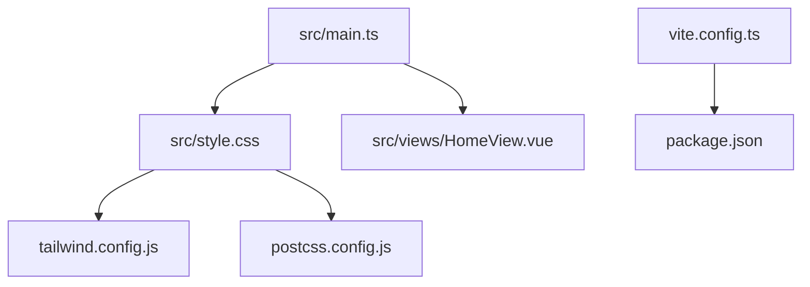
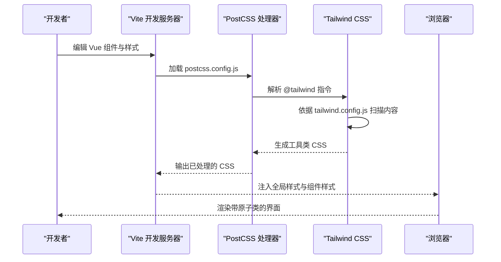
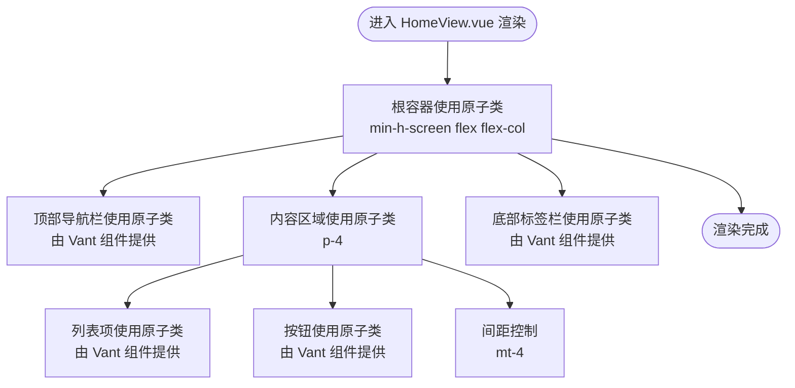
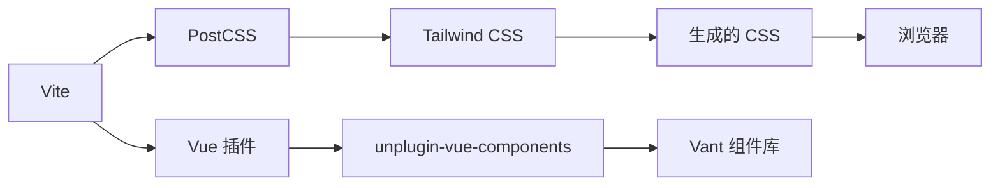

# 使用 Tailwind CSS 样式

<cite>
**本文引用的文件**
- [tailwind.config.js](file://tailwind.config.js)
- [postcss.config.js](file://postcss.config.js)
- [src/style.css](file://src/style.css)
- [src/views/HomeView.vue](file://src/views/HomeView.vue)
- [src/main.ts](file://src/main.ts)
- [vite.config.ts](file://vite.config.ts)
- [package.json](file://package.json)
</cite>

## 目录
1. [简介](#简介)
2. [项目结构](#项目结构)
3. [核心组件与样式集成](#核心组件与样式集成)
4. [架构总览](#架构总览)
5. [详细组件分析](#详细组件分析)
6. [依赖关系分析](#依赖关系分析)
7. [性能与最佳实践](#性能与最佳实践)
8. [故障排查指南](#故障排查指南)
9. [结论](#结论)

## 简介
本篇文档面向在 ainote-web 中使用 Tailwind CSS 构建响应式 UI 的开发者，系统说明项目如何通过 tailwind.config.js 与 postcss.config.js 集成 Tailwind，并以 src/style.css 作为全局样式的入口文件；同时结合 HomeView.vue 的实际示例，演示如何在组件 class 属性中直接使用原子类进行布局与样式设计，并给出响应式设计与主题扩展的最佳实践建议。

## 项目结构
- 全局样式入口：src/style.css，其中包含 @tailwind 基础指令，确保基础、组件与工具类被正确引入。
- Tailwind 配置：tailwind.config.js，声明内容扫描范围与主题扩展点。
- PostCSS 配置：postcss.config.js，启用 Tailwind 与 Autoprefixer 插件。
- 应用入口：src/main.ts，负责挂载应用并引入全局样式。
- 构建工具：vite.config.ts，使用 Vue 插件与 Vant 自动导入解析器。
- 依赖管理：package.json，包含 tailwindcss、@tailwindcss/postcss、autoprefixer 等关键依赖。

图表来源
- [src/main.ts](file://src/main.ts#L1-L12)
- [src/style.css](file://src/style.css#L1-L26)
- [tailwind.config.js](file://tailwind.config.js#L1-L12)
- [postcss.config.js](file://postcss.config.js#L1-L6)
- [vite.config.ts](file://vite.config.ts#L1-L19)
- [package.json](file://package.json#L1-L32)

章节来源
- [src/main.ts](file://src/main.ts#L1-L12)
- [src/style.css](file://src/style.css#L1-L26)
- [tailwind.config.js](file://tailwind.config.js#L1-L12)
- [postcss.config.js](file://postcss.config.js#L1-L6)
- [vite.config.ts](file://vite.config.ts#L1-L19)
- [package.json](file://package.json#L1-L32)

## 核心组件与样式集成
- Tailwind 内容扫描范围：tailwind.config.js 的 content 字段会扫描 index.html 与 src 下的 Vue/JS/TS 文件，确保仅生成实际使用的工具类，避免无用体积。
- PostCSS 处理链：postcss.config.js 启用 @tailwindcss/postcss 与 autoprefixer，使 @tailwind 指令生效并自动补全浏览器前缀。
- 全局样式入口：src/style.css 引入 @tailwind base、components、utilities，作为原子类体系的统一入口。
- 应用挂载：src/main.ts 在创建应用后引入全局样式，保证组件渲染时样式可用。
- 组件内使用：HomeView.vue 在模板中直接使用 flex、p-4、mt-4、min-h-screen 等原子类进行布局与间距控制。

章节来源
- [tailwind.config.js](file://tailwind.config.js#L1-L12)
- [postcss.config.js](file://postcss.config.js#L1-L6)
- [src/style.css](file://src/style.css#L1-L26)
- [src/main.ts](file://src/main.ts#L1-L12)
- [src/views/HomeView.vue](file://src/views/HomeView.vue#L13-L40)

## 架构总览
下图展示了从源码到最终样式输出的关键流程：开发阶段由 Vite 驱动，PostCSS 负责处理 @tailwind 指令与自动前缀，Tailwind 根据配置生成所需工具类，最终由 Vue 组件在运行时消费这些原子类。

图表来源
- [postcss.config.js](file://postcss.config.js#L1-L6)
- [tailwind.config.js](file://tailwind.config.js#L1-L12)
- [src/style.css](file://src/style.css#L1-L26)
- [src/main.ts](file://src/main.ts#L1-L12)
- [vite.config.ts](file://vite.config.ts#L1-L19)

## 详细组件分析

### Tailwind 配置与主题扩展
- 内容扫描：content 指定扫描路径，确保仅打包实际使用的工具类，提升构建效率与产物体积可控。
- 主题扩展：theme.extend 为空对象，表示当前未添加自定义断点或颜色等扩展。若需扩展，可在该处按官方规范新增键值对，例如扩展颜色、字体大小、间距等。

章节来源
- [tailwind.config.js](file://tailwind.config.js#L1-L12)

### PostCSS 配置与插件链
- 插件顺序：先执行 @tailwindcss/postcss（解析 @tailwind 指令），再执行 autoprefixer（自动补全前缀），符合 Tailwind 官方推荐的处理顺序。
- 产物优化：通过 Autoprefixer 提升兼容性，减少手动前缀维护成本。

章节来源
- [postcss.config.js](file://postcss.config.js#L1-L6)

### 全局样式入口与基础样式
- 入口文件：src/style.css 通过 @tailwind base、components、utilities 将基础、组件与工具类注入构建管线。
- 基础样式：:root、body、#app 等基础选择器设置了字体、行高、最小高度等基础属性，为后续原子类提供一致的基线环境。

章节来源
- [src/style.css](file://src/style.css#L1-L26)

### 应用入口与样式加载时机
- 入口文件：src/main.ts 创建应用并引入全局样式，确保组件挂载时样式已就绪。
- 与路由/状态：main.ts 同时初始化 Pinia 与路由，保证样式与功能模块协同工作。

章节来源
- [src/main.ts](file://src/main.ts#L1-L12)

### 组件中的原子类使用示例
- HomeView.vue 展示了在模板中直接使用原子类进行布局与间距控制：
  - 容器级：min-h-screen、flex、flex-col 用于占满视口高度并采用纵向布局。
  - 内容区：p-4 用于统一内边距。
  - 间距控制：mt-4 用于元素之间的垂直间距。
- 注意：组件内的 <style scoped> 仅作用于该组件，不会影响全局工具类；如需全局背景色等效果，可直接在全局样式中定义或在组件根节点上使用原子类。

图表来源
- [src/views/HomeView.vue](file://src/views/HomeView.vue#L13-L40)

章节来源
- [src/views/HomeView.vue](file://src/views/HomeView.vue#L13-L40)

## 依赖关系分析
- 构建链路：Vite -> PostCSS -> Tailwind -> 浏览器
- 关键依赖：tailwindcss、@tailwindcss/postcss、autoprefixer、unplugin-vue-components（与 Vant 解析器）
- 组件生态：Vant 与 Tailwind 并存，Vant 通过自动导入解析器在组件中直接使用其语义化组件，而样式层面则以原子类为主。

图表来源
- [vite.config.ts](file://vite.config.ts#L1-L19)
- [package.json](file://package.json#L1-L32)

章节来源
- [vite.config.ts](file://vite.config.ts#L1-L19)
- [package.json](file://package.json#L1-L32)

## 性能与最佳实践
- 内容扫描范围：保持 tailwind.config.js 的 content 覆盖到所有可能使用原子类的文件，避免误删或遗漏。
- 仅使用必要类：遵循“按需使用”的原则，减少未使用工具类的打包体积。
- 响应式设计：优先使用断点前缀（如 md:、lg:）组合原子类实现响应式布局，避免在组件内写重复的媒体查询。
- 主题扩展：在 theme.extend 中集中扩展颜色、字体、间距等，形成统一的设计令牌，便于团队协作与一致性维护。
- 与第三方组件库配合：Vant 组件通常自带样式，建议在组件根节点使用原子类进行布局与微调，避免覆盖其默认样式。

[本节为通用指导，不直接分析具体文件]

## 故障排查指南
- 问题：页面无 Tailwind 原子类效果
  - 排查要点：
    - 确认 src/style.css 已被引入（src/main.ts 中已引入）。
    - 确认 postcss.config.js 中 @tailwindcss/postcss 与 autoprefixer 已启用。
    - 确认 tailwind.config.js 的 content 能匹配到目标文件。
- 问题：构建后样式缺失或报错
  - 排查要点：
    - 检查 package.json 中 tailwindcss、@tailwindcss/postcss、autoprefixer 是否安装。
    - 确认 Vite 配置未禁用 PostCSS 或与其它插件冲突。
- 问题：组件内样式未生效
  - 排查要点：
    - 若使用 <style scoped>，注意其作用域限制，不会影响全局工具类；如需全局样式，应在全局样式文件中定义或在组件根节点使用原子类。

章节来源
- [src/main.ts](file://src/main.ts#L1-L12)
- [postcss.config.js](file://postcss.config.js#L1-L6)
- [tailwind.config.js](file://tailwind.config.js#L1-L12)
- [package.json](file://package.json#L1-L32)

## 结论
ainote-web 已通过 tailwind.config.js 与 postcss.config.js 完成 Tailwind 的标准集成，全局样式入口为 src/style.css，并在 src/main.ts 中完成加载。组件中可直接使用原子类进行布局与样式设计，HomeView.vue 提供了 min-h-screen、flex、p-4、mt-4 等类的实际应用示例。建议在 theme.extend 中进行主题扩展，在组件中结合断点前缀实现响应式布局，并与 Vant 组件库协同使用，以获得更高效、一致的 UI 开发体验。