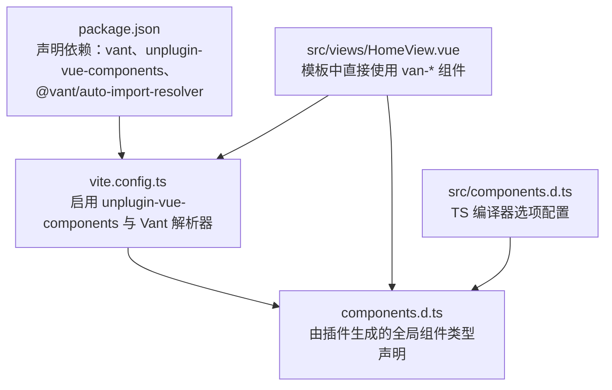
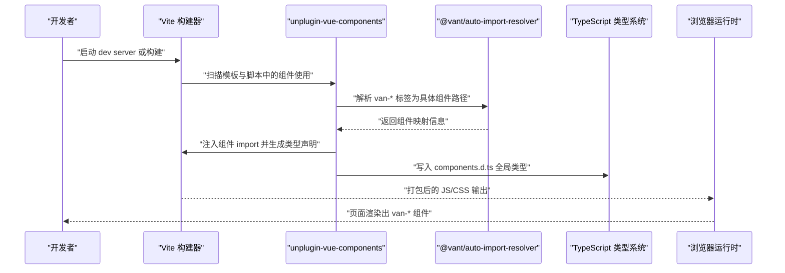
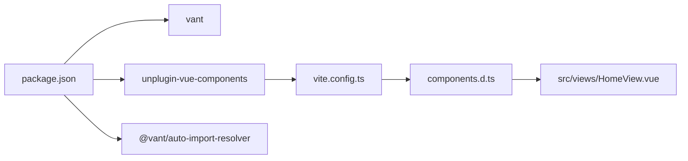

# 使用 Vant 组件

<cite>
**本文引用的文件**
- [vite.config.ts](file://vite.config.ts)
- [package.json](file://package.json)
- [components.d.ts](file://components.d.ts)
- [src/components.d.ts](file://src/components.d.ts)
- [src/views/HomeView.vue](file://src/views/HomeView.vue)
- [README.md](file://README.md)
</cite>

## 目录
1. [简介](#简介)
2. [项目结构](#项目结构)
3. [核心组件](#核心组件)
4. [架构总览](#架构总览)
5. [详细组件分析](#详细组件分析)
6. [依赖关系分析](#依赖关系分析)
7. [性能与体积优化建议](#性能与体积优化建议)
8. [故障排查指南](#故障排查指南)
9. [结论](#结论)

## 简介
本项目通过 Vite 插件体系实现了 Vant 4 组件的“零样板代码”使用方式：在模板中直接书写如 van-button、van-cell、van-nav-bar、van-tabbar 等标签，无需手动 import 即可全局可用；同时由插件自动生成类型声明文件，为这些全局组件提供 TypeScript 类型支持，提升开发体验与类型安全。

## 项目结构
围绕 Vant 自动导入的关键文件与职责如下：
- 构建配置：在构建工具中启用自动导入解析器，使模板中的 Vant 标签能被正确识别与按需引入。
- 类型声明：生成全局组件类型声明，让编辑器具备智能提示与类型校验能力。
- 模板示例：在视图组件中直接使用 Vant 组件，展示常用属性与事件绑定方式。

图表来源
- [vite.config.ts](file://vite.config.ts#L1-L19)
- [package.json](file://package.json#L1-L31)
- [components.d.ts](file://components.d.ts#L1-L24)
- [src/components.d.ts](file://src/components.d.ts#L1-L12)
- [src/views/HomeView.vue](file://src/views/HomeView.vue#L1-L46)

章节来源
- [vite.config.ts](file://vite.config.ts#L1-L19)
- [package.json](file://package.json#L1-L31)
- [components.d.ts](file://components.d.ts#L1-L24)
- [src/components.d.ts](file://src/components.d.ts#L1-L12)
- [src/views/HomeView.vue](file://src/views/HomeView.vue#L1-L46)
- [README.md](file://README.md#L1-L6)

## 核心组件
- Vite 插件配置：在构建配置中启用 unplugin-vue-components，并注册 VantResolver，使模板中出现的 van- 前缀组件自动解析到对应模块，从而实现“零 import 使用”。
- 自动生成的类型声明：插件会生成 components.d.ts，向 Vue 的 GlobalComponents 注册 VanButton、VanCell、VanNavBar、VanTabbar 等类型，保障 TS 开发时的类型推断与提示。
- 模板中的实际使用：在 HomeView.vue 中直接使用 van-nav-bar、van-cell-group、van-cell、van-button、van-tabbar 及 van-tabbar-item，演示常用属性与事件绑定。

章节来源
- [vite.config.ts](file://vite.config.ts#L1-L19)
- [components.d.ts](file://components.d.ts#L1-L24)
- [src/views/HomeView.vue](file://src/views/HomeView.vue#L1-L46)

## 架构总览
下图展示了从模板到运行时的自动导入链路：Vite 启动时加载插件，扫描模板中的 van-* 标签，交由 VantResolver 解析为具体组件，随后在编译期注入 import 并生成类型声明，最终在浏览器端正常渲染。

图表来源
- [vite.config.ts](file://vite.config.ts#L1-L19)
- [components.d.ts](file://components.d.ts#L1-L24)
- [package.json](file://package.json#L1-L31)

## 详细组件分析

### Vite 自动导入配置
- 插件启用：在插件数组中添加 unplugin-vue-components，并传入 VantResolver。
- 解析策略：VantResolver 将 van- 前缀组件名映射到 vant 包内的对应导出，实现按需引入与零样板代码。
- 别名配置：保留了 @ 到 src 的路径别名，便于项目内相对路径引用。

章节来源
- [vite.config.ts](file://vite.config.ts#L1-L19)

### 自动生成的类型声明
- 生成来源：由 unplugin-vue-components 在构建过程中生成，包含 VanButton、VanCell、VanNavBar、VanTabbar、VanTabbarItem 等类型。
- 类型注册：通过向 Vue 的 GlobalComponents 扩展，使模板中直接使用的 van-* 组件具备类型推断与智能提示。
- 作用范围：components.d.ts 位于项目根目录，供 TS 编译器与编辑器消费。

章节来源
- [components.d.ts](file://components.d.ts#L1-L24)

### 模板中的 Vant 组件使用示例
- 导航栏与标题：在模板中直接使用 van-nav-bar，绑定 title 属性与点击左侧事件。
- 列表与单元格：使用 van-cell-group 与多个 van-cell，演示分组与列表项的基本用法。
- 按钮：使用 van-button，演示主按钮样式与块级布局。
- 底部标签栏：使用 van-tabbar 与 v-model 进行双向绑定，配合 van-tabbar-item 配置图标与文本。
- 事件绑定：示例中包含 @click-left 事件绑定，展示如何响应用户交互。

章节来源
- [src/views/HomeView.vue](file://src/views/HomeView.vue#L1-L46)

### 类型配置与编译器选项
- 编译器选项：src/components.d.ts 中的 compilerOptions 指定模块解析策略与目标版本，确保类型声明与项目 TS 设置一致。
- 与全局类型的关系：components.d.ts 作为全局类型入口，与 src/components.d.ts 协同工作，保证类型系统稳定。

章节来源
- [src/components.d.ts](file://src/components.d.ts#L1-L12)
- [components.d.ts](file://components.d.ts#L1-L24)

## 依赖关系分析
- 必要依赖：vant 提供组件库；unplugin-vue-components 提供自动导入能力；@vant/auto-import-resolver 提供 Vant 组件解析规则。
- 版本与兼容性：项目中已安装相应版本，满足 Vue 3 与 Vite 生态要求。

图表来源
- [package.json](file://package.json#L1-L31)
- [vite.config.ts](file://vite.config.ts#L1-L19)
- [components.d.ts](file://components.d.ts#L1-L24)
- [src/views/HomeView.vue](file://src/views/HomeView.vue#L1-L46)

章节来源
- [package.json](file://package.json#L1-L31)
- [vite.config.ts](file://vite.config.ts#L1-L19)
- [components.d.ts](file://components.d.ts#L1-L24)
- [src/views/HomeView.vue](file://src/views/HomeView.vue#L1-L46)

## 性能与体积优化建议
- 按需引入：得益于 VantResolver 的解析与 unplugin-vue-components 的自动导入，组件按需引入，避免整包引入导致的体积膨胀。
- Tree Shaking：结合 Vite 默认的打包策略，未使用的组件不会被打包进产物，有利于减小体积。
- 组件裁剪：仅在模板中使用到的 van-* 组件会被编译器处理并注入 import，减少冗余代码。

章节来源
- [vite.config.ts](file://vite.config.ts#L1-L19)
- [package.json](file://package.json#L1-L31)

## 故障排查指南
- 组件未生效或报错
  - 确认 vite.config.ts 已启用 unplugin-vue-components 并配置 VantResolver。
  - 确认 package.json 中已安装 vant、unplugin-vue-components、@vant/auto-import-resolver。
  - 清理缓存后重启开发服务器，确保插件重新扫描模板。
- 类型提示缺失
  - 确认 components.d.ts 存在且未被忽略；检查编辑器是否加载该文件。
  - 确认 tsconfig 或 src/components.d.ts 的 compilerOptions 配置正确。
- 模板中仍需手动 import
  - 检查模板中是否使用了正确的 van-* 命名规范（小写短横线形式）。
  - 确保组件名称与 Vant 官方文档一致，避免大小写或拼写差异。
- 事件绑定无效
  - 确认事件监听器命名与 Vant 文档一致（例如 click-left），并在 script 中定义对应方法。

章节来源
- [vite.config.ts](file://vite.config.ts#L1-L19)
- [package.json](file://package.json#L1-L31)
- [components.d.ts](file://components.d.ts#L1-L24)
- [src/views/HomeView.vue](file://src/views/HomeView.vue#L1-L46)

## 结论
本项目通过在 Vite 中集成 unplugin-vue-components 与 @vant/auto-import-resolver，实现了 Vant 4 组件的“零样板代码”使用模式：模板中直接书写 van-* 标签即可，无需手动 import；同时由插件自动生成 components.d.ts，为全局组件提供 TypeScript 类型支持。在 HomeView.vue 中，van-nav-bar、van-cell-group、van-cell、van-button、van-tabbar 及 van-tabbar-item 的使用示例清晰展示了常用属性与事件绑定方式。建议开发者遵循 Vant 官方文档的组件 API 规范，以获得最佳的开发体验与一致性。