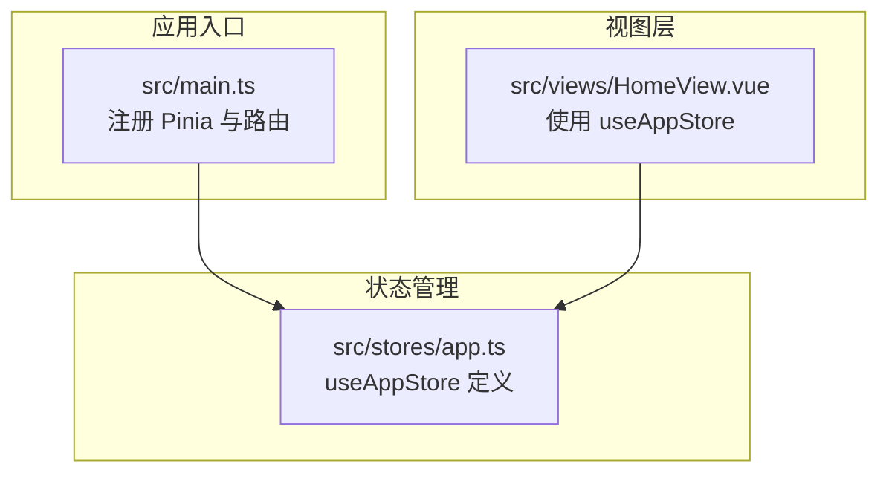
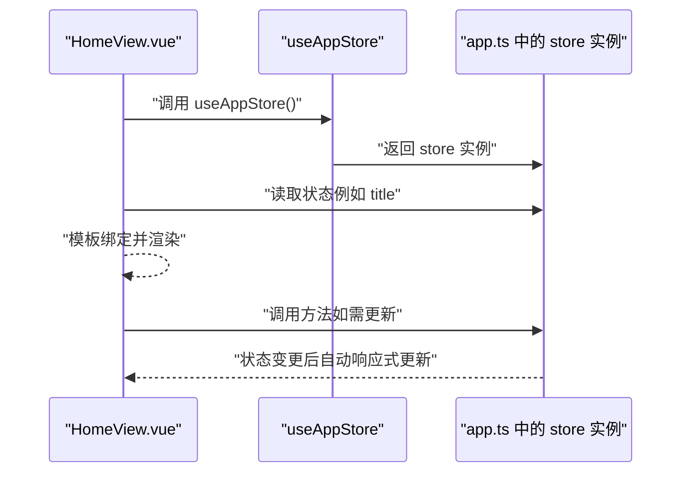
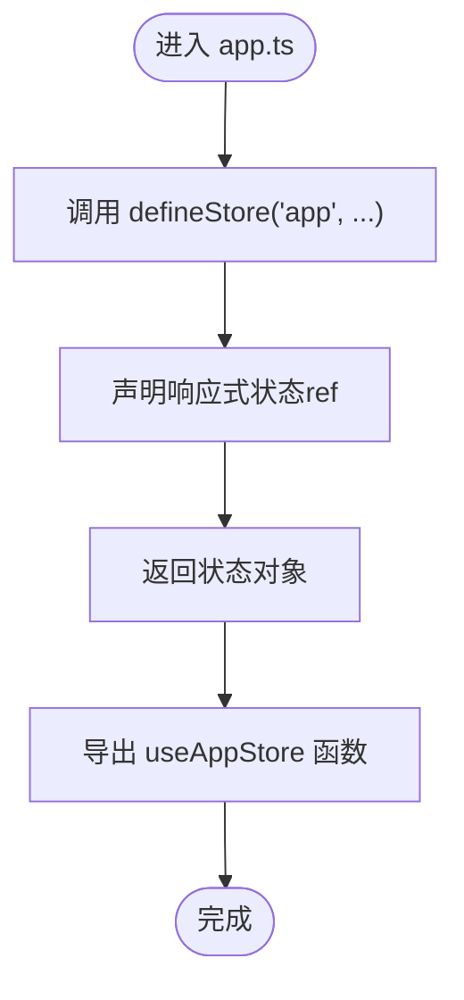
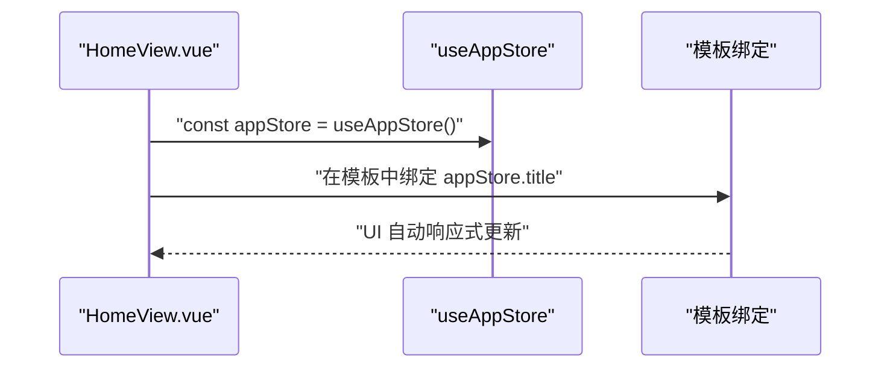
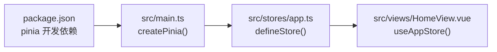

# 定义新的 Store 模块

<cite>
**本文引用的文件**
- [src/stores/app.ts](file://src/stores/app.ts)
- [src/views/HomeView.vue](file://src/views/HomeView.vue)
- [src/main.ts](file://src/main.ts)
- [package.json](file://package.json)
</cite>

## 目录
1. [引言](#引言)
2. [项目结构](#项目结构)
3. [核心组件](#核心组件)
4. [架构总览](#架构总览)
5. [详细组件分析](#详细组件分析)
6. [依赖分析](#依赖分析)
7. [性能考虑](#性能考虑)
8. [故障排查指南](#故障排查指南)
9. [结论](#结论)
10. [附录](#附录)

## 引言
本指南面向希望在 Pinia 状态管理中新增业务模块的开发者。我们将基于现有代码库中的 app store 实现，演示如何在 src/stores/ 目录下创建一个新的 TypeScript store 模块，并在组件中正确引入与使用。文档将重点说明：
- 在 src/stores/ 下新建 store 文件并使用 defineStore 定义模块
- 在 store 中声明响应式状态、计算属性与方法（actions）
- 在组件中通过导入 useXxxStore 并调用其状态与方法
- 结合 HomeView.vue 展示如何读取与更新状态，强调 Pinia 响应式机制与模块化设计的优势

## 项目结构
当前项目采用“按功能域分层”的组织方式：应用入口、路由、视图、组件与状态管理分别位于不同目录。Pinia 的 store 放置在 src/stores/ 下，遵循“每个业务域一个模块”的原则，便于维护与扩展。

图表来源
- [src/main.ts](file://src/main.ts#L1-L12)
- [src/stores/app.ts](file://src/stores/app.ts#L1-L11)
- [src/views/HomeView.vue](file://src/views/HomeView.vue#L1-L47)

章节来源
- [src/main.ts](file://src/main.ts#L1-L12)
- [src/stores/app.ts](file://src/stores/app.ts#L1-L11)
- [src/views/HomeView.vue](file://src/views/HomeView.vue#L1-L47)

## 核心组件
- Pinia 根实例与应用集成：在应用入口中创建并挂载 Pinia，确保全局可用。
- app store：提供基础标题状态，演示了最小化的 store 定义与导出 useAppStore 的模式。
- HomeView 组件：演示如何在组件中引入并使用 store，读取状态并在模板中绑定。

章节来源
- [src/main.ts](file://src/main.ts#L1-L12)
- [src/stores/app.ts](file://src/stores/app.ts#L1-L11)
- [src/views/HomeView.vue](file://src/views/HomeView.vue#L1-L47)

## 架构总览
下面的时序图展示了从组件到 store 的典型交互流程：组件通过 useXxxStore 获取 store 实例，读取状态并在需要时调用方法进行更新。

图表来源
- [src/views/HomeView.vue](file://src/views/HomeView.vue#L1-L47)
- [src/stores/app.ts](file://src/stores/app.ts#L1-L11)

## 详细组件分析

### app store 分析
- 定义方式：使用 defineStore 创建模块，内部通过 ref 声明响应式状态，最终以对象形式返回给外部使用。
- 导出函数命名：useAppStore，遵循“use + 模块名 + Store”的约定，便于在组件中统一引入与使用。
- 使用场景：为应用提供共享的基础状态（如标题），并可作为新 store 的参考模板。

图表来源
- [src/stores/app.ts](file://src/stores/app.ts#L1-L11)

章节来源
- [src/stores/app.ts](file://src/stores/app.ts#L1-L11)

### HomeView 组件分析
- 引入与使用：组件通过 import 语句引入 useAppStore，并在脚本区域调用获取实例。
- 状态读取：在模板中直接绑定 store 的状态字段，体现 Pinia 的响应式能力。
- 扩展点：组件内已存在本地状态（如 activeTab），可在此基础上继续引入更多 store 模块。

图表来源
- [src/views/HomeView.vue](file://src/views/HomeView.vue#L1-L47)

章节来源
- [src/views/HomeView.vue](file://src/views/HomeView.vue#L1-L47)

### 新建用户 store 的步骤与最佳实践
以下为在 src/stores/ 下新增一个用户相关 store 的完整流程与注意事项，可直接参照 app.ts 的实现风格：

- 步骤一：创建文件
  - 在 src/stores/ 下新建一个 TypeScript 文件（例如 user.ts），用于存放用户相关的状态与逻辑。
  - 参考路径：[src/stores/app.ts](file://src/stores/app.ts#L1-L11)

- 步骤二：定义 store
  - 使用 defineStore('user', ...) 定义模块，模块名建议与文件名一致或更具业务含义。
  - 参考路径：[src/stores/app.ts](file://src/stores/app.ts#L1-L11)

- 步骤三：声明响应式状态
  - 使用 ref 或 computed 声明状态与派生数据，保持单一职责与清晰的数据边界。
  - 参考路径：[src/stores/app.ts](file://src/stores/app.ts#L1-L11)

- 步骤四：定义方法（actions）
  - 将对状态的修改封装为方法，便于集中管理与测试。
  - 可参考 app.ts 的简洁风格，逐步扩展为包含 actions 的完整 store。

- 步骤五：导出 useUserStore
  - 导出 useUserStore 函数，命名规范与 app.ts 保持一致，便于在组件中统一引入。
  - 参考路径：[src/stores/app.ts](file://src/stores/app.ts#L1-L11)

- 步骤六：在组件中使用
  - 在需要的组件中引入 useUserStore，并在脚本区域调用获取实例。
  - 在模板中绑定 store 的状态字段，实现响应式更新。
  - 参考路径：[src/views/HomeView.vue](file://src/views/HomeView.vue#L1-L47)

- 步骤七：与现有 app store 对比
  - 对比 app.ts 的实现，理解最小化 store 的结构与扩展方式，有助于快速上手。
  - 参考路径：[src/stores/app.ts](file://src/stores/app.ts#L1-L11)

- 步骤八：响应式机制与模块化优势
  - Pinia 的响应式由 Vue 的 ref/computed 提供，store 内的状态变化会自动驱动组件更新。
  - 模块化设计使得状态按业务域拆分，降低耦合并提升可维护性。
  - 参考路径：[src/views/HomeView.vue](file://src/views/HomeView.vue#L1-L47), [src/stores/app.ts](file://src/stores/app.ts#L1-L11)

章节来源
- [src/stores/app.ts](file://src/stores/app.ts#L1-L11)
- [src/views/HomeView.vue](file://src/views/HomeView.vue#L1-L47)

## 依赖分析
- 应用入口依赖
  - main.ts 中通过 createPinia() 注册 Pinia，使所有 store 在应用范围内可用。
  - 参考路径：[src/main.ts](file://src/main.ts#L1-L12)

- 包依赖
  - package.json 明确 pinia 为开发依赖，版本与 Vue 兼容性良好。
  - 参考路径：[package.json](file://package.json#L1-L32)

图表来源
- [package.json](file://package.json#L1-L32)
- [src/main.ts](file://src/main.ts#L1-L12)
- [src/stores/app.ts](file://src/stores/app.ts#L1-L11)
- [src/views/HomeView.vue](file://src/views/HomeView.vue#L1-L47)

章节来源
- [package.json](file://package.json#L1-L32)
- [src/main.ts](file://src/main.ts#L1-L12)
- [src/stores/app.ts](file://src/stores/app.ts#L1-L11)
- [src/views/HomeView.vue](file://src/views/HomeView.vue#L1-L47)

## 性能考虑
- 状态粒度控制：将状态按业务域拆分，避免单个 store 过大导致不必要的重渲染。
- 计算属性优先：对复杂派生数据使用 computed，减少重复计算与冗余状态。
- 方法封装：将状态变更集中在 actions 中，便于追踪与优化。
- 组件绑定：仅绑定必要的状态字段，避免过度响应式更新。

## 故障排查指南
- 未注册 Pinia
  - 症状：组件无法使用 useXxxStore。
  - 排查：确认 main.ts 中已调用 app.use(createPinia())。
  - 参考路径：[src/main.ts](file://src/main.ts#L1-L12)

- 导入路径错误
  - 症状：模块找不到或类型提示异常。
  - 排查：检查 store 文件路径与导出函数命名是否与组件 import 一致。
  - 参考路径：[src/stores/app.ts](file://src/stores/app.ts#L1-L11), [src/views/HomeView.vue](file://src/views/HomeView.vue#L1-L47)

- 未导出 useXxxStore
  - 症状：组件 import 后无法获取 store 实例。
  - 排查：确保 store 文件导出了 useXxxStore 函数。
  - 参考路径：[src/stores/app.ts](file://src/stores/app.ts#L1-L11)

- 类型不匹配
  - 症状：TypeScript 报错或智能提示缺失。
  - 排查：确认项目已安装 pinia，并在组件中正确引入 store。
  - 参考路径：[package.json](file://package.json#L1-L32)

章节来源
- [src/main.ts](file://src/main.ts#L1-L12)
- [src/stores/app.ts](file://src/stores/app.ts#L1-L11)
- [src/views/HomeView.vue](file://src/views/HomeView.vue#L1-L47)
- [package.json](file://package.json#L1-L32)

## 结论
通过 app.ts 的最小化实现与 HomeView.vue 的使用示例，可以清晰地看到 Pinia 在本项目中的集成方式与响应式机制。按照本文给出的步骤，在 src/stores/ 下新增 store 模块即可快速接入现有系统，享受模块化与响应式的双重优势。建议在新增模块时遵循统一的命名与导出规范，并将状态与方法按业务域合理拆分，以获得更好的可维护性与扩展性。

## 附录
- 快速对照清单
  - 在 src/stores/ 下创建新文件并定义 store
  - 使用 defineStore('xxx', ...) 声明模块
  - 通过 ref/computed 声明状态与派生数据
  - 在 store 内定义 actions 管理状态变更
  - 导出 useXxxStore 并在组件中引入使用
  - 在模板中绑定 store 状态，验证响应式更新