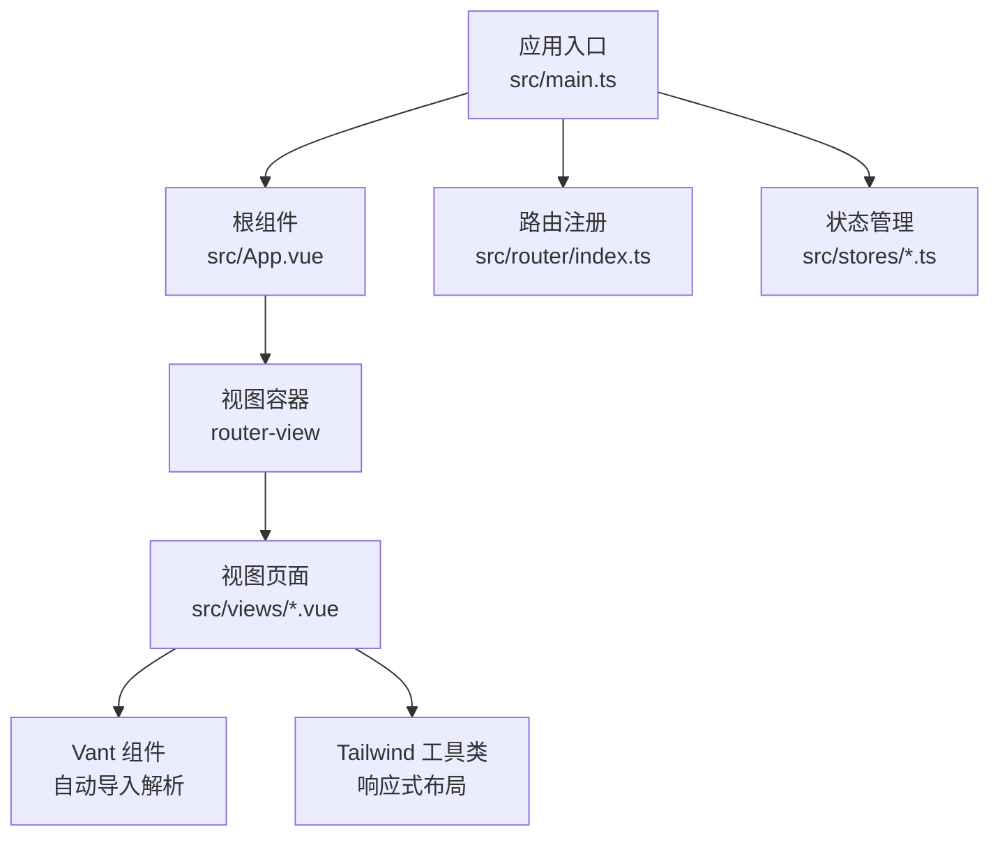
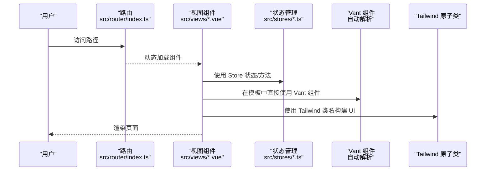
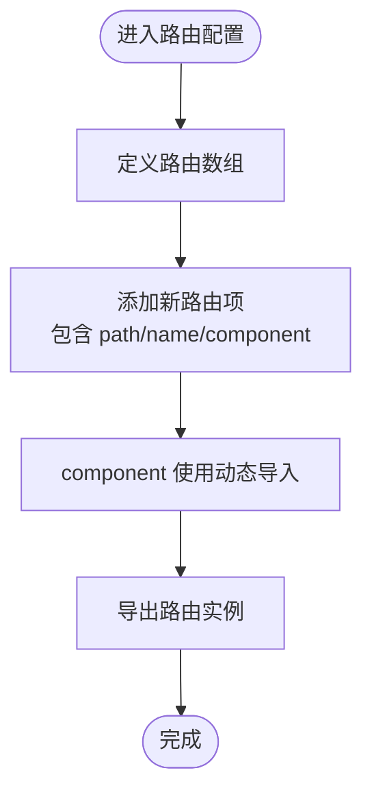
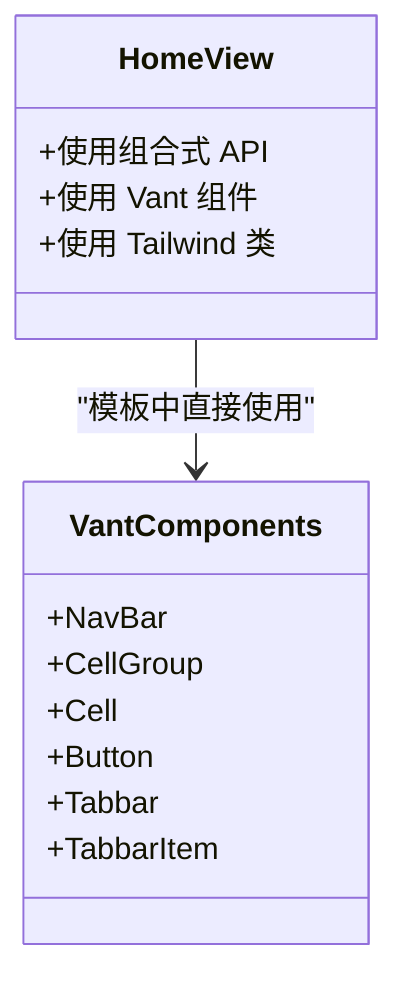
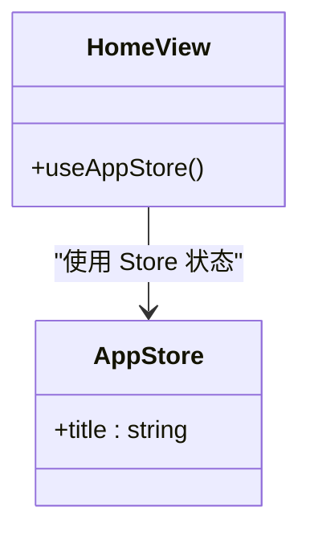
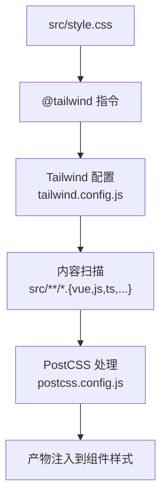
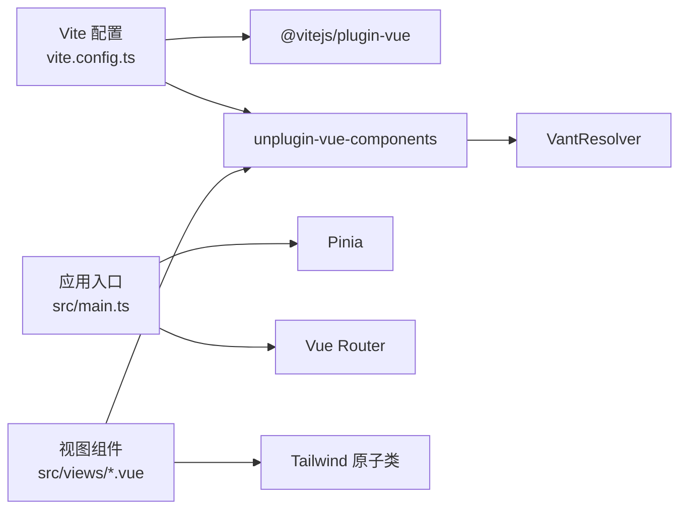

# 开发实践

<cite>
**本文引用的文件**
- [src/main.ts](file://src/main.ts)
- [src/App.vue](file://src/App.vue)
- [src/router/index.ts](file://src/router/index.ts)
- [src/views/HomeView.vue](file://src/views/HomeView.vue)
- [src/stores/app.ts](file://src/stores/app.ts)
- [vite.config.ts](file://vite.config.ts)
- [components.d.ts](file://components.d.ts)
- [tailwind.config.js](file://tailwind.config.js)
- [src/style.css](file://src/style.css)
- [package.json](file://package.json)
- [src/components/HelloWorld.vue](file://src/components/HelloWorld.vue)
- [tsconfig.json](file://tsconfig.json)
- [postcss.config.js](file://postcss.config.js)
</cite>

## 目录
1. [简介](#简介)
2. [项目结构](#项目结构)
3. [核心组件](#核心组件)
4. [架构总览](#架构总览)
5. [详细组件分析](#详细组件分析)
6. [依赖关系分析](#依赖关系分析)
7. [性能与工程化建议](#性能与工程化建议)
8. [故障排查指南](#故障排查指南)
9. [结论](#结论)
10. [附录：新增功能标准流程](#附录新增功能标准流程)

## 简介
本指南面向在 ainote-web 中新增功能的开发者，基于现有项目结构与工具链，给出可复用的开发实践步骤，覆盖：
- 在 src/views/ 下创建新的 Vue 3 单文件组件（SFC）
- 在 src/router/index.ts 中添加新路由并实现懒加载
- 在 src/stores/ 下创建新的 Pinia Store 模块
- 在模板中直接使用 Vant 组件（得益于自动解析器）
- 利用 Tailwind CSS 快速构建响应式 UI

## 项目结构
项目采用典型的 Vue 3 + Vite + TypeScript + Pinia + Vue Router + Vant + Tailwind CSS 组合，核心入口与模块分布如下：
- 应用入口与全局注册：src/main.ts、src/App.vue
- 路由：src/router/index.ts
- 视图：src/views/*.vue
- 状态管理：src/stores/*.ts
- 样式：src/style.css、tailwind.config.js、postcss.config.js
- 构建与自动导入：vite.config.ts、components.d.ts
- 依赖：package.json

图表来源
- [src/main.ts](file://src/main.ts#L1-L12)
- [src/App.vue](file://src/App.vue#L1-L6)
- [src/router/index.ts](file://src/router/index.ts#L1-L15)
- [src/views/HomeView.vue](file://src/views/HomeView.vue#L1-L47)
- [vite.config.ts](file://vite.config.ts#L1-L19)
- [tailwind.config.js](file://tailwind.config.js#L1-L12)

章节来源
- [src/main.ts](file://src/main.ts#L1-L12)
- [src/App.vue](file://src/App.vue#L1-L6)
- [src/router/index.ts](file://src/router/index.ts#L1-L15)
- [src/views/HomeView.vue](file://src/views/HomeView.vue#L1-L47)
- [vite.config.ts](file://vite.config.ts#L1-L19)
- [tailwind.config.js](file://tailwind.config.js#L1-L12)

## 核心组件
- 应用入口与全局注册：在应用启动时挂载 Pinia 与 Router，并挂载根组件。
- 路由系统：使用 History 模式，路由表定义在 src/router/index.ts，采用动态导入实现懒加载。
- 视图层：采用 Vue 3 SFC，模板中可直接使用 Vant 组件（经由自动解析器生成类型声明）。
- 状态管理：使用 Pinia，Store 以组合式 API 定义，便于在组件中直接使用。
- 样式体系：通过 Tailwind CSS 提供原子类，配合 PostCSS 插件与内容扫描配置。

章节来源
- [src/main.ts](file://src/main.ts#L1-L12)
- [src/router/index.ts](file://src/router/index.ts#L1-L15)
- [src/stores/app.ts](file://src/stores/app.ts#L1-L11)
- [src/views/HomeView.vue](file://src/views/HomeView.vue#L1-L47)
- [vite.config.ts](file://vite.config.ts#L1-L19)
- [components.d.ts](file://components.d.ts#L1-L25)
- [tailwind.config.js](file://tailwind.config.js#L1-L12)
- [src/style.css](file://src/style.css#L1-L26)

## 架构总览
下图展示了从用户访问到页面渲染的关键路径，以及 Vant 自动导入与 Tailwind 响应式样式的协作方式。

图表来源
- [src/router/index.ts](file://src/router/index.ts#L1-L15)
- [src/views/HomeView.vue](file://src/views/HomeView.vue#L1-L47)
- [src/stores/app.ts](file://src/stores/app.ts#L1-L11)
- [vite.config.ts](file://vite.config.ts#L1-L19)
- [components.d.ts](file://components.d.ts#L1-L25)
- [tailwind.config.js](file://tailwind.config.js#L1-L12)

## 详细组件分析

### 路由系统与懒加载
- 路由定义：在路由配置中，使用动态导入的方式加载视图组件，实现按需加载与代码分割。
- 命名约定：路由对象包含 path、name、component 等字段，便于在模板或逻辑中引用。
- 历史模式：使用 History 模式，结合 BASE_URL 配置，适配部署场景。

图表来源
- [src/router/index.ts](file://src/router/index.ts#L1-L15)

章节来源
- [src/router/index.ts](file://src/router/index.ts#L1-L15)

### 视图组件与 Vant 自动导入
- 组件结构：采用 Vue 3 SFC，<script setup> 与组合式 API，便于在模板中直接使用 Vant 组件。
- 自动导入：通过 unplugin-vue-components 与 VantResolver，在模板中无需手动 import Vant 组件即可使用。
- 类型声明：components.d.ts 由插件自动生成，确保 TS 对 Vant 组件的类型感知。

图表来源
- [src/views/HomeView.vue](file://src/views/HomeView.vue#L1-L47)
- [components.d.ts](file://components.d.ts#L1-L25)

章节来源
- [src/views/HomeView.vue](file://src/views/HomeView.vue#L1-L47)
- [components.d.ts](file://components.d.ts#L1-L25)

### Pinia Store 模块
- 定义方式：使用 defineStore 定义 Store，返回响应式状态与方法。
- 组合式 API：Store 内部使用 ref 等响应式 API，便于在组件中解构使用。
- 全局注册：在应用入口中注册 Pinia，组件内通过组合式 API 使用 Store。

图表来源
- [src/stores/app.ts](file://src/stores/app.ts#L1-L11)
- [src/views/HomeView.vue](file://src/views/HomeView.vue#L1-L47)

章节来源
- [src/stores/app.ts](file://src/stores/app.ts#L1-L11)
- [src/views/HomeView.vue](file://src/views/HomeView.vue#L1-L47)

### 样式与响应式布局
- Tailwind 配置：content 扫描 src/**/*.{vue,js,ts,jsx,tsx}，确保原子类被正确打包。
- PostCSS 插件：启用 Tailwind 与 Autoprefixer，保证兼容性与输出优化。
- 全局样式：src/style.css 引入 Tailwind 指令，统一基础样式与根元素变量。

图表来源
- [src/style.css](file://src/style.css#L1-L26)
- [tailwind.config.js](file://tailwind.config.js#L1-L12)
- [postcss.config.js](file://postcss.config.js#L1-L6)

章节来源
- [src/style.css](file://src/style.css#L1-L26)
- [tailwind.config.js](file://tailwind.config.js#L1-L12)
- [postcss.config.js](file://postcss.config.js#L1-L6)

## 依赖关系分析
- 构建与自动导入：Vite 插件链路包含 @vitejs/plugin-vue、unplugin-vue-components 与 VantResolver，实现 Vant 组件的自动导入与类型声明生成。
- 应用注册：main.ts 注册 Pinia 与 Router，App.vue 仅负责渲染 router-view。
- 依赖清单：package.json 明确了 Vue、Vue Router、Pinia、Vant、Tailwind CSS、Vite 等核心依赖。

图表来源
- [vite.config.ts](file://vite.config.ts#L1-L19)
- [src/main.ts](file://src/main.ts#L1-L12)
- [src/views/HomeView.vue](file://src/views/HomeView.vue#L1-L47)
- [tailwind.config.js](file://tailwind.config.js#L1-L12)

章节来源
- [vite.config.ts](file://vite.config.ts#L1-L19)
- [src/main.ts](file://src/main.ts#L1-L12)
- [package.json](file://package.json#L1-L32)

## 性能与工程化建议
- 路由懒加载：继续沿用动态导入策略，避免首屏加载过多代码。
- 组件按需：Vant 组件已通过自动解析器按需引入，保持模板中直接使用即可。
- Tailwind 内容扫描：确保 tailwind.config.js 的 content 覆盖所有可能使用原子类的文件，避免无用样式被打包。
- 构建优化：在生产构建前运行预览，检查路由与组件是否正常加载。
- 类型安全：components.d.ts 由插件生成，避免手动维护，减少类型错误。

## 故障排查指南
- Vant 组件无法识别：
  - 检查 vite.config.ts 是否配置了 VantResolver 与 unplugin-vue-components。
  - 确认 components.d.ts 是否存在且包含 Vant 组件类型。
- Tailwind 类无效：
  - 检查 src/style.css 是否引入了 @tailwind 指令。
  - 确认 tailwind.config.js 的 content 是否包含当前文件路径。
  - 检查 postcss.config.js 是否启用 Tailwind 与 Autoprefixer。
- 路由跳转异常：
  - 确认路由配置中的 path 与 name 正确。
  - 检查动态导入路径是否指向正确的视图组件。
- Store 状态未更新：
  - 确认在组件中使用了组合式 API 获取 Store 实例。
  - 检查 Store 返回的状态是否为响应式 ref 或 computed。

章节来源
- [vite.config.ts](file://vite.config.ts#L1-L19)
- [components.d.ts](file://components.d.ts#L1-L25)
- [src/style.css](file://src/style.css#L1-L26)
- [tailwind.config.js](file://tailwind.config.js#L1-L12)
- [postcss.config.js](file://postcss.config.js#L1-L6)
- [src/router/index.ts](file://src/router/index.ts#L1-L15)
- [src/stores/app.ts](file://src/stores/app.ts#L1-L11)

## 结论
通过遵循本指南的新增功能流程，开发者可以在 ainote-web 中高效地扩展页面、路由与状态管理，同时充分利用 Vant 自动导入与 Tailwind 原子类提升开发效率与一致性。建议在每次新增功能后，同步完善路由、Store 与样式配置，并进行本地预览验证。

## 附录：新增功能标准流程
以下流程以“新增一个名为 NewFeature 的页面”为例，给出可操作步骤与参考位置。

- 在 src/views/ 下创建新页面组件
  - 参考现有视图组件结构，采用 Vue 3 SFC 与 <script setup>。
  - 示例参考：[src/views/HomeView.vue](file://src/views/HomeView.vue#L1-L47)
  - 如需使用 Vant 组件，可在模板中直接使用，无需手动 import。
  - 示例参考：[vite.config.ts](file://vite.config.ts#L1-L19)、[components.d.ts](file://components.d.ts#L1-L25)

- 在 src/router/index.ts 中添加新路由
  - 新增路由对象，包含 path、name、component 字段。
  - component 使用动态导入实现懒加载。
  - 示例参考：[src/router/index.ts](file://src/router/index.ts#L1-L15)

- 在 src/stores/ 下创建新的 Pinia Store 模块
  - 使用 defineStore 定义 Store，返回响应式状态与方法。
  - 在组件中通过组合式 API 使用 Store。
  - 示例参考：[src/stores/app.ts](file://src/stores/app.ts#L1-L11)、[src/views/HomeView.vue](file://src/views/HomeView.vue#L1-L47)

- 在模板中使用 Vant 组件
  - 无需手动 import，直接在模板中使用 Vant 组件。
  - 类型声明由插件自动生成，确保 TS 支持。
  - 示例参考：[components.d.ts](file://components.d.ts#L1-L25)

- 利用 Tailwind CSS 快速构建响应式 UI
  - 在组件模板中直接使用原子类，确保 tailwind.config.js 的 content 覆盖当前文件。
  - 示例参考：[tailwind.config.js](file://tailwind.config.js#L1-L12)、[src/style.css](file://src/style.css#L1-L26)

- 运行与验证
  - 启动开发服务器，访问新增路由，确认页面渲染与交互正常。
  - 生产构建预览，检查懒加载与样式是否生效。
  - 示例参考：[package.json](file://package.json#L1-L32)、[src/main.ts](file://src/main.ts#L1-L12)