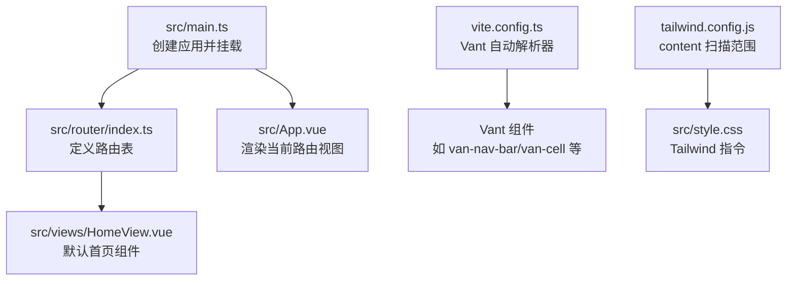
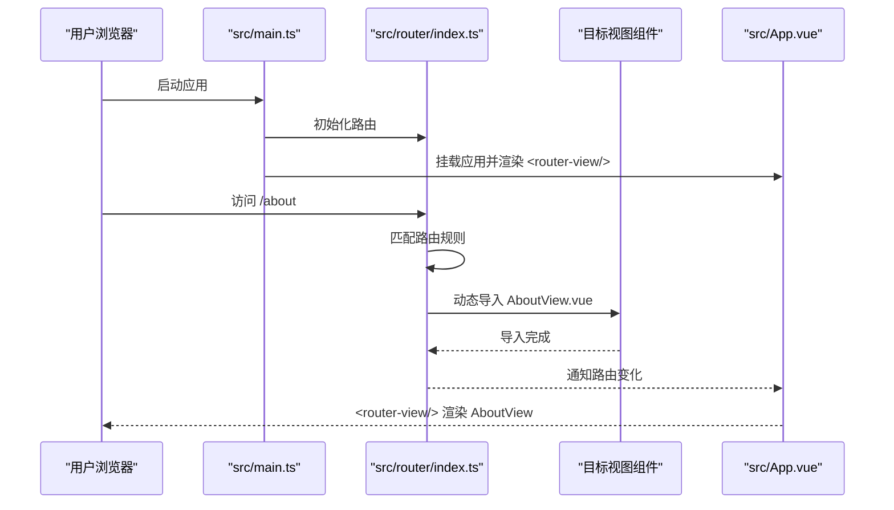
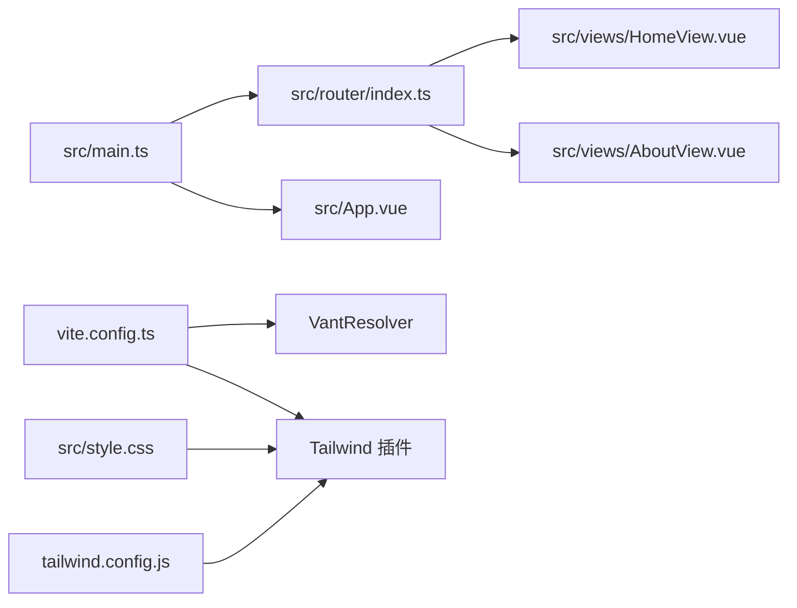

# 添加新页面

<cite>
**本文引用的文件**
- [src/router/index.ts](file://src/router/index.ts)
- [src/views/HomeView.vue](file://src/views/HomeView.vue)
- [src/App.vue](file://src/App.vue)
- [src/main.ts](file://src/main.ts)
- [vite.config.ts](file://vite.config.ts)
- [tailwind.config.js](file://tailwind.config.js)
- [src/style.css](file://src/style.css)
- [src/stores/app.ts](file://src/stores/app.ts)
- [package.json](file://package.json)
</cite>

## 目录
1. [简介](#简介)
2. [项目结构](#项目结构)
3. [核心组件](#核心组件)
4. [架构总览](#架构总览)
5. [详细组件分析](#详细组件分析)
6. [依赖关系分析](#依赖关系分析)
7. [性能考虑](#性能考虑)
8. [故障排查指南](#故障排查指南)
9. [结论](#结论)
10. [附录](#附录)

## 简介
本指南面向希望在 ainote-web 项目中添加新页面组件的开发者。文档将基于现有代码库的实际实现，给出从创建 Vue 单文件组件（SFC）到配置路由、引入 UI 库与样式系统的完整流程，并提供“创建 AboutView 并添加 /about 路由”的完整示例步骤，确保新页面能正确懒加载与渲染。

## 项目结构
ainote-web 采用 Vue 3 + Vite + TypeScript + Pinia + Vue Router + Vant 4 + Tailwind CSS 的技术栈。页面组件统一放置于 src/views 下，路由配置位于 src/router/index.ts，应用入口在 src/main.ts 中注册路由与状态管理，UI 组件通过 unplugin-vue-components 与 Vant 自动解析器按需引入，Tailwind CSS 通过 PostCSS 插件自动扫描并生成所需类名。

图表来源
- [src/main.ts](file://src/main.ts#L1-L12)
- [src/router/index.ts](file://src/router/index.ts#L1-L15)
- [src/App.vue](file://src/App.vue#L1-L6)
- [vite.config.ts](file://vite.config.ts#L1-L19)
- [tailwind.config.js](file://tailwind.config.js#L1-L12)
- [src/style.css](file://src/style.css#L1-L26)

章节来源
- [src/main.ts](file://src/main.ts#L1-L12)
- [src/router/index.ts](file://src/router/index.ts#L1-L15)
- [src/App.vue](file://src/App.vue#L1-L6)
- [vite.config.ts](file://vite.config.ts#L1-L19)
- [tailwind.config.js](file://tailwind.config.js#L1-L12)
- [src/style.css](file://src/style.css#L1-L26)

## 核心组件
- 路由配置：在 src/router/index.ts 中定义路由表，使用 history 模式与动态导入实现懒加载。
- 视图组件：在 src/views 下新增 SFC，使用 <script setup> 语法与 Composition API，模板中可直接使用 Vant 组件与 Tailwind CSS 类名。
- 应用入口：在 src/main.ts 中注册 Pinia 与 Vue Router，并挂载应用。
- UI 与样式：通过 vite.config.ts 的 Vant 自动解析器与 tailwind.config.js 的 content 扫描，结合 src/style.css 中的 Tailwind 指令，实现按需引入与样式生效。

章节来源
- [src/router/index.ts](file://src/router/index.ts#L1-L15)
- [src/views/HomeView.vue](file://src/views/HomeView.vue#L1-L47)
- [src/main.ts](file://src/main.ts#L1-L12)
- [vite.config.ts](file://vite.config.ts#L1-L19)
- [tailwind.config.js](file://tailwind.config.js#L1-L12)
- [src/style.css](file://src/style.css#L1-L26)

## 架构总览
下面的时序图展示了从浏览器访问新路由到页面渲染的关键调用链：应用启动后，根据当前 URL 匹配路由表中的规则，动态导入目标组件并通过 <router-view/> 渲染。

图表来源
- [src/main.ts](file://src/main.ts#L1-L12)
- [src/router/index.ts](file://src/router/index.ts#L1-L15)
- [src/App.vue](file://src/App.vue#L1-L6)

## 详细组件分析

### 新建页面组件（以 AboutView.vue 为例）
- 在 src/views/ 目录下创建新的单文件组件，使用 <script setup> 语法组织逻辑。
- 在模板中使用 Vant 组件（如导航栏、单元格、按钮等）与 Tailwind CSS 类名构建 UI。
- 可按需引入 Pinia Store 或其他工具函数，保持组件职责单一。
- 建议为组件编写 scoped 样式或使用 Tailwind 工具类，避免全局污染。

章节来源
- [src/views/HomeView.vue](file://src/views/HomeView.vue#L1-L47)
- [src/stores/app.ts](file://src/stores/app.ts#L1-L11)

### 配置路由（以 /about 为例）
- 在 src/router/index.ts 中添加一条新路由规则：
  - 使用 history 模式与 createWebHistory。
  - 为新路由提供唯一的 path 与 name。
  - 使用动态导入（() => import('@/views/AboutView.vue')）实现懒加载。
- 确保路由表中已存在基础路由（如根路径 '/'），以便测试跳转与回退。
- 如需嵌套路由或命名视图，可在现有基础上扩展。

章节来源
- [src/router/index.ts](file://src/router/index.ts#L1-L15)

### 应用入口与渲染
- src/main.ts 中创建应用实例，注册 Pinia 与 Vue Router，最后挂载到 DOM。
- src/App.vue 仅包含 <router-view/>，用于承载当前路由对应的视图组件。
- 若需要全局布局或通用容器，可在 App.vue 或新增的布局组件中实现。

章节来源
- [src/main.ts](file://src/main.ts#L1-L12)
- [src/App.vue](file://src/App.vue#L1-L6)

### UI 与样式集成
- Vant 组件通过 vite.config.ts 中的 VantResolver 实现自动按需引入，无需手动 import。
- Tailwind CSS 通过 src/style.css 中的 @tailwind 指令启用，并由 tailwind.config.js 的 content 配置扫描 src/**/* 文件生成所需类名。
- 在组件模板中直接使用 Tailwind 类名即可生效；如需自定义主题，可在 tailwind.config.js 中扩展 theme。

章节来源
- [vite.config.ts](file://vite.config.ts#L1-L19)
- [tailwind.config.js](file://tailwind.config.js#L1-L12)
- [src/style.css](file://src/style.css#L1-L26)

### 完整示例：创建 AboutView 并添加 /about 路由
以下为操作步骤与参考位置（不直接展示代码内容）：
1. 创建组件文件
   - 在 src/views/ 下新建 AboutView.vue，并在其中使用 <script setup> 编写逻辑与模板。
   - 模板中可使用 Vant 组件与 Tailwind 类名。
   - 参考现有组件结构与样式实践：[src/views/HomeView.vue](file://src/views/HomeView.vue#L1-L47)
2. 引入组件与样式
   - 确认 vite.config.ts 已配置 VantResolver，使 Vant 组件可直接使用：[vite.config.ts](file://vite.config.ts#L1-L19)
   - 确认 src/style.css 中包含 Tailwind 指令，tailwind.config.js 的 content 覆盖到 src/**/*：[src/style.css](file://src/style.css#L1-L26)，[tailwind.config.js](file://tailwind.config.js#L1-L12)
3. 配置路由
   - 在 src/router/index.ts 中添加新路由规则，使用动态导入与唯一 path/name：[src/router/index.ts](file://src/router/index.ts#L1-L15)
4. 启动与验证
   - 运行开发服务器并访问 /about，确认页面正确渲染且无报错。
   - 可通过浏览器开发者工具查看网络面板，确认 AboutView.vue 为懒加载资源。

章节来源
- [src/views/HomeView.vue](file://src/views/HomeView.vue#L1-L47)
- [vite.config.ts](file://vite.config.ts#L1-L19)
- [tailwind.config.js](file://tailwind.config.js#L1-L12)
- [src/style.css](file://src/style.css#L1-L26)
- [src/router/index.ts](file://src/router/index.ts#L1-L15)

## 依赖关系分析
- 组件与路由：路由表决定哪些组件会被动态导入；<router-view/> 决定当前视图渲染哪个组件。
- UI 库与自动解析：Vant 通过 VantResolver 自动解析，减少手动 import；Tailwind 通过 PostCSS 插件扫描类名。
- 状态管理：Pinia 在 main.ts 注册，组件内可按需使用 Store。

图表来源
- [src/router/index.ts](file://src/router/index.ts#L1-L15)
- [src/views/HomeView.vue](file://src/views/HomeView.vue#L1-L47)
- [src/views/AboutView.vue](file://src/views/AboutView.vue)
- [src/main.ts](file://src/main.ts#L1-L12)
- [src/App.vue](file://src/App.vue#L1-L6)
- [vite.config.ts](file://vite.config.ts#L1-L19)
- [src/style.css](file://src/style.css#L1-L26)
- [tailwind.config.js](file://tailwind.config.js#L1-L12)

章节来源
- [src/router/index.ts](file://src/router/index.ts#L1-L15)
- [src/main.ts](file://src/main.ts#L1-L12)
- [vite.config.ts](file://vite.config.ts#L1-L19)
- [tailwind.config.js](file://tailwind.config.js#L1-L12)
- [src/style.css](file://src/style.css#L1-L26)

## 性能考虑
- 懒加载：通过动态导入实现按需加载，减小首屏体积，提升初始加载速度。
- 组件拆分：将页面拆分为多个小组件，配合 Vant 的自动解析，避免不必要的包体增长。
- Tailwind 扫描：确保 tailwind.config.js 的 content 覆盖到实际使用的目录，避免生成冗余样式。
- 资源优化：生产构建时由 Vite 处理代码分割与压缩，建议开启预加载策略（如需要）。

## 故障排查指南
- 路由无法匹配
  - 检查路由表是否包含正确的 path 与 name，以及动态导入路径是否正确：[src/router/index.ts](file://src/router/index.ts#L1-L15)
- 页面空白或组件未渲染
  - 确认 <router-view/> 是否存在于应用根组件中：[src/App.vue](file://src/App.vue#L1-L6)
- Vant 组件未生效
  - 确认 vite.config.ts 中已启用 VantResolver：[vite.config.ts](file://vite.config.ts#L1-L19)
  - 确认组件模板中使用了正确的 Vant 组件标签与属性。
- Tailwind 类名无效
  - 确认 src/style.css 中包含 @tailwind 指令：[src/style.css](file://src/style.css#L1-L26)
  - 确认 tailwind.config.js 的 content 能扫描到当前文件：[tailwind.config.js](file://tailwind.config.js#L1-L12)
- 样式冲突或覆盖
  - 使用 scoped 样式或更语义化的 Tailwind 类名，避免全局样式污染。
- 开发服务器热更新异常
  - 清理缓存并重启开发服务器，检查依赖安装是否完整：[package.json](file://package.json#L1-L32)

章节来源
- [src/router/index.ts](file://src/router/index.ts#L1-L15)
- [src/App.vue](file://src/App.vue#L1-L6)
- [vite.config.ts](file://vite.config.ts#L1-L19)
- [tailwind.config.js](file://tailwind.config.js#L1-L12)
- [src/style.css](file://src/style.css#L1-L26)
- [package.json](file://package.json#L1-L32)

## 结论
通过遵循本指南，您可以在 ainote-web 项目中快速添加新页面：先在 src/views 下创建 SFC 并使用 Vant 与 Tailwind 构建 UI，再在 src/router/index.ts 中以动态导入方式添加路由规则，最后在 src/main.ts 中确保路由已注册并由 <router-view/> 渲染。以上流程已在现有代码库中得到验证，可直接复用到新页面开发中。

## 附录
- 推荐的组件命名规范：视图组件以 View 结尾（如 HomeView.vue、AboutView.vue），便于识别页面级组件。
- 路由命名建议：使用全小写与短横线组合，保证 path 与 name 唯一且语义清晰。
- 依赖版本：项目使用 Vue 3、Vue Router、Vant 4、Tailwind CSS 4 与 Vite，确保新增功能与现有依赖兼容。