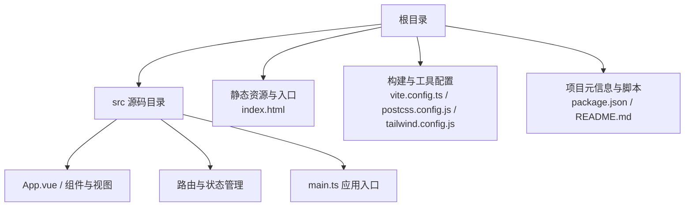
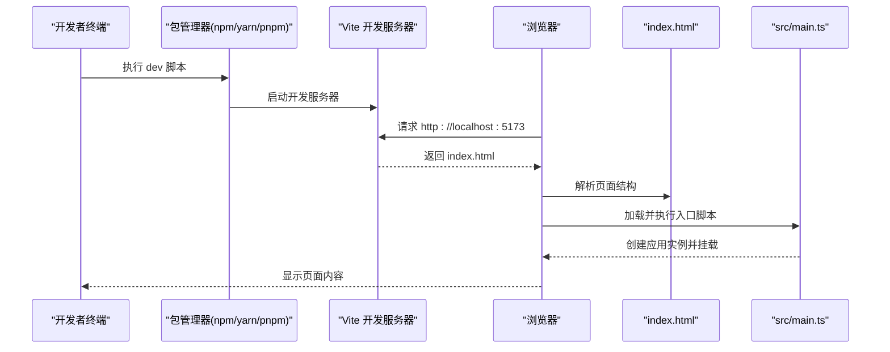
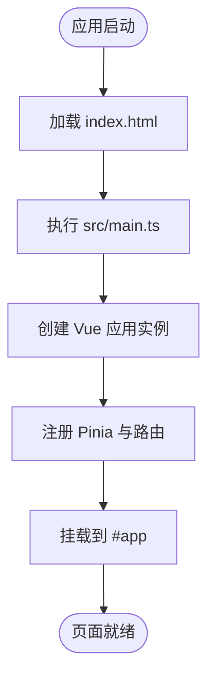

# 快速开始指南

<cite>
**本文引用的文件**
- [package.json](file://package.json)
- [README.md](file://README.md)
- [vite.config.ts](file://vite.config.ts)
- [index.html](file://index.html)
- [src/main.ts](file://src/main.ts)
- [postcss.config.js](file://postcss.config.js)
- [tailwind.config.js](file://tailwind.config.js)
</cite>

## 目录
1. [简介](#简介)
2. [项目结构](#项目结构)
3. [核心组件](#核心组件)
4. [架构总览](#架构总览)
5. [详细组件分析](#详细组件分析)
6. [依赖分析](#依赖分析)
7. [性能注意事项](#性能注意事项)
8. [故障排查指南](#故障排查指南)
9. [结论](#结论)
10. [附录](#附录)

## 简介
本指南面向首次接触 ainote-web 的开发者，帮助你在本地环境中快速完成项目的安装与启动。你将学会：
- 准备 Node.js 运行环境（推荐使用 Node.js LTS）
- 安装依赖（支持 npm、yarn 或 pnpm）
- 启动开发服务器并访问默认地址
- 构建生产版本与预览构建结果
- 常见初始化问题的排查思路

本指南严格依据仓库中的配置与脚本，确保每一步都可复现。

## 项目结构
该项目采用 Vue 3 + TypeScript + Vite 的现代前端工程化方案，核心入口为 HTML 页面与 TypeScript 入口文件，配合 Vite 提供开发服务器与打包能力。

图表来源
- [index.html](file://index.html#L1-L14)
- [src/main.ts](file://src/main.ts#L1-L12)
- [vite.config.ts](file://vite.config.ts#L1-L19)
- [postcss.config.js](file://postcss.config.js#L1-L6)
- [tailwind.config.js](file://tailwind.config.js#L1-L12)
- [package.json](file://package.json#L1-L31)

章节来源
- [README.md](file://README.md#L1-L6)
- [package.json](file://package.json#L1-L31)

## 核心组件
- 开发服务器与脚本
  - 开发模式：通过 package.json 中的 dev 脚本启动 Vite 开发服务器
  - 生产构建：通过 build 脚本进行类型检查与打包
  - 预览构建：通过 preview 脚本启动静态预览服务器
- 应用入口
  - index.html 提供挂载点与入口脚本加载
  - src/main.ts 创建 Vue 应用实例，注册 Pinia、路由与全局样式，并挂载到 DOM
- 构建与样式
  - vite.config.ts 配置了 Vue 插件与自动组件导入（Vant Resolver）
  - postcss.config.js 与 tailwind.config.js 支持 TailwindCSS 流式样式体系

章节来源
- [package.json](file://package.json#L1-L31)
- [index.html](file://index.html#L1-L14)
- [src/main.ts](file://src/main.ts#L1-L12)
- [vite.config.ts](file://vite.config.ts#L1-L19)
- [postcss.config.js](file://postcss.config.js#L1-L6)
- [tailwind.config.js](file://tailwind.config.js#L1-L12)

## 架构总览
下图展示了从命令行到浏览器的关键流程：开发者执行 npm/yarn/pnpm 脚本，Vite 启动开发服务器，浏览器加载 index.html 并由 main.ts 初始化应用。

图表来源
- [package.json](file://package.json#L1-L31)
- [index.html](file://index.html#L1-L14)
- [src/main.ts](file://src/main.ts#L1-L12)

## 详细组件分析

### 启动与访问流程
- 启动开发服务器
  - 使用包管理器执行 dev 脚本，Vite 将启动本地开发服务器
  - 默认访问地址为 http://localhost:5173（Vite 默认端口）
- 访问应用
  - 在浏览器中打开上述地址，即可看到页面渲染
- 构建与预览
  - 生产构建：执行 build 脚本生成优化后的产物
  - 预览构建：执行 preview 脚本在本地预览构建结果

章节来源
- [package.json](file://package.json#L1-L31)
- [index.html](file://index.html#L1-L14)
- [src/main.ts](file://src/main.ts#L1-L12)

### 应用入口与插件配置
- 入口文件职责
  - 创建 Vue 应用实例
  - 注册 Pinia 状态管理与路由
  - 引入全局样式
  - 挂载到页面元素
- Vite 插件链
  - Vue 单文件组件支持
  - 自动组件导入（结合 Vant Resolver 实现按需引入）

图表来源
- [index.html](file://index.html#L1-L14)
- [src/main.ts](file://src/main.ts#L1-L12)
- [vite.config.ts](file://vite.config.ts#L1-L19)

章节来源
- [src/main.ts](file://src/main.ts#L1-L12)
- [vite.config.ts](file://vite.config.ts#L1-L19)

### 样式与工具链
- TailwindCSS 集成
  - 通过 tailwind.config.js 指定扫描范围与基础配置
  - 通过 postcss.config.js 启用 TailwindCSS 与 Autoprefixer
- Vite 配置
  - 别名 @ 指向 src 目录，便于模块导入
  - 插件链包含 Vue 与自动组件导入

章节来源
- [tailwind.config.js](file://tailwind.config.js#L1-L12)
- [postcss.config.js](file://postcss.config.js#L1-L6)
- [vite.config.ts](file://vite.config.ts#L1-L19)

## 依赖分析
- 运行时依赖
  - Vue：核心框架
- 开发时依赖
  - Vite：开发服务器与打包工具
  - Vue Router、Pinia：路由与状态管理
  - TailwindCSS 及相关 PostCSS 插件：样式系统
  - unplugin-vue-components 与 @vant/auto-import-resolver：组件自动导入与 Vant 按需引入
  - vue-tsc：类型检查与编译辅助
  - TypeScript 与相关类型定义：类型支持

章节来源
- [package.json](file://package.json#L1-L31)

## 性能注意事项
- 开发阶段优先使用 dev 脚本，以获得热更新与更快的响应速度
- 生产构建前确保清理缓存与临时文件，避免历史构建影响
- 如需预览生产效果，使用 preview 脚本启动本地预览服务，确认构建产物可用后再部署

## 故障排查指南
- 依赖安装失败
  - 症状：安装过程中报错或卡住
  - 排查要点：
    - 确认网络环境稳定，必要时切换为国内镜像源
    - 清理缓存后重试（不同包管理器的清理方式不同）
    - 确认 Node.js 版本满足项目要求（建议使用 LTS）
- 端口占用
  - 症状：启动开发服务器时报端口冲突
  - 排查要点：
    - 默认开发端口为 5173，若被占用，可在 Vite 配置中调整端口
    - 关闭占用该端口的其他进程
- 构建失败
  - 症状：build 脚本执行中断或输出错误
  - 排查要点：
    - 检查 TypeScript 类型错误
    - 确认所有依赖均已正确安装
    - 清理 node_modules 与 lock 文件后重新安装
- 预览无法访问
  - 症状：preview 启动后无法打开页面
  - 排查要点：
    - 确认已先执行 build 生成产物
    - 检查防火墙或安全软件是否拦截
    - 尝试更换端口或关闭占用端口的程序

## 结论
按照本指南的步骤，你可以顺利在本地安装并启动 ainote-web 项目。开发阶段使用 dev 脚本，生产阶段使用 build 与 preview 脚本。遇到问题时，优先检查依赖安装、端口占用与构建产物完整性。祝你开发顺利！

## 附录
- 常用命令参考
  - 安装依赖：使用 npm、yarn 或 pnpm 任一工具执行安装
  - 启动开发服务器：执行 dev 脚本
  - 构建生产版本：执行 build 脚本
  - 预览构建结果：执行 preview 脚本
- 默认访问地址
  - 开发服务器默认地址为 http://localhost:5173

章节来源
- [package.json](file://package.json#L1-L31)
- [index.html](file://index.html#L1-L14)
- [src/main.ts](file://src/main.ts#L1-L12)