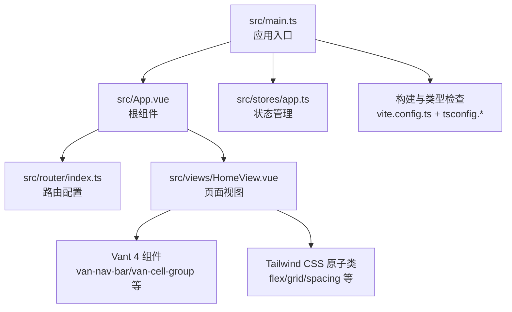
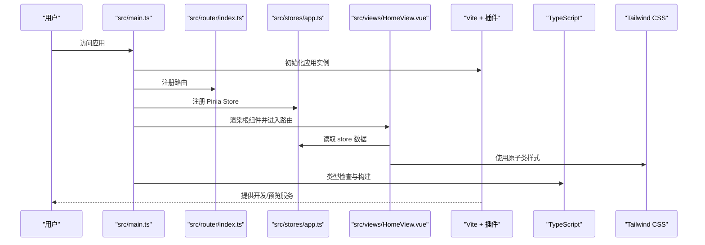

# 技术栈与依赖

<cite>
**本文引用的文件列表**
- [package.json](file://package.json)
- [vite.config.ts](file://vite.config.ts)
- [tsconfig.json](file://tsconfig.json)
- [tsconfig.app.json](file://tsconfig.app.json)
- [tsconfig.node.json](file://tsconfig.node.json)
- [postcss.config.js](file://postcss.config.js)
- [tailwind.config.js](file://tailwind.config.js)
- [src/main.ts](file://src/main.ts)
- [src/App.vue](file://src/App.vue)
- [src/router/index.ts](file://src/router/index.ts)
- [src/stores/app.ts](file://src/stores/app.ts)
- [src/views/HomeView.vue](file://src/views/HomeView.vue)
- [src/style.css](file://src/style.css)
</cite>

## 目录
1. [引言](#引言)
2. [项目结构](#项目结构)
3. [核心组件](#核心组件)
4. [架构总览](#架构总览)
5. [详细组件分析](#详细组件分析)
6. [依赖分析](#依赖分析)
7. [性能考量](#性能考量)
8. [故障排查指南](#故障排查指南)
9. [结论](#结论)
10. [附录](#附录)

## 引言
本文件围绕 ainote-web 的技术栈与依赖进行系统性说明，重点覆盖以下方面：
- 运行时与开发依赖的关键包及其版本
- 每个技术选型的作用与优势
- 各技术如何协同工作以实现高效开发与高性能运行
- 对关键配置文件（如 vite.config.ts、tsconfig.json、tailwind.config.js、postcss.config.js）的简要解读

## 项目结构
ainote-web 采用典型的 Vue 3 单页应用结构，结合 Vite 构建、TypeScript 类型系统、Pinia 状态管理、Vue Router 路由系统、Vant 4 移动 UI 组件库以及 Tailwind CSS 原子化样式方案。核心入口在 src/main.ts 中创建应用并挂载到 DOM；路由与状态管理分别在 src/router 与 src/stores 下组织；UI 层通过 Vant 4 组件与 Tailwind CSS 原子类组合实现。

图表来源
- [src/main.ts](file://src/main.ts#L1-L12)
- [src/App.vue](file://src/App.vue#L1-L6)
- [src/router/index.ts](file://src/router/index.ts#L1-L15)
- [src/stores/app.ts](file://src/stores/app.ts#L1-L11)
- [src/views/HomeView.vue](file://src/views/HomeView.vue#L1-L47)
- [vite.config.ts](file://vite.config.ts#L1-L19)
- [tsconfig.json](file://tsconfig.json#L1-L8)

章节来源
- [src/main.ts](file://src/main.ts#L1-L12)
- [src/App.vue](file://src/App.vue#L1-L6)
- [src/router/index.ts](file://src/router/index.ts#L1-L15)
- [src/stores/app.ts](file://src/stores/app.ts#L1-L11)
- [src/views/HomeView.vue](file://src/views/HomeView.vue#L1-L47)

## 核心组件
- Vue 3（Composition API 与 <script setup>）
  - 使用 <script setup> 与 Composition API 编写组件逻辑，简化样板代码，提升可读性与维护性。
  - 在 HomeView.vue 中演示了响应式 ref、store 注入与事件处理。
- Vite 构建工具
  - 提供快速的开发服务器与热更新能力；生产构建优化打包体积与加载性能。
  - 通过插件体系集成 Vue 单文件组件与自动导入解析器。
- TypeScript 类型系统
  - 通过多份 tsconfig 文件分离应用与 Node 工具链的编译配置，启用严格模式与未使用项检查，提升类型安全。
- Pinia 状态管理
  - 轻量、易用且具备良好 TypeScript 支持的状态容器；在 app.ts 中定义 store 并在组件中注入使用。
- Vue Router 路由系统
  - 基于 History 模式的路由配置，支持动态导入页面组件，实现按需加载与懒加载。
- Vant 4 移动 UI 组件库
  - 提供移动端常用组件（导航栏、单元格、按钮、标签栏等），配合自动导入解析器减少手动引入成本。
- Tailwind CSS 原子化样式方案
  - 通过原子类快速构建界面，结合 PostCSS 插件链与内容扫描，确保产物体积可控。

章节来源
- [src/views/HomeView.vue](file://src/views/HomeView.vue#L1-L47)
- [src/stores/app.ts](file://src/stores/app.ts#L1-L11)
- [src/router/index.ts](file://src/router/index.ts#L1-L15)
- [vite.config.ts](file://vite.config.ts#L1-L19)
- [tsconfig.app.json](file://tsconfig.app.json#L1-L20)
- [tsconfig.node.json](file://tsconfig.node.json#L1-L27)
- [tailwind.config.js](file://tailwind.config.js#L1-L12)
- [postcss.config.js](file://postcss.config.js#L1-L6)

## 架构总览
下图展示了从入口到页面渲染、路由与状态管理的整体流程，以及构建与样式的集成路径。

图表来源
- [src/main.ts](file://src/main.ts#L1-L12)
- [src/router/index.ts](file://src/router/index.ts#L1-L15)
- [src/stores/app.ts](file://src/stores/app.ts#L1-L11)
- [src/views/HomeView.vue](file://src/views/HomeView.vue#L1-L47)
- [vite.config.ts](file://vite.config.ts#L1-L19)
- [tsconfig.json](file://tsconfig.json#L1-L8)
- [tailwind.config.js](file://tailwind.config.js#L1-L12)

## 详细组件分析

### Vue 应用初始化与挂载
- 入口文件负责创建应用实例、注册路由与状态管理，并将应用挂载至 DOM。
- 该流程体现了“约定优于配置”的工程化实践：通过集中注册，降低重复样板代码。

章节来源
- [src/main.ts](file://src/main.ts#L1-L12)

### 路由系统（Vue Router）
- 使用 History 模式与动态导入，实现页面级懒加载，减少首屏体积。
- 路由表简单清晰，便于扩展更多页面与嵌套路由。

章节来源
- [src/router/index.ts](file://src/router/index.ts#L1-L15)

### 状态管理（Pinia）
- 使用 defineStore 定义 store，导出可复用的逻辑模块。
- 在组件中通过 Composition API 注入 store，实现响应式数据与方法的访问。

章节来源
- [src/stores/app.ts](file://src/stores/app.ts#L1-L11)
- [src/views/HomeView.vue](file://src/views/HomeView.vue#L1-L47)

### UI 组件与样式（Vant 4 + Tailwind CSS）
- Vant 4 通过自动导入解析器在构建期按需解析组件，减少手动引入成本。
- Tailwind CSS 通过原子类快速布局，结合内容扫描与 PostCSS 插件链，确保产物体积可控。

章节来源
- [vite.config.ts](file://vite.config.ts#L1-L19)
- [tailwind.config.js](file://tailwind.config.js#L1-L12)
- [postcss.config.js](file://postcss.config.js#L1-L6)
- [src/views/HomeView.vue](file://src/views/HomeView.vue#L1-L47)
- [src/style.css](file://src/style.css#L1-L26)

### TypeScript 配置
- 多份 tsconfig 分离应用与 Node 工具链配置，启用严格模式与未使用项检查，提升类型安全与可维护性。
- 应用侧启用路径别名与 Vite 类型，Node 侧采用 bundler 模式解析，避免打包错误。

章节来源
- [tsconfig.json](file://tsconfig.json#L1-L8)
- [tsconfig.app.json](file://tsconfig.app.json#L1-L20)
- [tsconfig.node.json](file://tsconfig.node.json#L1-L27)

### 构建与开发体验（Vite）
- 通过插件体系集成 Vue 单文件组件与 Vant 自动导入解析器，提升开发效率。
- 别名配置简化路径引用，提升开发体验。

章节来源
- [vite.config.ts](file://vite.config.ts#L1-L19)

## 依赖分析
- 运行时依赖
  - vue：核心框架，提供响应式与组件模型。
  - pinia：轻量级状态管理，与 Vue 3 深度契合。
  - vue-router：官方路由库，支持 History 模式与动态导入。
  - vant：移动端 UI 组件库，提供丰富的业务组件。
- 开发依赖
  - vite：现代化构建工具，提供快速开发与高效打包。
  - typescript：强类型语言，提升代码质量与可维护性。
  - @vitejs/plugin-vue：Vue 单文件组件支持。
  - unplugin-vue-components：组件自动导入，减少样板代码。
  - @vant/auto-import-resolver：Vant 组件自动导入解析器。
  - tailwindcss、@tailwindcss/postcss、autoprefixer：样式工具链，支持原子类与浏览器兼容。
  - @vue/tsconfig：Vue 推荐的 TypeScript 配置基线。
  - vue-tsc：类型检查与声明生成，保障构建前类型安全。

章节来源
- [package.json](file://package.json#L1-L32)
- [vite.config.ts](file://vite.config.ts#L1-L19)
- [tsconfig.app.json](file://tsconfig.app.json#L1-L20)
- [tsconfig.node.json](file://tsconfig.node.json#L1-L27)
- [tailwind.config.js](file://tailwind.config.js#L1-L12)
- [postcss.config.js](file://postcss.config.js#L1-L6)

## 性能考量
- 懒加载与按需构建：路由与组件均采用动态导入，减少首屏资源压力。
- 原子类样式裁剪：Tailwind 内容扫描仅保留实际使用的样式，避免无用 CSS。
- 构建优化：Vite 的原生 ESM 与插件生态带来更快的冷启动与热更新。
- 类型检查前置：vue-tsc 在构建阶段执行类型检查，提前发现潜在问题，减少运行时风险。

## 故障排查指南
- 构建失败或类型错误
  - 确认已安装所有依赖并执行类型检查后再构建。
  - 检查 tsconfig.* 是否正确引用与严格模式配置。
- 样式未生效或 Tailwind 未识别
  - 确认 tailwind.config.js 的 content 范围包含目标文件。
  - 确认 postcss.config.js 已启用 Tailwind 与 Autoprefixer 插件。
- Vant 组件无法使用
  - 确认 vite.config.ts 已启用 unplugin-vue-components 与 Vant 解析器。
  - 确认组件在模板中正确使用，且未被 Tree Shaking 错误移除。
- 路由跳转异常
  - 检查路由配置是否正确，确认动态导入路径与别名一致。

章节来源
- [tsconfig.json](file://tsconfig.json#L1-L8)
- [tsconfig.app.json](file://tsconfig.app.json#L1-L20)
- [tsconfig.node.json](file://tsconfig.node.json#L1-L27)
- [tailwind.config.js](file://tailwind.config.js#L1-L12)
- [postcss.config.js](file://postcss.config.js#L1-L6)
- [vite.config.ts](file://vite.config.ts#L1-L19)
- [src/router/index.ts](file://src/router/index.ts#L1-L15)

## 结论
ainote-web 的技术栈以 Vue 3 为核心，结合 Vite、TypeScript、Pinia、Vue Router、Vant 4 与 Tailwind CSS，形成了现代前端工程化的高效组合。通过严格的类型配置、自动导入与按需构建策略，项目在开发体验与运行性能之间取得良好平衡。建议后续根据业务增长逐步完善路由与状态管理的分层设计，并持续优化 Tailwind 内容扫描范围与插件链配置，以进一步提升产物体积与构建速度。

## 附录
- 关键配置文件要点
  - vite.config.ts：启用 Vue 插件与 Vant 自动导入解析器，配置路径别名为 @。
  - tsconfig.json：通过 references 引入应用与 Node 两套配置。
  - tsconfig.app.json：启用严格模式与路径别名，面向浏览器端编译。
  - tsconfig.node.json：采用 bundler 模式解析，面向 Vite 配置文件。
  - tailwind.config.js：content 覆盖 HTML 与 src 下的 Vue/JS/TS 文件。
  - postcss.config.js：启用 Tailwind 与 Autoprefixer 插件。

章节来源
- [vite.config.ts](file://vite.config.ts#L1-L19)
- [tsconfig.json](file://tsconfig.json#L1-L8)
- [tsconfig.app.json](file://tsconfig.app.json#L1-L20)
- [tsconfig.node.json](file://tsconfig.node.json#L1-L27)
- [tailwind.config.js](file://tailwind.config.js#L1-L12)
- [postcss.config.js](file://postcss.config.js#L1-L6)