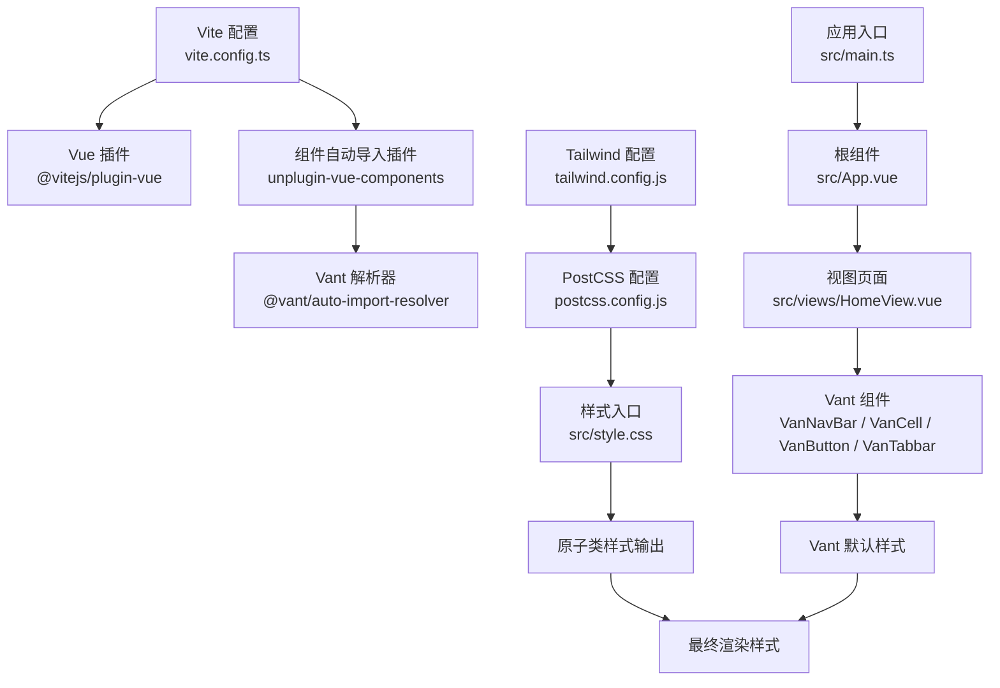
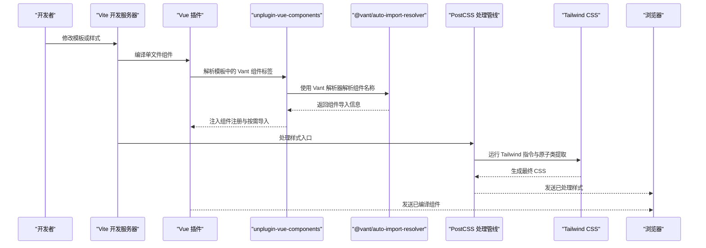
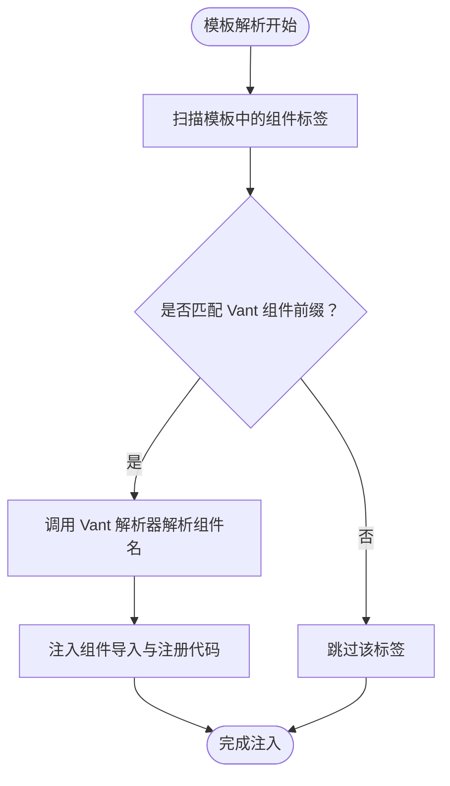
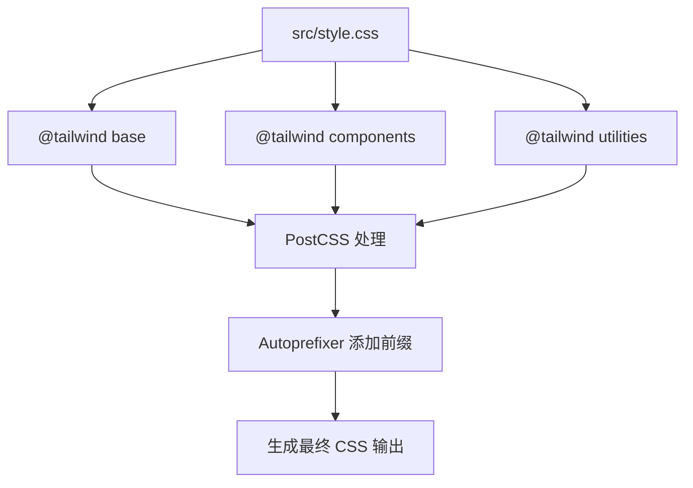
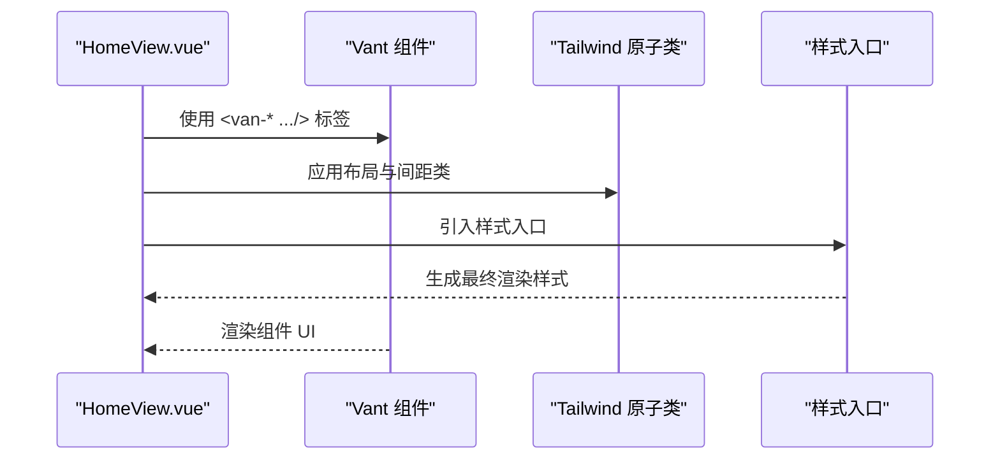
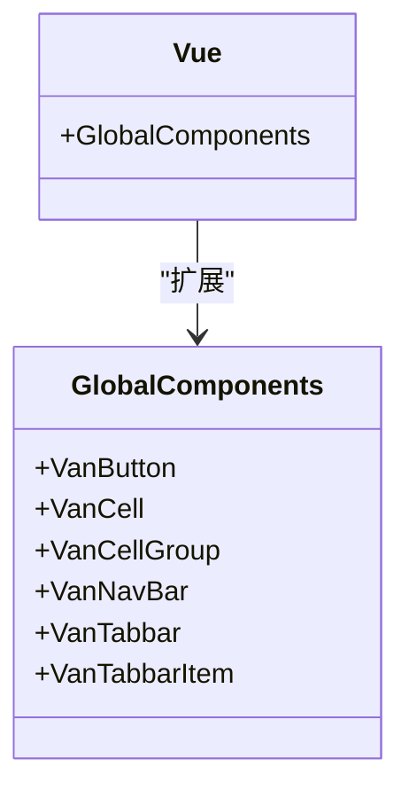
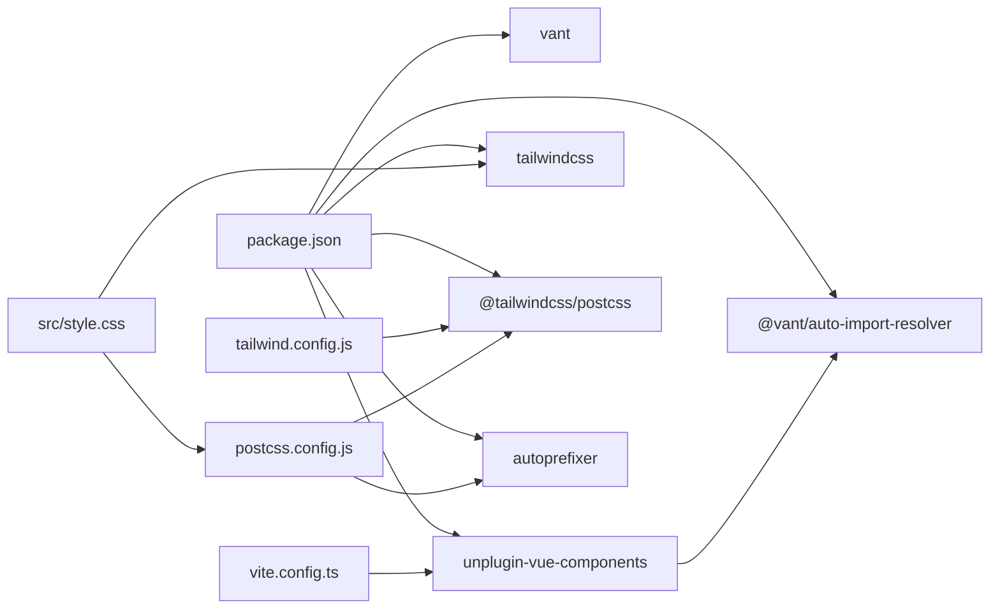

# UI 组件集成

<cite>
**本文引用的文件**
- [vite.config.ts](file://vite.config.ts)
- [tailwind.config.js](file://tailwind.config.js)
- [postcss.config.js](file://postcss.config.js)
- [src/style.css](file://src/style.css)
- [src/views/HomeView.vue](file://src/views/HomeView.vue)
- [src/main.ts](file://src/main.ts)
- [package.json](file://package.json)
- [components.d.ts](file://components.d.ts)
- [src/components.d.ts](file://src/components.d.ts)
- [src/App.vue](file://src/App.vue)
</cite>

## 目录
1. [简介](#简介)
2. [项目结构](#项目结构)
3. [核心组件](#核心组件)
4. [架构总览](#架构总览)
5. [详细组件分析](#详细组件分析)
6. [依赖关系分析](#依赖关系分析)
7. [性能考虑](#性能考虑)
8. [故障排查指南](#故障排查指南)
9. [结论](#结论)
10. [附录](#附录)

## 简介
本文件系统性说明本项目中 Vant 4 组件库与 Tailwind CSS 样式方案的集成方式，重点涵盖：
- 在 Vite 配置中通过 unplugin-vue-components 插件配合 @vant/auto-import-resolver 实现 Vant 组件的自动导入与注册，避免手动 import。
- 通过 components.d.ts 全局类型声明文件验证组件类型（如 VanNavBar、VanButton 等），确保 TypeScript 支持。
- 在 HomeView.vue 模板中直接使用 <van-nav-bar>、<van-cell> 等组件的实践示例。
- Tailwind CSS 的集成：通过 tailwind.config.js 配置扫描范围与主题扩展，通过 postcss.config.js 定义处理管道，并在 src/style.css 中引入 @tailwind 指令。
- 结合 Vant 默认样式与 Tailwind 原子类（如 mt-4、block、p-4）进行细粒度 UI 调整。
- 提供组件样式冲突或自动导入失效的调试步骤。

## 项目结构
该项目采用 Vite + Vue 3 + TypeScript + Pinia + Vue Router 的现代前端工程化结构，样式层以 Tailwind CSS 为主，辅以 Vant 4 组件库，实现“原子类 + 组件库”的混合样式策略。

图表来源
- [vite.config.ts](file://vite.config.ts#L1-L19)
- [tailwind.config.js](file://tailwind.config.js#L1-L12)
- [postcss.config.js](file://postcss.config.js#L1-L6)
- [src/style.css](file://src/style.css#L1-L26)
- [src/main.ts](file://src/main.ts#L1-L12)
- [src/App.vue](file://src/App.vue#L1-L6)
- [src/views/HomeView.vue](file://src/views/HomeView.vue#L1-L47)

章节来源
- [vite.config.ts](file://vite.config.ts#L1-L19)
- [tailwind.config.js](file://tailwind.config.js#L1-L12)
- [postcss.config.js](file://postcss.config.js#L1-L6)
- [src/style.css](file://src/style.css#L1-L26)
- [src/main.ts](file://src/main.ts#L1-L12)
- [src/App.vue](file://src/App.vue#L1-L6)
- [src/views/HomeView.vue](file://src/views/HomeView.vue#L1-L47)

## 核心组件
- Vite 配置与自动导入
  - 通过 unplugin-vue-components 插件与 @vant/auto-import-resolver 解析器，实现 Vant 组件在模板中的自动解析与注册，无需手动 import。
  - 同时保留别名 @ 指向 src 目录，便于路径引用。
- Tailwind CSS 集成
  - tailwind.config.js 配置 content 扫描范围，确保构建时提取所需原子类。
  - postcss.config.js 定义 @tailwindcss/postcss 与 autoprefixer 处理管线。
  - src/style.css 引入 @tailwind base、components、utilities 三段指令，作为样式入口。
- 类型声明与 TS 支持
  - components.d.ts 为全局类型声明文件，包含 VanButton、VanCell、VanCellGroup、VanNavBar、VanTabbar、VanTabbarItem 等组件类型，确保模板与 TS 推断正常。
  - src/components.d.ts 为项目级 tsconfig 编译选项文件，确保模块解析与类型环境正确。
- 视图与样式实践
  - HomeView.vue 直接使用 <van-nav-bar>、<van-cell-group>、<van-cell>、<van-button>、<van-tabbar>、<van-tabbar-item> 等组件，并结合 Tailwind 原子类进行布局与间距控制。

章节来源
- [vite.config.ts](file://vite.config.ts#L1-L19)
- [tailwind.config.js](file://tailwind.config.js#L1-L12)
- [postcss.config.js](file://postcss.config.js#L1-L6)
- [src/style.css](file://src/style.css#L1-L26)
- [components.d.ts](file://components.d.ts#L1-L24)
- [src/components.d.ts](file://src/components.d.ts#L1-L12)
- [src/views/HomeView.vue](file://src/views/HomeView.vue#L1-L47)

## 架构总览
下图展示了从开发到构建再到运行时的关键流程，包括 Vite 插件链路、Tailwind 处理管线与组件类型声明生成。

图表来源
- [vite.config.ts](file://vite.config.ts#L1-L19)
- [postcss.config.js](file://postcss.config.js#L1-L6)
- [src/style.css](file://src/style.css#L1-L26)

## 详细组件分析

### Vite 自动导入与 Vant 集成
- 插件链路
  - @vitejs/plugin-vue：负责 Vue 单文件组件的编译与热更新。
  - unplugin-vue-components：在模板中识别未导入的组件标签，自动注入导入语句与注册逻辑。
  - @vant/auto-import-resolver：为 Vant 4 组件提供解析规则，将 <van-*> 标签映射到对应组件。
- 效果
  - 在模板中直接使用 <van-nav-bar>、<van-cell>、<van-button> 等标签即可，无需在 script 中手动 import。
- 验证
  - components.d.ts 中包含 VanNavBar、VanButton、VanCell、VanCellGroup、VanTabbar、VanTabbarItem 等类型，TS 可正确推断组件属性与事件。

图表来源
- [vite.config.ts](file://vite.config.ts#L1-L19)
- [components.d.ts](file://components.d.ts#L1-L24)

章节来源
- [vite.config.ts](file://vite.config.ts#L1-L19)
- [components.d.ts](file://components.d.ts#L1-L24)

### Tailwind CSS 集成与处理管线
- 配置与扫描
  - tailwind.config.js 的 content 字段定义了扫描范围，确保构建时提取模板与脚本中的原子类。
- 处理管线
  - postcss.config.js 中启用 @tailwindcss/postcss 与 autoprefixer，前者负责执行 @tailwind 指令，后者自动添加浏览器前缀。
- 样式入口
  - src/style.css 引入 @tailwind base、components、utilities 三段指令，作为样式入口文件，确保基础样式、组件样式与原子类被正确生成。

图表来源
- [src/style.css](file://src/style.css#L1-L26)
- [postcss.config.js](file://postcss.config.js#L1-L6)
- [tailwind.config.js](file://tailwind.config.js#L1-L12)

章节来源
- [tailwind.config.js](file://tailwind.config.js#L1-L12)
- [postcss.config.js](file://postcss.config.js#L1-L6)
- [src/style.css](file://src/style.css#L1-L26)

### HomeView.vue 中的组件使用与样式实践
- 组件使用
  - 直接在模板中使用 <van-nav-bar>、<van-cell-group>、<van-cell>、<van-button>、<van-tabbar>、<van-tabbar-item> 等组件，无需手动 import。
- 原子类与布局
  - 使用 Tailwind 原子类进行布局与间距控制，例如 min-h-screen、flex、flex-col、flex-1、p-4、mt-4、block 等。
- 类型支持
  - 由于 components.d.ts 中已声明 Van* 组件类型，TS 可对 props、事件等进行类型校验。

图表来源
- [src/views/HomeView.vue](file://src/views/HomeView.vue#L1-L47)
- [src/style.css](file://src/style.css#L1-L26)
- [components.d.ts](file://components.d.ts#L1-L24)

章节来源
- [src/views/HomeView.vue](file://src/views/HomeView.vue#L1-L47)
- [components.d.ts](file://components.d.ts#L1-L24)

### 类型声明与 TypeScript 支持
- 全局类型声明
  - components.d.ts 中通过 declare module 'vue' 的方式扩展 GlobalComponents，将 VanButton、VanCell、VanCellGroup、VanNavBar、VanTabbar、VanTabbarItem 等组件纳入全局类型，使模板与 TS 推断生效。
- 项目级 tsconfig
  - src/components.d.ts 为项目 tsconfig 编译选项文件，确保模块解析与类型环境正确，避免类型缺失导致的编译错误。

图表来源
- [components.d.ts](file://components.d.ts#L1-L24)
- [src/components.d.ts](file://src/components.d.ts#L1-L12)

章节来源
- [components.d.ts](file://components.d.ts#L1-L24)
- [src/components.d.ts](file://src/components.d.ts#L1-L12)

## 依赖关系分析
- 开发依赖
  - package.json 中包含 vant、unplugin-vue-components、@vant/auto-import-resolver、tailwindcss、@tailwindcss/postcss、autoprefixer 等关键依赖，支撑组件自动导入与 Tailwind 处理。
- 运行时依赖
  - package.json 中包含 vue、pinia、vue-router 等运行时依赖，保证应用功能完整。
- 关键耦合点
  - vite.config.ts 与 @vant/auto-import-resolver 的耦合，决定组件自动导入行为。
  - tailwind.config.js 与 postcss.config.js 的耦合，决定样式处理流程。
  - src/style.css 与 Tailwind 处理管线的耦合，决定样式入口与输出。

图表来源
- [package.json](file://package.json#L1-L32)
- [vite.config.ts](file://vite.config.ts#L1-L19)
- [tailwind.config.js](file://tailwind.config.js#L1-L12)
- [postcss.config.js](file://postcss.config.js#L1-L6)
- [src/style.css](file://src/style.css#L1-L26)

章节来源
- [package.json](file://package.json#L1-L32)
- [vite.config.ts](file://vite.config.ts#L1-L19)
- [tailwind.config.js](file://tailwind.config.js#L1-L12)
- [postcss.config.js](file://postcss.config.js#L1-L6)
- [src/style.css](file://src/style.css#L1-L26)

## 性能考虑
- 按需导入与 Tree Shaking
  - 通过 unplugin-vue-components 与 @vant/auto-import-resolver 的组合，实现按需导入，减少打包体积。
- Tailwind 原子类提取
  - tailwind.config.js 的 content 配置仅提取实际使用的原子类，避免无用样式的生成。
- 浏览器兼容性
  - autoprefixer 自动添加前缀，减少手动维护成本，提升兼容性。
- 构建优化
  - 将样式入口集中于 src/style.css，统一由 PostCSS 处理，有利于缓存与增量构建。

## 故障排查指南
- 症状：模板中使用 <van-*> 标签时报错“找不到组件”
  - 排查要点
    - 确认 vite.config.ts 中已启用 unplugin-vue-components 并配置 VantResolver。
    - 确认 components.d.ts 已生成并包含 Van* 组件类型。
    - 确认 src/style.css 已引入 @tailwind 指令且 Tailwind 处理管线正常。
  - 参考路径
    - [vite.config.ts](file://vite.config.ts#L1-L19)
    - [components.d.ts](file://components.d.ts#L1-L24)
    - [src/style.css](file://src/style.css#L1-L26)
- 症状：样式未生效或样式冲突
  - 排查要点
    - 检查 tailwind.config.js 的 content 是否包含当前文件路径。
    - 检查 postcss.config.js 是否启用 @tailwindcss/postcss 与 autoprefixer。
    - 确认 src/style.css 的 @tailwind 指令顺序与语法正确。
  - 参考路径
    - [tailwind.config.js](file://tailwind.config.js#L1-L12)
    - [postcss.config.js](file://postcss.config.js#L1-L6)
    - [src/style.css](file://src/style.css#L1-L26)
- 症状：TypeScript 报错“无法解析全局组件类型”
  - 排查要点
    - 确认 components.d.ts 存在且包含 Van* 组件类型。
    - 确认 tsconfig 或项目级类型声明文件已正确配置。
  - 参考路径
    - [components.d.ts](file://components.d.ts#L1-L24)
    - [src/components.d.ts](file://src/components.d.ts#L1-L12)
- 症状：组件样式覆盖不生效
  - 排查要点
    - 检查组件作用域样式与全局样式的优先级。
    - 确认未被 Tailwind 原子类覆盖或冲突。
  - 参考路径
    - [src/views/HomeView.vue](file://src/views/HomeView.vue#L1-L47)
    - [src/style.css](file://src/style.css#L1-L26)

## 结论
本项目通过 unplugin-vue-components 与 @vant/auto-import-resolver 实现 Vant 组件的自动导入与注册，结合 Tailwind CSS 的原子类体系，形成“组件 + 原子类”的高效样式工作流。components.d.ts 提供全局类型声明，保障 TypeScript 开发体验。在 HomeView.vue 中可直接使用 Vant 组件并结合 Tailwind 原子类进行布局与间距控制。若遇到样式冲突或自动导入失效问题，可依据本文提供的排查步骤逐一定位并修复。

## 附录
- 快速核对清单
  - vite.config.ts 已启用 unplugin-vue-components 与 VantResolver。
  - tailwind.config.js 的 content 包含当前项目路径。
  - postcss.config.js 启用 @tailwindcss/postcss 与 autoprefixer。
  - src/style.css 引入 @tailwind base、components、utilities。
  - components.d.ts 包含 VanButton、VanCell、VanCellGroup、VanNavBar、VanTabbar、VanTabbarItem 类型。
  - HomeView.vue 中直接使用 <van-*> 组件并应用 Tailwind 原子类。