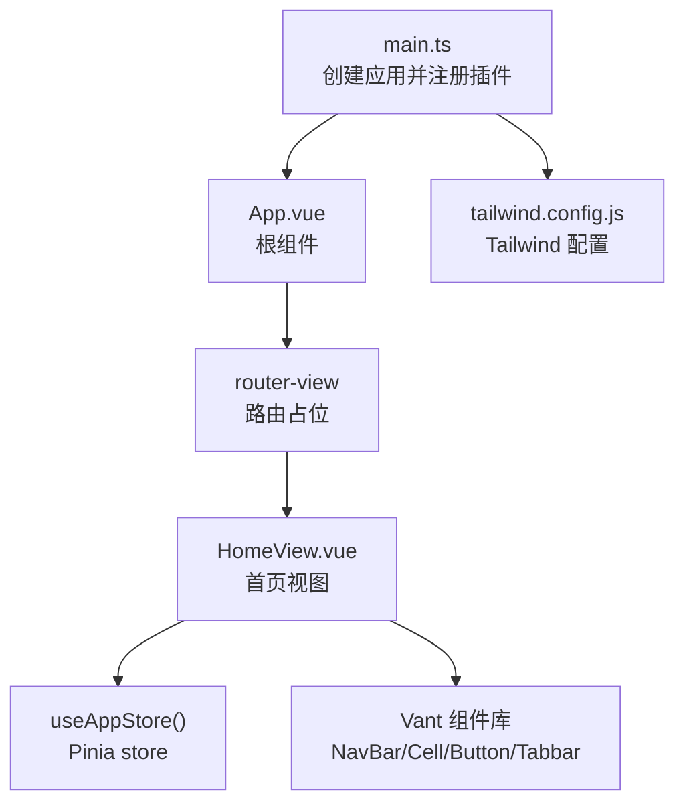
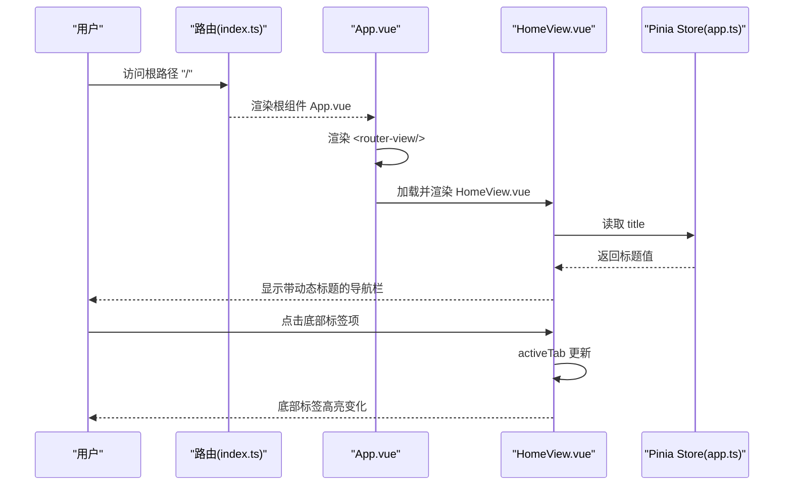
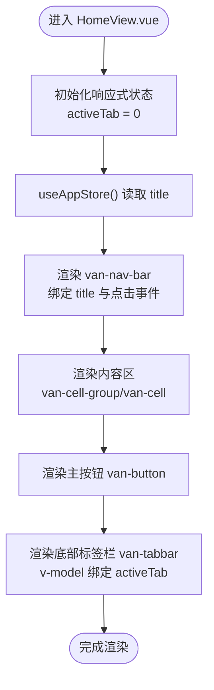
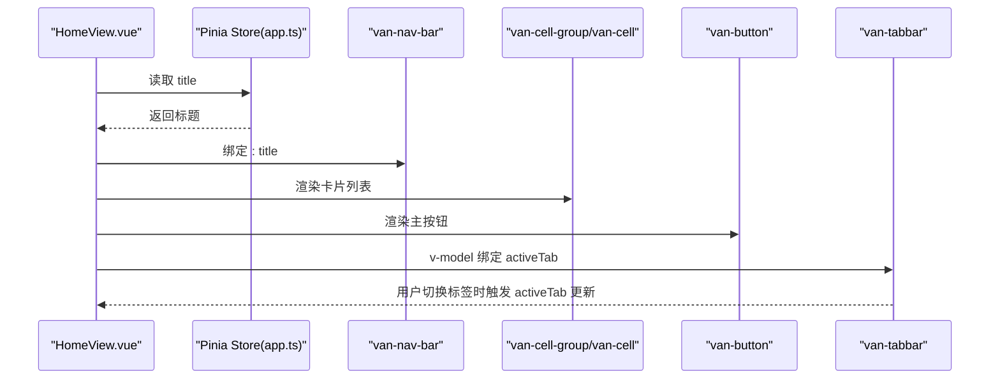
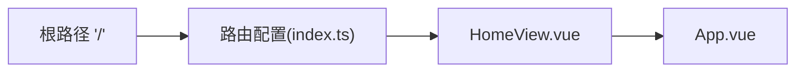
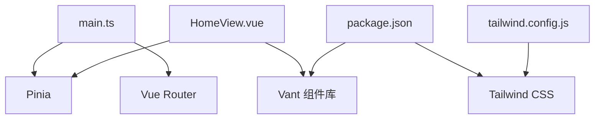

# 主页面展示

<cite>
**本文引用的文件列表**
- [HomeView.vue](file://src/views/HomeView.vue)
- [app.ts](file://src/stores/app.ts)
- [App.vue](file://src/App.vue)
- [index.ts](file://src/router/index.ts)
- [main.ts](file://src/main.ts)
- [package.json](file://package.json)
- [tailwind.config.js](file://tailwind.config.js)
</cite>

## 目录
1. [简介](#简介)
2. [项目结构](#项目结构)
3. [核心组件](#核心组件)
4. [架构总览](#架构总览)
5. [详细组件分析](#详细组件分析)
6. [依赖分析](#依赖分析)
7. [性能考虑](#性能考虑)
8. [故障排查指南](#故障排查指南)
9. [结论](#结论)
10. [附录](#附录)

## 简介
本篇文档围绕 HomeView.vue 首页组件展开，系统性讲解其如何基于 Vue 3 的 Composition API 与 `<script setup>` 组织逻辑，如何通过 Pinia store 获取全局标题并在导航栏中动态绑定；同时解析模板中 Vant 组件（NavBar、Cell、Button、Tabbar）的结构与交互，说明 activeTab 如何驱动底部标签栏状态切换；结合 Tailwind CSS 实用类实现响应式布局；并阐述该组件与 App.vue 中 `<router-view>` 的嵌套关系及路由控制下的渲染机制。最后提供常见问题排查与扩展建议。

## 项目结构
- 入口应用：main.ts 创建并挂载应用，注册 Pinia 与路由。
- 路由：index.ts 定义根路径指向 HomeView.vue。
- 视图：App.vue 仅包含一个 <router-view>，负责承载当前路由对应的视图组件。
- 首页：HomeView.vue 使用 Vant 组件构建导航、卡片列表与底部标签栏，并通过 Pinia store 提供的标题进行动态绑定。

图表来源
- [main.ts](file://src/main.ts#L1-L12)
- [App.vue](file://src/App.vue#L1-L6)
- [index.ts](file://src/router/index.ts#L1-L15)
- [HomeView.vue](file://src/views/HomeView.vue#L1-L47)
- [app.ts](file://src/stores/app.ts#L1-L11)
- [tailwind.config.js](file://tailwind.config.js#L1-L12)

章节来源
- [main.ts](file://src/main.ts#L1-L12)
- [App.vue](file://src/App.vue#L1-L6)
- [index.ts](file://src/router/index.ts#L1-L15)
- [HomeView.vue](file://src/views/HomeView.vue#L1-L47)
- [app.ts](file://src/stores/app.ts#L1-L11)
- [tailwind.config.js](file://tailwind.config.js#L1-L12)

## 核心组件
- HomeView.vue：首页视图，使用 Composition API 与 <script setup>，通过 useAppStore() 获取全局标题并绑定到 van-nav-bar；使用 van-cell-group/van-cell 展示信息卡片；使用 van-button 提供操作入口；使用 van-tabbar 与 activeTab 实现底部标签栏切换。
- app.ts：Pinia store，提供只读标题 title，供 HomeView 动态绑定。
- App.vue：根组件，仅包含 <router-view>，用于承载当前路由视图。
- index.ts：路由配置，将根路径 '/' 指向 HomeView.vue，采用异步加载以优化首屏。
- main.ts：应用入口，注册 Pinia 与路由，挂载应用。

章节来源
- [HomeView.vue](file://src/views/HomeView.vue#L1-L47)
- [app.ts](file://src/stores/app.ts#L1-L11)
- [App.vue](file://src/App.vue#L1-L6)
- [index.ts](file://src/router/index.ts#L1-L15)
- [main.ts](file://src/main.ts#L1-L12)

## 架构总览
HomeView.vue 在路由系统中作为根路径的视图组件，通过 Pinia store 提供的标题数据驱动 UI 更新；底部标签栏通过 v-model 与响应式变量 activeTab 进行双向绑定，实现状态切换。

图表来源
- [index.ts](file://src/router/index.ts#L1-L15)
- [App.vue](file://src/App.vue#L1-L6)
- [HomeView.vue](file://src/views/HomeView.vue#L1-L47)
- [app.ts](file://src/stores/app.ts#L1-L11)

## 详细组件分析

### HomeView.vue：Composition API 与模板结构
- 逻辑组织
  - 使用 <script setup> 与 ref 定义响应式状态 activeTab。
  - 通过 useAppStore() 获取 store 实例，并从其中读取标题 title。
  - 提供点击左侧按钮的事件处理函数 onClickLeft。
- 模板结构
  - 外层容器使用 Tailwind 类实现最小高度与纵向布局。
  - 导航栏 van-nav-bar 绑定 title，并配置左侧文本、箭头与点击事件。
  - 内容区使用 van-cell-group/van-cell 展示信息卡片；下方放置主按钮。
  - 底部标签栏 van-tabbar 使用 v-model 绑定 activeTab，内部三个标签项分别对应首页、搜索、设置。
- 样式与主题
  - 组件作用域样式为 home-view 设置背景色。
  - Tailwind 配置通过 content 指向 HTML 与 src 下的各类文件，确保工具类生效。

图表来源
- [HomeView.vue](file://src/views/HomeView.vue#L1-L47)
- [app.ts](file://src/stores/app.ts#L1-L11)

章节来源
- [HomeView.vue](file://src/views/HomeView.vue#L1-L47)
- [app.ts](file://src/stores/app.ts#L1-L11)

### Vant 组件交互与数据流
- 导航栏（van-nav-bar）
  - 双向绑定标题：:title="appStore.title"，实现标题随 store 更新而更新。
  - 左侧图标与文本：left-text、left-arrow 控制显示。
  - 事件绑定：@click-left 执行 onClickLeft。
- 卡片组与单元格（van-cell-group / van-cell）
  - 通过 inset 属性实现内嵌样式，形成圆角卡片效果。
  - 列表项使用多个 van-cell 展示静态信息。
- 主按钮（van-button）
  - 主题类型与块级宽度组合，提供明确的操作入口。
- 底部标签栏（van-tabbar）
  - v-model 绑定 activeTab，实现选中态与高亮。
  - 子元素 van-tabbar-item 提供图标与文字，支持多标签切换。

图表来源
- [HomeView.vue](file://src/views/HomeView.vue#L1-L47)
- [app.ts](file://src/stores/app.ts#L1-L11)

章节来源
- [HomeView.vue](file://src/views/HomeView.vue#L1-L47)

### 响应式设计与 Tailwind CSS 实用类
- 容器类
  - min-h-screen：使容器至少占满一屏高度，避免内容过短导致底部标签被顶出可视区域。
  - flex flex-col：纵向布局，保证导航栏、内容区、标签栏垂直排列。
  - flex-1：内容区自动填充剩余空间，避免标签栏上移。
  - p-4：内容区内外边距，提升可读性与视觉层次。
- 组件样式
  - van-cell-group inset：内嵌卡片样式，配合圆角与间距。
  - van-button block：块级按钮，适配移动端宽度。
- Tailwind 配置
  - content 指向 index.html 与 src 下的各类文件，确保工具类在组件中可用。

章节来源
- [HomeView.vue](file://src/views/HomeView.vue#L1-L47)
- [tailwind.config.js](file://tailwind.config.js#L1-L12)

### 路由与嵌套关系
- 根组件 App.vue 仅包含 <router-view>，用于承载当前路由视图。
- 路由 index.ts 将根路径 '/' 指向 HomeView.vue，并采用异步加载以减少首屏体积。
- 当访问根路径时，App.vue 的 <router-view> 会渲染 HomeView.vue，从而展示首页内容。

图表来源
- [index.ts](file://src/router/index.ts#L1-L15)
- [App.vue](file://src/App.vue#L1-L6)
- [HomeView.vue](file://src/views/HomeView.vue#L1-L47)

章节来源
- [index.ts](file://src/router/index.ts#L1-L15)
- [App.vue](file://src/App.vue#L1-L6)

## 依赖分析
- 组件依赖
  - HomeView.vue 依赖 useAppStore() 来获取标题数据，依赖 Vant 组件实现 UI。
- 插件与框架
  - main.ts 注册 Pinia 与路由，确保 store 与路由在应用层面可用。
  - package.json 指明依赖 vue、pinia、vue-router、vant、tailwindcss 等。
- 样式与构建
  - tailwind.config.js 配置 content，确保工具类在组件中生效。
  - Vant 通过 unplugin-vue-components 与 @vant/auto-import-resolver 自动按需导入，减少手动引入成本。

图表来源
- [main.ts](file://src/main.ts#L1-L12)
- [HomeView.vue](file://src/views/HomeView.vue#L1-L47)
- [package.json](file://package.json#L1-L32)
- [tailwind.config.js](file://tailwind.config.js#L1-L12)

章节来源
- [main.ts](file://src/main.ts#L1-L12)
- [package.json](file://package.json#L1-L32)
- [tailwind.config.js](file://tailwind.config.js#L1-L12)

## 性能考虑
- 路由懒加载：根路径视图采用异步加载，有助于降低首屏资源压力。
- 组件拆分：首页仅包含基础导航、卡片与标签栏，复杂业务建议拆分为子组件，保持单文件组件职责单一。
- 样式按需：Tailwind 与 Vant 的自动导入策略减少冗余代码，但需注意生产环境的 Tree Shaking 与打包体积。

## 故障排查指南
- 组件不显示
  - 检查路由配置是否正确指向 HomeView.vue，确认根路径 '/' 是否生效。
  - 确认 App.vue 中存在 <router-view>，否则不会渲染任何视图。
  - 章节来源
    - [index.ts](file://src/router/index.ts#L1-L15)
    - [App.vue](file://src/App.vue#L1-L6)
- 样式错乱或工具类无效
  - 检查 tailwind.config.js 的 content 配置是否包含当前文件路径。
  - 确保已安装并启用 Tailwind 相关插件（postcss、autoprefixer、tailwindcss）。
  - 章节来源
    - [tailwind.config.js](file://tailwind.config.js#L1-L12)
    - [package.json](file://package.json#L1-L32)
- 导航栏标题不更新
  - 确认 useAppStore() 返回的 title 是否存在且可读。
  - 检查 van-nav-bar 的 :title 绑定是否正确。
  - 章节来源
    - [app.ts](file://src/stores/app.ts#L1-L11)
    - [HomeView.vue](file://src/views/HomeView.vue#L1-L47)
- 底部标签栏无响应
  - 确认 activeTab 初始化为数字类型，且与 van-tabbar-item 数量一致。
  - 检查 v-model 绑定是否正确，避免字符串与数字混用。
  - 章节来源
    - [HomeView.vue](file://src/views/HomeView.vue#L1-L47)

## 结论
HomeView.vue 通过 Composition API 与 <script setup> 简洁地组织了首页逻辑，借助 Pinia store 提供的标题数据动态绑定到导航栏，结合 Vant 组件快速搭建移动端友好的界面。配合 Tailwind CSS 实用类实现响应式布局，路由系统则确保根路径正确渲染该视图。整体结构清晰、职责单一，便于后续扩展与维护。

## 附录
- 扩展建议
  - 将导航栏、卡片列表、按钮与标签栏拆分为独立子组件，提升复用性与可测试性。
  - 为 activeTab 增加路由联动，使不同标签跳转到对应路由，增强导航体验。
  - 引入更多 Vant 组件（如 Toast、Dialog）完善交互反馈。
  - 对标题、卡片文案等进行国际化与多语言支持准备。
- 相关文件定位
  - 首页组件：[HomeView.vue](file://src/views/HomeView.vue#L1-L47)
  - 全局 store：[app.ts](file://src/stores/app.ts#L1-L11)
  - 根组件与路由：[App.vue](file://src/App.vue#L1-L6)，[index.ts](file://src/router/index.ts#L1-L15)
  - 应用入口与依赖：[main.ts](file://src/main.ts#L1-L12)，[package.json](file://package.json#L1-L32)
  - Tailwind 配置：[tailwind.config.js](file://tailwind.config.js#L1-L12)