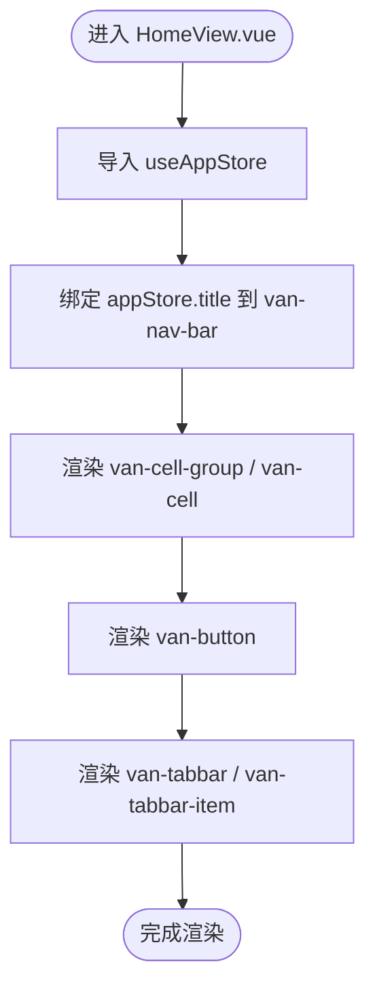

# 核心功能模块

<cite>
**本文引用的文件**
- [src/views/HomeView.vue](file://src/views/HomeView.vue)
- [src/stores/app.ts](file://src/stores/app.ts)
- [src/router/index.ts](file://src/router/index.ts)
- [src/App.vue](file://src/App.vue)
- [src/main.ts](file://src/main.ts)
- [vite.config.ts](file://vite.config.ts)
- [package.json](file://package.json)
- [components.d.ts](file://components.d.ts)
</cite>

## 目录
1. [引言](#引言)
2. [项目结构](#项目结构)
3. [核心组件](#核心组件)
4. [架构总览](#架构总览)
5. [详细组件分析](#详细组件分析)
6. [依赖分析](#依赖分析)
7. [性能考虑](#性能考虑)
8. [故障排查指南](#故障排查指南)
9. [结论](#结论)

## 引言
本文件系统性梳理 ainote-web 的四大核心功能模块：主页面展示、状态管理、路由系统与 UI 组件集成。重点解释 HomeView.vue 如何作为首页渲染内容并与全局状态联动；app.ts 中 useAppStore 的定义方式与响应式数据 title 的使用机制；router/index.ts 的路由配置语法与懒加载实现；以及 Vant 组件在模板中的实际应用方式。通过这些模块的协同工作，形成“路由驱动视图切换、视图读取全局状态”的完整闭环。

## 项目结构
项目采用典型的 Vue 3 + Vite + TypeScript 前端工程布局：
- 应用入口与挂载：在 main.ts 创建应用实例，注册 Pinia 状态库与 Vue Router 路由系统，并将根组件 App.vue 挂载到 DOM。
- 视图层：HomeView.vue 为首页视图，负责页面结构与交互。
- 状态层：app.ts 定义 Pinia Store，提供响应式数据 title。
- 路由层：router/index.ts 配置路由表，使用动态导入实现懒加载。
- UI 层：通过 Vite 插件自动按需引入 Vant 组件，模板中直接使用 van-* 标签。

图表来源
- [src/main.ts](file://src/main.ts#L1-L12)
- [src/App.vue](file://src/App.vue#L1-L6)
- [src/views/HomeView.vue](file://src/views/HomeView.vue#L1-L46)
- [src/stores/app.ts](file://src/stores/app.ts#L1-L11)
- [src/router/index.ts](file://src/router/index.ts#L1-L15)
- [vite.config.ts](file://vite.config.ts#L1-L19)
- [components.d.ts](file://components.d.ts#L1-L24)

章节来源
- [src/main.ts](file://src/main.ts#L1-L12)
- [src/App.vue](file://src/App.vue#L1-L6)
- [src/router/index.ts](file://src/router/index.ts#L1-L15)
- [vite.config.ts](file://vite.config.ts#L1-L19)
- [components.d.ts](file://components.d.ts#L1-L24)

## 核心组件
- 主页面展示：HomeView.vue 作为首页，承担导航栏、列表信息与底部标签栏等 UI 结构，并通过绑定 store 的响应式数据 title 实现标题同步更新。
- 状态管理：app.ts 使用 Pinia defineStore 定义 useAppStore，导出响应式数据 title，供视图层读取与响应式更新。
- 路由系统：router/index.ts 使用 createRouter + createWebHistory 配置路由表，将 '/' 映射到 HomeView.vue，并通过动态导入实现懒加载。
- UI 组件集成：通过 vite.config.ts 的 Vant 自动导入与 components.d.ts 类型声明，模板中可直接使用 van-nav-bar、van-cell、van-button、van-tabbar 等组件。

章节来源
- [src/views/HomeView.vue](file://src/views/HomeView.vue#L1-L46)
- [src/stores/app.ts](file://src/stores/app.ts#L1-L11)
- [src/router/index.ts](file://src/router/index.ts#L1-L15)
- [vite.config.ts](file://vite.config.ts#L1-L19)
- [components.d.ts](file://components.d.ts#L1-L24)

## 架构总览
下图展示了从应用启动到首页渲染的关键流程：main.ts 初始化应用、安装 Pinia 与路由；App.vue 提供路由出口；router/index.ts 将 '/' 路径映射到 HomeView.vue；HomeView.vue 通过 useAppStore 读取 title 并渲染；Vant 组件通过自动导入在模板中可用。

图表来源
- [src/main.ts](file://src/main.ts#L1-L12)
- [src/App.vue](file://src/App.vue#L1-L6)
- [src/router/index.ts](file://src/router/index.ts#L1-L15)
- [src/views/HomeView.vue](file://src/views/HomeView.vue#L1-L46)
- [src/stores/app.ts](file://src/stores/app.ts#L1-L11)

## 详细组件分析

### 主页面展示：HomeView.vue
- 视图职责
  - 导航栏：绑定 store 的 title 字段，实现标题与全局状态联动。
  - 列表信息：使用 van-cell-group 与 van-cell 展示基础信息。
  - 操作按钮：使用 van-button 提供入口操作。
  - 底部标签栏：使用 van-tabbar 与 van-tabbar-item 提供页签导航。
- 数据绑定
  - 通过 useAppStore 获取响应式 title，并将其绑定到 van-nav-bar 的 title 属性，实现标题随 store 更新而更新。
- 事件处理
  - 为 van-nav-bar 的点击左侧图标事件绑定处理器，便于扩展交互逻辑。
- 样式与布局
  - 使用 Tailwind CSS 类进行布局与背景色设置，保证页面结构清晰。

图表来源
- [src/views/HomeView.vue](file://src/views/HomeView.vue#L1-L46)
- [src/stores/app.ts](file://src/stores/app.ts#L1-L11)

章节来源
- [src/views/HomeView.vue](file://src/views/HomeView.vue#L1-L46)

### 状态管理：app.ts 与 useAppStore
- 定义方式
  - 使用 Pinia 的 defineStore 定义命名 store，返回一个包含响应式数据 title 的对象。
- 响应式机制
  - title 由 ref 创建，具备响应式特性；当其值变化时，依赖该数据的视图会自动重新渲染。
- 使用方式
  - 在 HomeView.vue 中通过 useAppStore() 获取 store 实例，并读取 title 字段用于模板绑定。

图表来源
- [src/stores/app.ts](file://src/stores/app.ts#L1-L11)
- [src/views/HomeView.vue](file://src/views/HomeView.vue#L1-L46)

章节来源
- [src/stores/app.ts](file://src/stores/app.ts#L1-L11)

### 路由系统：router/index.ts
- 路由配置语法
  - 使用 createRouter 创建路由实例，指定 history 为 createWebHistory，并传入 BASE_URL。
  - routes 数组中定义单一路由项：path 为根路径 '/'，name 为 'home'，component 为动态导入的 HomeView.vue。
- 懒加载实现
  - 通过将 component 设置为函数并使用 import() 动态导入，实现按需加载，减少首屏体积与提升性能。
- 路由出口
  - App.vue 中的 <router-view /> 作为路由出口，承载当前激活路由对应的组件。

图表来源
- [src/router/index.ts](file://src/router/index.ts#L1-L15)
- [src/App.vue](file://src/App.vue#L1-L6)

章节来源
- [src/router/index.ts](file://src/router/index.ts#L1-L15)
- [src/App.vue](file://src/App.vue#L1-L6)

### UI 组件集成：Vant 在模板中的应用
- 自动导入机制
  - vite.config.ts 启用 unplugin-vue-components，并配置 VantResolver，使模板中直接使用 van-* 标签时自动按需引入对应组件。
- 类型声明
  - components.d.ts 由工具生成，声明了 van-* 组件的全局类型，确保 TS 推断与编辑器提示正常。
- 模板使用
  - HomeView.vue 中使用 van-nav-bar、van-cell-group、van-cell、van-button、van-tabbar、van-tabbar-item 等组件，均无需手动导入即可使用。

图表来源
- [vite.config.ts](file://vite.config.ts#L1-L19)
- [components.d.ts](file://components.d.ts#L1-L24)
- [src/views/HomeView.vue](file://src/views/HomeView.vue#L1-L46)

章节来源
- [vite.config.ts](file://vite.config.ts#L1-L19)
- [components.d.ts](file://components.d.ts#L1-L24)
- [src/views/HomeView.vue](file://src/views/HomeView.vue#L1-L46)

## 依赖分析
- 应用启动依赖
  - main.ts 依赖 Vue、Pinia、Vue Router 与 App.vue；同时通过 package.json 可见运行时依赖包括 vue、pinia、vue-router、vant 等。
- 组件依赖
  - HomeView.vue 依赖 useAppStore；router/index.ts 依赖 vue-router；Vant 组件依赖 vant 与自动导入配置。
- 类型与构建
  - components.d.ts 由 unplugin-vue-components 生成，确保模板中 van-* 组件的类型正确；vite.config.ts 的 VantResolver 与 alias 配置影响组件解析与路径别名。

图表来源
- [package.json](file://package.json#L1-L31)
- [src/main.ts](file://src/main.ts#L1-L12)
- [src/router/index.ts](file://src/router/index.ts#L1-L15)
- [src/stores/app.ts](file://src/stores/app.ts#L1-L11)
- [src/App.vue](file://src/App.vue#L1-L6)
- [vite.config.ts](file://vite.config.ts#L1-L19)
- [components.d.ts](file://components.d.ts#L1-L24)
- [src/views/HomeView.vue](file://src/views/HomeView.vue#L1-L46)

章节来源
- [package.json](file://package.json#L1-L31)
- [src/main.ts](file://src/main.ts#L1-L12)
- [src/router/index.ts](file://src/router/index.ts#L1-L15)
- [src/stores/app.ts](file://src/stores/app.ts#L1-L11)
- [src/App.vue](file://src/App.vue#L1-L6)
- [vite.config.ts](file://vite.config.ts#L1-L19)
- [components.d.ts](file://components.d.ts#L1-L24)
- [src/views/HomeView.vue](file://src/views/HomeView.vue#L1-L46)

## 性能考虑
- 路由懒加载：通过动态导入 HomeView.vue，避免首屏加载非必要资源，降低初始包体与白屏时间。
- 组件按需引入：VantResolver 仅在使用时引入对应组件，减少整体打包体积。
- 响应式更新：store 中的 title 为 ref 响应式数据，仅在变更时触发相关视图重渲染，避免不必要的计算。

## 故障排查指南
- Vant 组件未生效或类型报错
  - 检查 vite.config.ts 是否启用 VantResolver 与 unplugin-vue-components。
  - 确认 components.d.ts 是否存在且包含 van-* 组件类型声明。
- 路由无法跳转或空白页
  - 检查 router/index.ts 的 routes 配置是否包含 '/' 且 component 为动态导入。
  - 确认 App.vue 中存在 <router-view/>。
- 标题不更新
  - 确认 HomeView.vue 已调用 useAppStore 并绑定 appStore.title。
  - 确认 app.ts 中 title 为 ref 响应式数据，且在需要时被修改。

章节来源
- [vite.config.ts](file://vite.config.ts#L1-L19)
- [components.d.ts](file://components.d.ts#L1-L24)
- [src/router/index.ts](file://src/router/index.ts#L1-L15)
- [src/App.vue](file://src/App.vue#L1-L6)
- [src/stores/app.ts](file://src/stores/app.ts#L1-L11)
- [src/views/HomeView.vue](file://src/views/HomeView.vue#L1-L46)

## 结论
ainote-web 以简洁清晰的方式实现了主页面展示、状态管理、路由系统与 UI 组件集成四大模块。HomeView.vue 通过 useAppStore 读取响应式数据，router/index.ts 以懒加载方式将 '/' 路由映射至首页，vite.config.ts 与 components.d.ts 共同保障 Vant 组件在模板中的可用性与类型安全。四者协同构成“路由驱动视图、视图读取状态、UI 组件按需引入”的完整闭环，既满足功能需求又兼顾性能与可维护性。