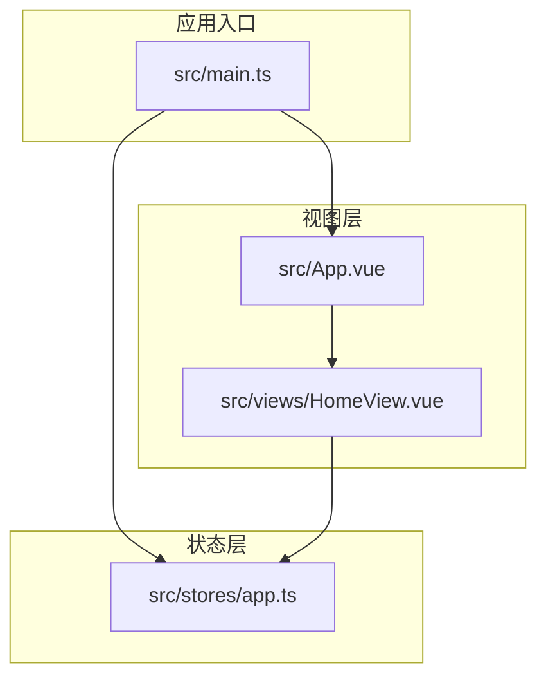
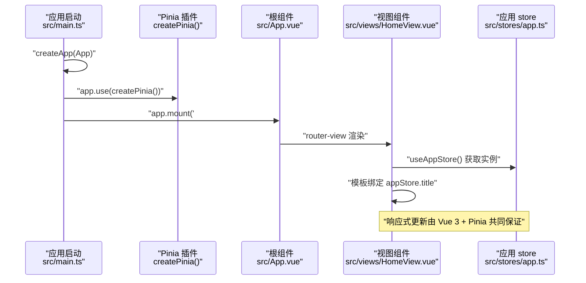
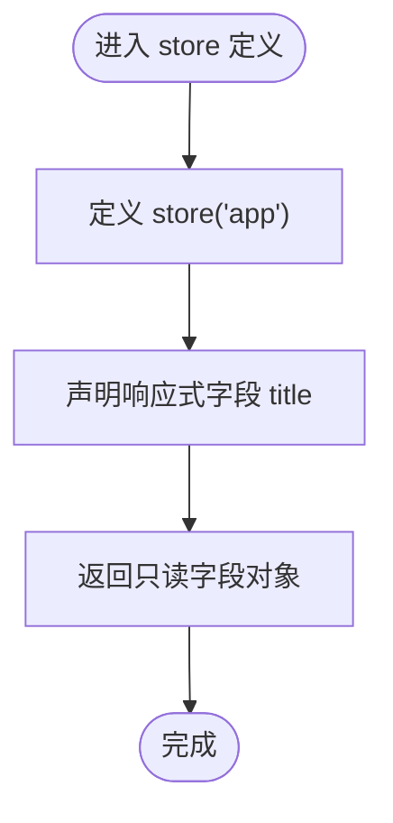
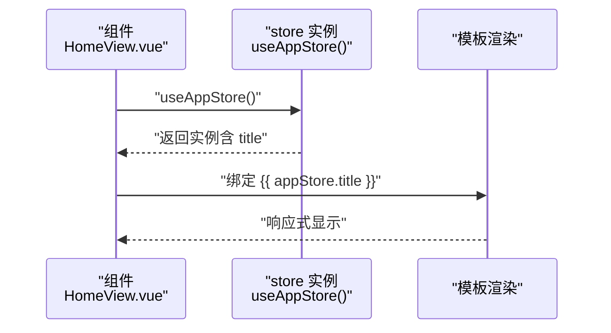
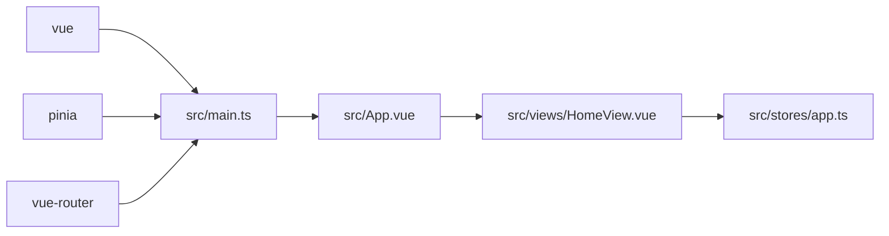

# 状态管理

<cite>
**本文引用的文件**
- [src/stores/app.ts](file://src/stores/app.ts)
- [src/main.ts](file://src/main.ts)
- [src/views/HomeView.vue](file://src/views/HomeView.vue)
- [src/App.vue](file://src/App.vue)
- [package.json](file://package.json)
</cite>

## 目录
1. [简介](#简介)
2. [项目结构](#项目结构)
3. [核心组件](#核心组件)
4. [架构总览](#架构总览)
5. [详细组件分析](#详细组件分析)
6. [依赖分析](#依赖分析)
7. [性能考量](#性能考量)
8. [故障排查指南](#故障排查指南)
9. [结论](#结论)
10. [附录](#附录)

## 简介
本项目采用 Vue 3 + Pinia 的组合进行前端状态管理。核心目标是通过集中式的 store 管理应用级状态，并在组件中以声明式的方式进行响应式绑定。本文围绕以下主题展开：
- 使用 defineStore 定义名为 'app' 的 store，并通过 ref 声明响应式标题字段；
- 在应用入口安装 Pinia 插件，使全局可访问 store；
- 在视图组件中导入并调用 useAppStore 获取实例，实现模板中的数据绑定；
- 解释集中管理的优势与响应式更新原理；
- 提供在其他组件中使用 store 的标准范式；
- 讨论扩展新状态字段（如 theme、user）的方法；
- 指出常见陷阱并建议引入 actions 以提升可维护性。

## 项目结构
该项目采用按功能分层的组织方式：
- 应用入口位于 src/main.ts，负责创建应用实例并安装 Pinia 和路由插件；
- store 定义位于 src/stores/app.ts，提供应用级状态；
- 视图组件位于 src/views/HomeView.vue，演示如何在组件中使用 store；
- 根组件 src/App.vue 作为路由出口容器。

图表来源
- [src/main.ts](file://src/main.ts#L1-L12)
- [src/stores/app.ts](file://src/stores/app.ts#L1-L11)
- [src/views/HomeView.vue](file://src/views/HomeView.vue#L1-L47)
- [src/App.vue](file://src/App.vue#L1-L6)

章节来源
- [src/main.ts](file://src/main.ts#L1-L12)
- [src/stores/app.ts](file://src/stores/app.ts#L1-L11)
- [src/views/HomeView.vue](file://src/views/HomeView.vue#L1-L47)
- [src/App.vue](file://src/App.vue#L1-L6)

## 核心组件
- 应用入口与插件安装
  - 在应用创建后，通过 app.use(createPinia()) 安装 Pinia 插件，使全局范围内可访问 store。
- 应用 store 定义
  - 使用 defineStore('app', ...) 定义名为 'app' 的 store；
  - 内部通过 ref 声明响应式标题字段，并将其作为只读属性返回；
  - 当前未包含 actions，所有状态变更需通过组件内逻辑间接完成。
- 视图组件使用
  - 组件通过 import 导入 useAppStore 并调用获取实例；
  - 在模板中通过插值绑定 appStore.title 实现响应式显示。

章节来源
- [src/main.ts](file://src/main.ts#L1-L12)
- [src/stores/app.ts](file://src/stores/app.ts#L1-L11)
- [src/views/HomeView.vue](file://src/views/HomeView.vue#L1-L47)

## 架构总览
下面的时序图展示了从应用启动到组件渲染的关键流程：

图表来源
- [src/main.ts](file://src/main.ts#L1-L12)
- [src/App.vue](file://src/App.vue#L1-L6)
- [src/views/HomeView.vue](file://src/views/HomeView.vue#L1-L47)
- [src/stores/app.ts](file://src/stores/app.ts#L1-L11)

## 详细组件分析

### 应用入口与 Pinia 安装
- 职责
  - 创建应用实例；
  - 安装 Pinia 插件，使全局可用；
  - 安装路由插件；
  - 挂载根节点。
- 关键点
  - app.use(createPinia()) 是全局 store 可用的前提；
  - 与路由安装顺序无关，但必须在挂载前完成。

章节来源
- [src/main.ts](file://src/main.ts#L1-L12)

### 应用 store（app.ts）
- 定义方式
  - 使用 defineStore('app', ...) 创建名为 'app' 的 store；
  - 返回对象包含响应式字段 title；
  - 当前未导出任何 actions，状态变更需通过组件逻辑间接完成。
- 数据结构与复杂度
  - title 为 ref 类型，读写复杂度均为 O(1)；
  - 返回的对象仅包含只读字段，便于在组件中直接解构使用。
- 错误处理与边界
  - 当前未包含显式的校验或错误处理逻辑；
  - 若后续引入 actions，可在其中统一处理副作用与异常。

图表来源
- [src/stores/app.ts](file://src/stores/app.ts#L1-L11)

章节来源
- [src/stores/app.ts](file://src/stores/app.ts#L1-L11)

### 视图组件（HomeView.vue）中的使用
- 导入与调用
  - 通过 import 导入 useAppStore；
  - 调用 useAppStore() 获取 store 实例；
  - 在模板中以插值形式绑定 appStore.title。
- 数据流
  - 组件渲染时读取 appStore.title；
  - 当 title 发生变化时，组件自动重新渲染；
  - 该行为由 Vue 3 的响应式系统与 Pinia 的 store 共同保障。

图表来源
- [src/views/HomeView.vue](file://src/views/HomeView.vue#L1-L47)
- [src/stores/app.ts](file://src/stores/app.ts#L1-L11)

章节来源
- [src/views/HomeView.vue](file://src/views/HomeView.vue#L1-L47)

### 响应式更新原理与集中管理优势
- 原理
  - Vue 3 的响应式系统通过 ref 对 title 进行追踪；
  - Pinia 将 store 作为全局状态容器，组件通过 useAppStore() 获取实例；
  - 当 title 发生变化时，Vue 会触发相关组件的重新渲染。
- 集中管理优势
  - 单一事实来源：应用标题等状态集中于 app store；
  - 组件间共享：任意组件均可通过 useAppStore() 访问同一实例；
  - 易于调试：通过 DevTools 可观察状态变化与组件订阅关系。

章节来源
- [src/stores/app.ts](file://src/stores/app.ts#L1-L11)
- [src/views/HomeView.vue](file://src/views/HomeView.vue#L1-L47)

### 扩展新状态字段的标准范式
- 新增字段（示例：theme、user）
  - 在 app.ts 中新增响应式字段（如 ref 或 computed）；
  - 将新字段加入返回对象，保持只读暴露；
  - 在需要使用的组件中导入并使用 useAppStore() 获取实例；
  - 在模板中绑定新字段，实现响应式显示。
- 注意事项
  - 保持返回对象的简洁与一致性；
  - 如需异步加载或复杂计算，优先使用 computed 或派生状态；
  - 避免在组件中直接修改 store 的响应式字段，建议通过 actions 封装。

章节来源
- [src/stores/app.ts](file://src/stores/app.ts#L1-L11)
- [src/views/HomeView.vue](file://src/views/HomeView.vue#L1-L47)

### 常见陷阱与改进建议
- 陷阱
  - 直接在组件中修改 store 的响应式字段，破坏了单向数据流；
  - 缺少 actions，导致状态变更分散且难以追踪。
- 建议
  - 引入 actions 封装状态变更逻辑，统一入口便于调试与测试；
  - 对外仅暴露只读字段，内部通过 actions 修改；
  - 对于跨组件共享的状态，优先放入 app store，避免重复定义。

章节来源
- [src/stores/app.ts](file://src/stores/app.ts#L1-L11)
- [src/views/HomeView.vue](file://src/views/HomeView.vue#L1-L47)

## 依赖分析
- 外部依赖
  - vue：提供响应式系统与组件框架；
  - pinia：提供状态管理能力；
  - vue-router：提供路由能力；
  - vant、tailwindcss：UI 与样式工具。
- 内部依赖关系
  - main.ts 依赖 pinia 与 router；
  - HomeView.vue 依赖 app store；
  - App.vue 作为路由出口承载视图。

图表来源
- [package.json](file://package.json#L1-L32)
- [src/main.ts](file://src/main.ts#L1-L12)
- [src/App.vue](file://src/App.vue#L1-L6)
- [src/views/HomeView.vue](file://src/views/HomeView.vue#L1-L47)
- [src/stores/app.ts](file://src/stores/app.ts#L1-L11)

章节来源
- [package.json](file://package.json#L1-L32)
- [src/main.ts](file://src/main.ts#L1-L12)
- [src/App.vue](file://src/App.vue#L1-L6)
- [src/views/HomeView.vue](file://src/views/HomeView.vue#L1-L47)
- [src/stores/app.ts](file://src/stores/app.ts#L1-L11)

## 性能考量
- 响应式粒度
  - 使用 ref 管理单一字段，读写开销低；
  - 对于复杂对象，建议拆分为多个独立 ref，减少不必要的重渲染。
- 组件渲染
  - 仅在 title 变化时触发相关组件的更新；
  - 避免在模板中进行昂贵的计算，必要时使用 computed。
- 资源占用
  - Pinia store 本身轻量，主要开销来自组件数量与渲染频率。

## 故障排查指南
- 无法访问 store
  - 确认已在 main.ts 中安装 Pinia 插件；
  - 确认组件中正确导入并调用了 useAppStore()。
- 标题不更新
  - 确认组件中对 store 的响应式字段进行了正确的读取与绑定；
  - 若后续引入 actions，请确保通过 action 触发状态变更。
- 调试建议
  - 使用浏览器开发者工具检查组件订阅关系；
  - 在控制台输出 store 实例，确认字段存在且可读。

章节来源
- [src/main.ts](file://src/main.ts#L1-L12)
- [src/views/HomeView.vue](file://src/views/HomeView.vue#L1-L47)
- [src/stores/app.ts](file://src/stores/app.ts#L1-L11)

## 结论
本项目通过最小化的 store 定义与 Pinia 的安装，实现了应用级状态的集中管理与响应式绑定。当前模式简单清晰，适合小型项目快速起步。随着业务增长，建议逐步引入 actions、模块化 store、以及更完善的类型定义与测试策略，以提升可维护性与可扩展性。

## 附录
- 在其他组件中使用 store 的标准范式
  - 在组件脚本中导入 useAppStore；
  - 调用获取实例并在模板中绑定相应字段；
  - 如需变更状态，优先通过 actions 封装。
- 扩展新状态字段的步骤
  - 在 app.ts 中新增响应式字段并返回；
  - 在组件中导入并使用；
  - 在模板中绑定新字段。