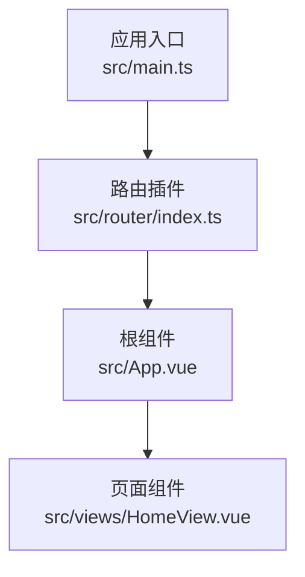
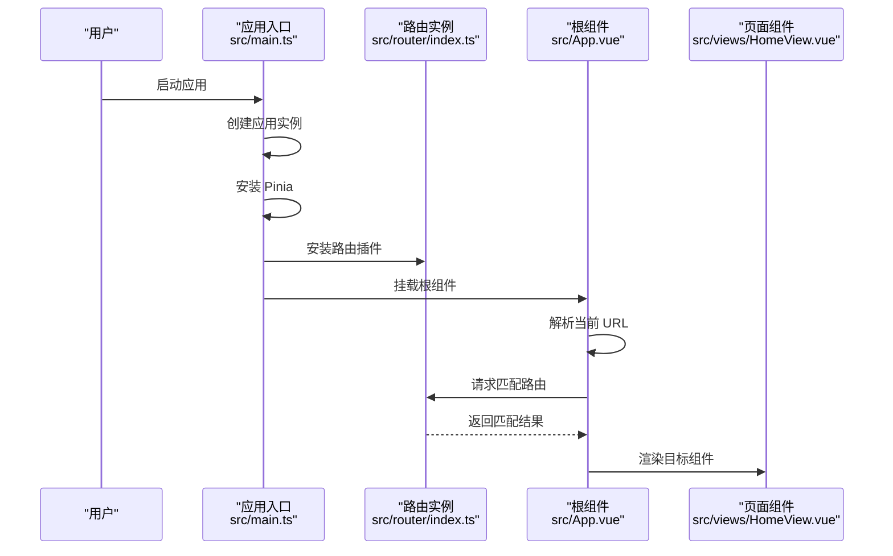
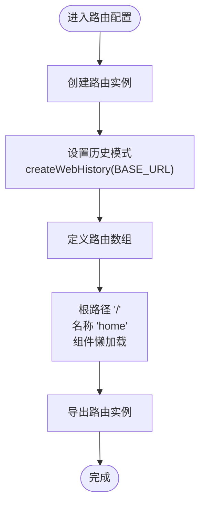
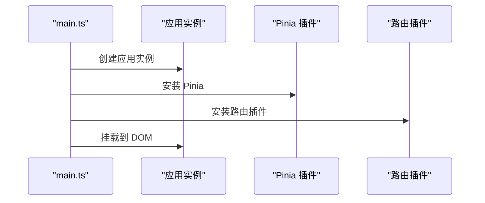
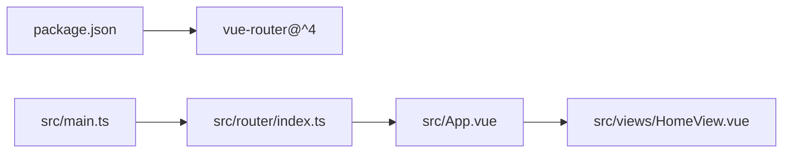

# 路由系统

<cite>
**本文引用的文件**
- [src/router/index.ts](file://src/router/index.ts)
- [src/main.ts](file://src/main.ts)
- [src/App.vue](file://src/App.vue)
- [src/views/HomeView.vue](file://src/views/HomeView.vue)
- [package.json](file://package.json)
</cite>

## 目录
1. [简介](#简介)
2. [项目结构](#项目结构)
3. [核心组件](#核心组件)
4. [架构总览](#架构总览)
5. [详细组件分析](#详细组件分析)
6. [依赖分析](#依赖分析)
7. [性能考量](#性能考量)
8. [故障排查指南](#故障排查指南)
9. [结论](#结论)
10. [附录](#附录)

## 简介
本节概述 ainote-web 项目中 Vue Router 的集成方式与当前配置。项目采用 Vue 3 + Vite + TypeScript 技术栈，路由系统通过 vue-router@^4 实现，使用浏览器历史模式（History 模式），并通过懒加载机制优化首屏性能。路由注册在应用入口完成，根组件通过 <router-view /> 渲染当前匹配的页面组件。

## 项目结构
- 路由定义位于 src/router/index.ts，负责创建路由实例、配置历史模式与路由表。
- 应用入口位于 src/main.ts，负责创建应用实例、安装 Pinia 和 Vue Router 插件。
- 根组件 src/App.vue 仅包含一个 <router-view /> 动态出口，用于渲染当前路由对应的视图。
- 当前唯一页面组件为 src/views/HomeView.vue，作为根路径 '/' 的懒加载组件。

**图表来源**
- [src/main.ts](file://src/main.ts#L1-L12)
- [src/router/index.ts](file://src/router/index.ts#L1-L15)
- [src/App.vue](file://src/App.vue#L1-L6)
- [src/views/HomeView.vue](file://src/views/HomeView.vue#L1-L47)

**章节来源**
- [src/router/index.ts](file://src/router/index.ts#L1-L15)
- [src/main.ts](file://src/main.ts#L1-L12)
- [src/App.vue](file://src/App.vue#L1-L6)
- [src/views/HomeView.vue](file://src/views/HomeView.vue#L1-L47)

## 核心组件
- 路由实例创建与配置
  - 使用 createRouter 创建路由实例，history 选项使用 createWebHistory 并传入 BASE_URL。
  - routes 数组中定义了根路径 '/' 的路由项，名称为 'home'，组件采用函数形式的懒加载导入。
- 应用注册与挂载
  - 在 main.ts 中创建应用实例后，先安装 Pinia，再安装路由插件，最后挂载到 DOM。
- 视图出口
  - App.vue 中仅包含 <router-view />，作为所有路由的动态渲染出口。

**章节来源**
- [src/router/index.ts](file://src/router/index.ts#L1-L15)
- [src/main.ts](file://src/main.ts#L1-L12)
- [src/App.vue](file://src/App.vue#L1-L6)

## 架构总览
下图展示了从应用启动到页面渲染的关键流程：应用创建 -> 安装路由插件 -> 解析 URL -> 匹配路由 -> 通过 <router-view /> 渲染目标组件。

**图表来源**
- [src/main.ts](file://src/main.ts#L1-L12)
- [src/router/index.ts](file://src/router/index.ts#L1-L15)
- [src/App.vue](file://src/App.vue#L1-L6)
- [src/views/HomeView.vue](file://src/views/HomeView.vue#L1-L47)

## 详细组件分析

### 路由定义与懒加载机制
- 路由实例创建
  - 通过 createRouter 初始化路由，history 使用 createWebHistory 并传入 BASE_URL，确保在不同部署环境下路径正确。
  - routes 数组中仅包含根路径 '/' 的路由项，名称为 'home'，组件通过函数形式的动态导入实现懒加载。
- 懒加载对首屏性能的影响
  - 将组件导入延迟到路由命中时执行，可减少初始包体积，避免一次性加载所有页面资源，从而缩短首屏渲染时间。
  - 对于大型应用，建议对非首屏页面均采用懒加载策略，以进一步优化加载性能。

**图表来源**
- [src/router/index.ts](file://src/router/index.ts#L1-L15)

**章节来源**
- [src/router/index.ts](file://src/router/index.ts#L1-L15)

### 应用注册与挂载
- 在 main.ts 中：
  - 先创建应用实例，再安装 Pinia，随后安装路由插件，最后挂载到 DOM。
  - 这种顺序保证了路由插件在应用生命周期早期可用，避免后续逻辑访问路由时出现未初始化问题。

**图表来源**
- [src/main.ts](file://src/main.ts#L1-L12)

**章节来源**
- [src/main.ts](file://src/main.ts#L1-L12)

### 根组件与视图出口
- App.vue 仅包含一个 <router-view />，作为全局动态出口，所有路由匹配到的组件都会在此处渲染。
- 该设计使路由切换无需修改根组件代码，便于扩展新的页面与路由。

**章节来源**
- [src/App.vue](file://src/App.vue#L1-L6)

### 页面组件与导航
- 当前页面组件为 HomeView.vue，位于 src/views/HomeView.vue。
- 若需新增页面（例如 AboutView），可在路由配置中添加新的路由项，并在视图目录中创建对应组件文件。

**章节来源**
- [src/views/HomeView.vue](file://src/views/HomeView.vue#L1-L47)

### 导航与跳转
- 基础导航方式
  - 模板中使用 <router-link> 进行声明式导航。
  - 脚本中使用 router.push 进行编程式导航。
- 示例参考
  - 以上两种方式的具体用法请参见相关章节“附录”。

**章节来源**
- [src/router/index.ts](file://src/router/index.ts#L1-L15)
- [src/App.vue](file://src/App.vue#L1-L6)

### 多级路由与复杂应用
- 当前项目仅包含一个路由，适合简单场景；若需要支持更复杂的页面结构，可考虑：
  - 在路由配置中添加嵌套路由（children），以实现多级菜单或子页面。
  - 为每个功能模块划分独立的路由文件，按模块拆分管理。
  - 结合命名视图、路由守卫等特性，增强权限控制与页面生命周期管理。
- 注意事项
  - 新增路由时，确保组件懒加载路径正确，避免运行时找不到模块。
  - 对于大型应用，建议结合路由预加载与缓存策略，进一步优化用户体验。

**章节来源**
- [src/router/index.ts](file://src/router/index.ts#L1-L15)

## 依赖分析
- 项目依赖
  - package.json 显示已安装 vue-router@^4，满足当前路由配置需求。
- 内部依赖关系
  - main.ts 依赖路由实例导出，App.vue 依赖路由插件提供的 <router-view />，HomeView.vue 作为路由组件被懒加载。

**图表来源**
- [package.json](file://package.json#L1-L32)
- [src/main.ts](file://src/main.ts#L1-L12)
- [src/router/index.ts](file://src/router/index.ts#L1-L15)
- [src/App.vue](file://src/App.vue#L1-L6)
- [src/views/HomeView.vue](file://src/views/HomeView.vue#L1-L47)

**章节来源**
- [package.json](file://package.json#L1-L32)
- [src/main.ts](file://src/main.ts#L1-L12)
- [src/router/index.ts](file://src/router/index.ts#L1-L15)
- [src/App.vue](file://src/App.vue#L1-L6)
- [src/views/HomeView.vue](file://src/views/HomeView.vue#L1-L47)

## 性能考量
- 懒加载策略
  - 通过函数形式的动态导入实现组件懒加载，有助于降低初始包体积，缩短首屏渲染时间。
- 建议
  - 对非首屏页面统一采用懒加载。
  - 在大型应用中，可结合路由预加载与缓存策略，进一步优化交互流畅度。

[本节为通用性能建议，不直接分析具体文件]

## 故障排查指南
- 路由无法匹配
  - 检查路由路径是否正确，确认 routes 中是否存在对应条目。
  - 确认组件懒加载路径有效，避免运行时找不到模块。
- 首屏加载缓慢
  - 检查是否对非首屏页面启用懒加载。
  - 评估页面组件体积，必要时进行拆分或异步加载。
- 导航异常
  - 模板中使用 <router-link> 时，确认目标路由名称或路径正确。
  - 编程式导航使用 router.push 时，确认传入参数类型与格式正确。

[本节为通用排查建议，不直接分析具体文件]

## 结论
ainote-web 已完成基础路由集成：通过 createRouter 与 createWebHistory 实现浏览器历史模式，使用懒加载优化首屏性能，并在应用入口完成插件注册。根组件仅保留 <router-view /> 出口，便于后续扩展新页面。当前路由较为简单，适合入门学习；随着业务增长，建议逐步引入多级路由、命名视图与路由守卫等高级特性，以支撑更复杂的页面结构与交互需求。

[本节为总结性内容，不直接分析具体文件]

## 附录

### 如何添加新页面（以 AboutView 为例）
- 步骤概览
  - 在视图目录中创建 AboutView 组件文件。
  - 在路由配置中新增一条路由项，指向该组件（建议使用懒加载）。
  - 在模板中使用 <router-link> 或脚本中使用 router.push 进行跳转。
- 参考路径
  - 路由配置位置：[src/router/index.ts](file://src/router/index.ts#L1-L15)
  - 根组件出口位置：[src/App.vue](file://src/App.vue#L1-L6)
  - 页面组件位置：[src/views/HomeView.vue](file://src/views/HomeView.vue#L1-L47)

**章节来源**
- [src/router/index.ts](file://src/router/index.ts#L1-L15)
- [src/App.vue](file://src/App.vue#L1-L6)
- [src/views/HomeView.vue](file://src/views/HomeView.vue#L1-L47)

### 路由跳转基本用法示例
- 声明式导航（模板）
  - 使用 <router-link> 进行页面跳转，适用于链接类导航。
- 编程式导航（脚本）
  - 使用 router.push 进行编程式跳转，适用于条件判断或动态跳转场景。
- 参考路径
  - 路由实例导出位置：[src/router/index.ts](file://src/router/index.ts#L1-L15)
  - 应用入口注册位置：[src/main.ts](file://src/main.ts#L1-L12)

**章节来源**
- [src/router/index.ts](file://src/router/index.ts#L1-L15)
- [src/main.ts](file://src/main.ts#L1-L12)

### 当前路由的局限性与扩展建议
- 局限性
  - 仅存在根路径 '/' 的单一路由，难以支撑多页面应用。
- 扩展建议
  - 引入嵌套路由（children）以支持多级菜单或子页面。
  - 拆分路由文件，按模块化管理路由配置。
  - 结合命名视图与路由守卫，增强权限控制与页面生命周期管理。
- 参考路径
  - 路由配置位置：[src/router/index.ts](file://src/router/index.ts#L1-L15)

**章节来源**
- [src/router/index.ts](file://src/router/index.ts#L1-L15)