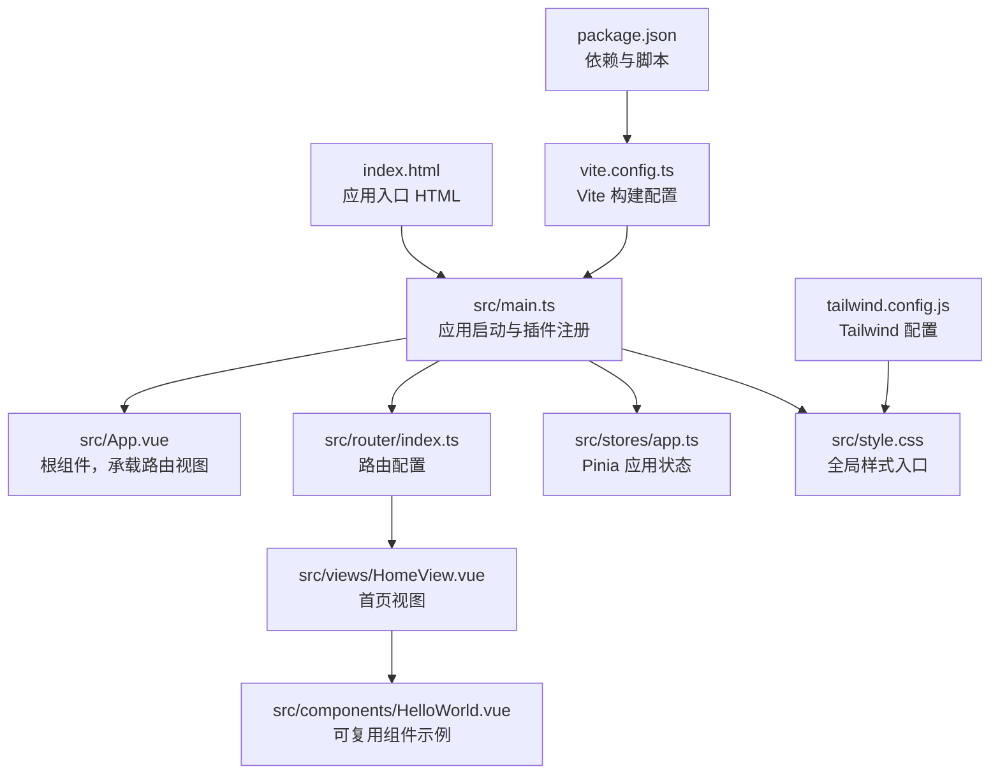
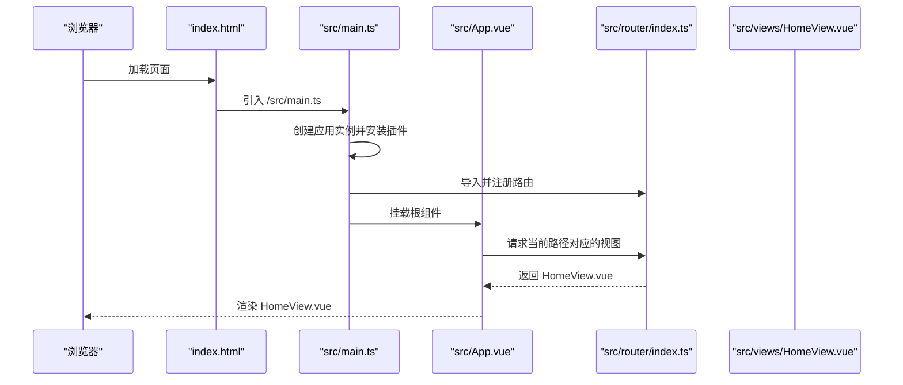
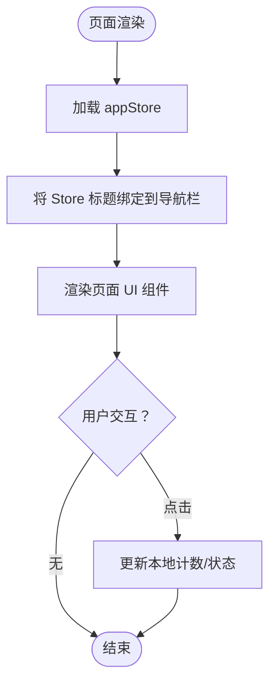
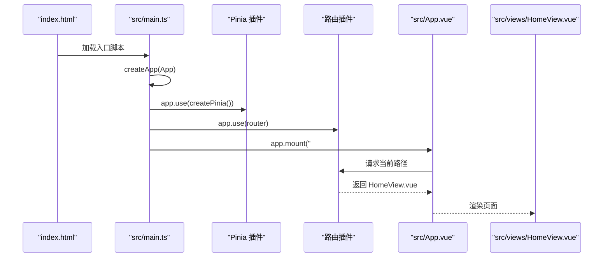

# 目录结构详解

<cite>
**本文引用的文件列表**
- [src/main.ts](file://src/main.ts)
- [src/App.vue](file://src/App.vue)
- [src/router/index.ts](file://src/router/index.ts)
- [src/stores/app.ts](file://src/stores/app.ts)
- [src/views/HomeView.vue](file://src/views/HomeView.vue)
- [src/components/HelloWorld.vue](file://src/components/HelloWorld.vue)
- [vite.config.ts](file://vite.config.ts)
- [package.json](file://package.json)
- [index.html](file://index.html)
- [src/style.css](file://src/style.css)
- [tailwind.config.js](file://tailwind.config.js)
- [README.md](file://README.md)
</cite>

## 目录结构总览

本项目采用典型的 Vue 3 + Vite + TypeScript 前端工程化组织方式，采用“按功能域分层”的目录结构：
- 根目录包含构建配置、工具链配置、入口 HTML 以及项目说明文档
- src/ 目录为核心源码区，按职责划分为：
  - components/：可复用 UI 组件
  - views/：页面级视图组件
  - router/：路由配置
  - stores/：状态管理（Pinia）
  - 入口文件 main.ts、根组件 App.vue、样式入口 style.css 等

下面以图示展示项目整体结构与关键文件之间的关系：

图表来源
- [index.html](file://index.html#L1-L14)
- [src/main.ts](file://src/main.ts#L1-L12)
- [src/App.vue](file://src/App.vue#L1-L6)
- [src/router/index.ts](file://src/router/index.ts#L1-L15)
- [src/stores/app.ts](file://src/stores/app.ts#L1-L11)
- [src/views/HomeView.vue](file://src/views/HomeView.vue#L1-L47)
- [src/components/HelloWorld.vue](file://src/components/HelloWorld.vue#L1-L42)
- [src/style.css](file://src/style.css#L1-L26)
- [vite.config.ts](file://vite.config.ts#L1-L19)
- [tailwind.config.js](file://tailwind.config.js#L1-L12)
- [package.json](file://package.json#L1-L32)

章节来源
- [index.html](file://index.html#L1-L14)
- [src/main.ts](file://src/main.ts#L1-L12)
- [src/App.vue](file://src/App.vue#L1-L6)
- [src/router/index.ts](file://src/router/index.ts#L1-L15)
- [src/stores/app.ts](file://src/stores/app.ts#L1-L11)
- [src/views/HomeView.vue](file://src/views/HomeView.vue#L1-L47)
- [src/components/HelloWorld.vue](file://src/components/HelloWorld.vue#L1-L42)
- [src/style.css](file://src/style.css#L1-L26)
- [vite.config.ts](file://vite.config.ts#L1-L19)
- [tailwind.config.js](file://tailwind.config.js#L1-L12)
- [package.json](file://package.json#L1-L32)

## 核心组件与职责

- src/main.ts：应用入口，负责创建 Vue 应用实例、安装 Pinia 和路由插件，并将应用挂载到 DOM
- src/App.vue：根组件，内部仅包含一个路由视图出口，用于承载所有页面级视图
- src/router/index.ts：定义路由表，当前包含一条根路径映射到首页视图
- src/stores/app.ts：使用 Pinia 定义应用级状态（示例中包含标题字段），供页面组件消费
- src/views/HomeView.vue：页面级视图，演示如何在页面中使用状态管理与 UI 组件
- src/components/HelloWorld.vue：通用可复用组件示例，展示基础交互与模板结构
- src/style.css：全局样式入口，引入 Tailwind 指令，提供基础排版与背景色
- vite.config.ts：构建配置，启用 Vue 插件与自动导入组件解析器，配置路径别名
- tailwind.config.js：Tailwind 内容扫描范围，确保按需生成样式
- package.json：声明依赖与脚本命令（开发、构建、预览）

章节来源
- [src/main.ts](file://src/main.ts#L1-L12)
- [src/App.vue](file://src/App.vue#L1-L6)
- [src/router/index.ts](file://src/router/index.ts#L1-L15)
- [src/stores/app.ts](file://src/stores/app.ts#L1-L11)
- [src/views/HomeView.vue](file://src/views/HomeView.vue#L1-L47)
- [src/components/HelloWorld.vue](file://src/components/HelloWorld.vue#L1-L42)
- [src/style.css](file://src/style.css#L1-L26)
- [vite.config.ts](file://vite.config.ts#L1-L19)
- [tailwind.config.js](file://tailwind.config.js#L1-L12)
- [package.json](file://package.json#L1-L32)

## 路由与页面组织

- 路由配置位于 src/router/index.ts，采用历史模式并懒加载页面组件，当前将根路径映射到 HomeView.vue
- 页面级视图存放在 src/views/，HomeView.vue 是当前唯一页面，作为应用主界面
- 根组件 App.vue 仅包含一个路由视图出口，所有页面切换通过路由完成

图表来源
- [index.html](file://index.html#L1-L14)
- [src/main.ts](file://src/main.ts#L1-L12)
- [src/App.vue](file://src/App.vue#L1-L6)
- [src/router/index.ts](file://src/router/index.ts#L1-L15)
- [src/views/HomeView.vue](file://src/views/HomeView.vue#L1-L47)

章节来源
- [src/router/index.ts](file://src/router/index.ts#L1-L15)
- [src/views/HomeView.vue](file://src/views/HomeView.vue#L1-L47)
- [src/App.vue](file://src/App.vue#L1-L6)

## 状态管理与组件分类

- 状态管理：src/stores/app.ts 使用 Pinia 定义应用级状态，示例中导出一个包含标题字段的 Store，页面组件通过 Store 实例读取状态
- 组件分类：
  - 可复用 UI 组件：src/components/HelloWorld.vue 展示基础交互与模板结构，适合跨页面复用
  - 页面级视图：src/views/HomeView.vue 承载业务页面内容，包含导航栏、单元格组、按钮与底部标签栏等
- 在页面中使用状态：HomeView.vue 引入并使用 appStore，将 Store 中的状态绑定到视图元素上

图表来源
- [src/stores/app.ts](file://src/stores/app.ts#L1-L11)
- [src/views/HomeView.vue](file://src/views/HomeView.vue#L1-L47)
- [src/components/HelloWorld.vue](file://src/components/HelloWorld.vue#L1-L42)

章节来源
- [src/stores/app.ts](file://src/stores/app.ts#L1-L11)
- [src/views/HomeView.vue](file://src/views/HomeView.vue#L1-L47)
- [src/components/HelloWorld.vue](file://src/components/HelloWorld.vue#L1-L42)

## 构建与开发环境

- 构建配置：vite.config.ts 启用 Vue 插件与自动导入组件解析器，配置路径别名为 @，便于统一导入
- 样式体系：src/style.css 引入 Tailwind 指令；tailwind.config.js 指定内容扫描范围，确保按需生成样式
- 依赖管理：package.json 声明运行时与开发时依赖，包括 Vue、Vue Router、Pinia、Vant、Tailwind CSS、Vite 等
- 开发脚本：package.json 提供 dev/build/preview 三类常用脚本，分别对应开发服务器、类型检查+构建、预览

章节来源
- [vite.config.ts](file://vite.config.ts#L1-L19)
- [src/style.css](file://src/style.css#L1-L26)
- [tailwind.config.js](file://tailwind.config.js#L1-L12)
- [package.json](file://package.json#L1-L32)

## 关键流程：应用启动与挂载

- 启动流程：
  - index.html 通过 script 标签引入 /src/main.ts
  - main.ts 创建应用实例，安装 Pinia 与路由插件，最后挂载到 #app
  - App.vue 作为根组件，内部仅包含 <router-view />，用于承载路由匹配到的页面
  - 路由根据路径懒加载 HomeView.vue，完成首屏渲染

图表来源
- [index.html](file://index.html#L1-L14)
- [src/main.ts](file://src/main.ts#L1-L12)
- [src/App.vue](file://src/App.vue#L1-L6)
- [src/router/index.ts](file://src/router/index.ts#L1-L15)
- [src/views/HomeView.vue](file://src/views/HomeView.vue#L1-L47)

章节来源
- [index.html](file://index.html#L1-L14)
- [src/main.ts](file://src/main.ts#L1-L12)
- [src/App.vue](file://src/App.vue#L1-L6)
- [src/router/index.ts](file://src/router/index.ts#L1-L15)
- [src/views/HomeView.vue](file://src/views/HomeView.vue#L1-L47)

## 文件组织与命名规范

- 目录职责清晰：
  - src/components/：存放可复用 UI 组件，如 HelloWorld.vue
  - src/views/：存放页面级视图，如 HomeView.vue
  - src/router/：集中管理路由配置
  - src/stores/：集中管理状态逻辑
- 文件命名与导入：
  - 路径别名 @ 指向 src/，便于在组件中统一导入 '@/stores/app'
  - 页面组件通过懒加载方式按需加载，减少首屏体积
- 样式与主题：
  - 全局样式通过 src/style.css 引入 Tailwind 指令
  - tailwind.config.js 指定内容扫描范围，避免未使用的样式被移除

章节来源
- [vite.config.ts](file://vite.config.ts#L1-L19)
- [src/style.css](file://src/style.css#L1-L26)
- [tailwind.config.js](file://tailwind.config.js#L1-L12)
- [src/components/HelloWorld.vue](file://src/components/HelloWorld.vue#L1-L42)
- [src/views/HomeView.vue](file://src/views/HomeView.vue#L1-L47)

## 总结

本项目遵循现代前端工程的最佳实践，采用清晰的目录划分与职责分离：
- 入口文件 main.ts 负责应用初始化与插件注册
- App.vue 作为路由出口容器，承载页面级视图
- 路由配置集中管理，页面组件按需加载
- 状态管理通过 Pinia 统一维护
- 构建与样式体系通过 Vite 与 Tailwind 协同工作

对于开发者而言，建议：
- 新增页面时，在 src/views/ 下新增对应组件，并在路由中注册
- 复用 UI 时优先放入 src/components/，保持组件单一职责
- 状态逻辑集中在 src/stores/，避免分散在页面中
- 使用 @ 别名进行导入，提升可读性与迁移便利性

章节来源
- [src/main.ts](file://src/main.ts#L1-L12)
- [src/App.vue](file://src/App.vue#L1-L6)
- [src/router/index.ts](file://src/router/index.ts#L1-L15)
- [src/stores/app.ts](file://src/stores/app.ts#L1-L11)
- [src/views/HomeView.vue](file://src/views/HomeView.vue#L1-L47)
- [src/components/HelloWorld.vue](file://src/components/HelloWorld.vue#L1-L42)
- [vite.config.ts](file://vite.config.ts#L1-L19)
- [src/style.css](file://src/style.css#L1-L26)
- [tailwind.config.js](file://tailwind.config.js#L1-L12)
- [package.json](file://package.json#L1-L32)
- [README.md](file://README.md#L1-L6)