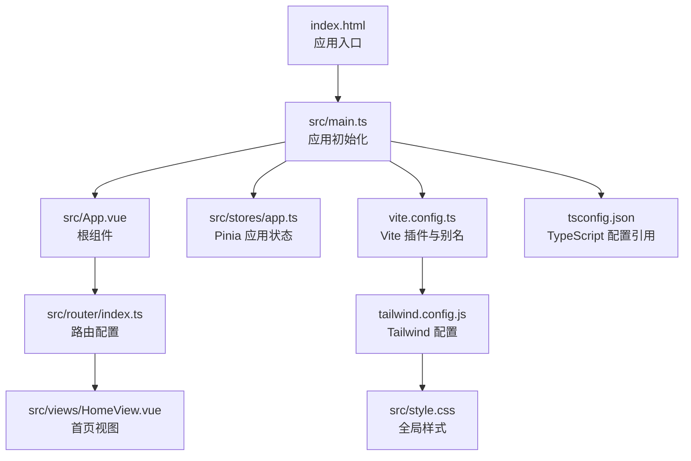
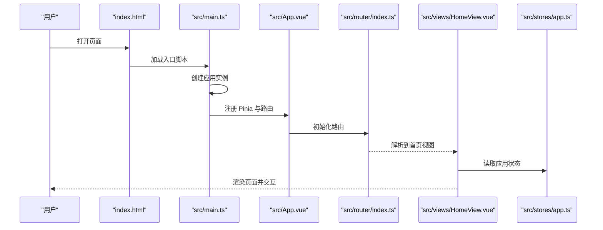
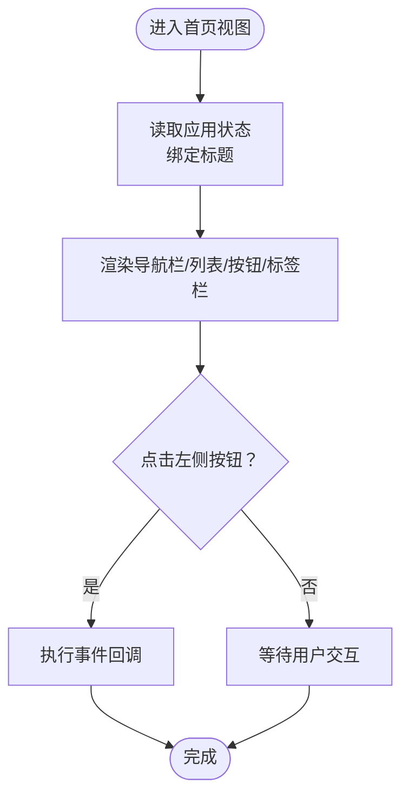
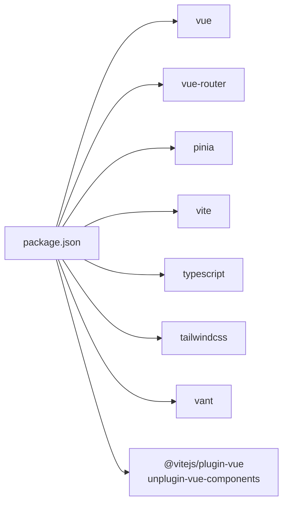

# 项目概述

<cite>
**本文引用的文件**
- [README.md](file://README.md)
- [package.json](file://package.json)
- [index.html](file://index.html)
- [src/main.ts](file://src/main.ts)
- [src/App.vue](file://src/App.vue)
- [src/router/index.ts](file://src/router/index.ts)
- [src/views/HomeView.vue](file://src/views/HomeView.vue)
- [src/stores/app.ts](file://src/stores/app.ts)
- [vite.config.ts](file://vite.config.ts)
- [tailwind.config.js](file://tailwind.config.js)
- [src/style.css](file://src/style.css)
- [tsconfig.json](file://tsconfig.json)
</cite>

## 目录
1. [引言](#引言)
2. [项目结构](#项目结构)
3. [核心组件](#核心组件)
4. [架构总览](#架构总览)
5. [详细组件分析](#详细组件分析)
6. [依赖关系分析](#依赖关系分析)
7. [性能与开发体验](#性能与开发体验)
8. [故障排查指南](#故障排查指南)
9. [结论](#结论)
10. [附录](#附录)

## 引言
ainote-web 是一个以 Vue 3 + TypeScript + Vite 为核心的现代化前端单页应用（SPA），旨在为“智能化笔记应用”提供可扩展的前端界面骨架。项目采用 MVVM 架构范式，围绕组件化设计、集中式状态管理（Pinia）与路由驱动视图展开，具备移动端优先的响应式布局能力，并通过 Vant 4 组件库与 Tailwind CSS 提供一致且高效的 UI 开发体验。项目当前处于快速起步阶段，已搭建基础工程化环境与最小可用视图，便于后续接入 AI 服务能力与后端 API。

本项目在开发者工作流中扮演“前端基础设施”的角色：提供统一的脚手架、工具链与约定，降低新功能接入成本；同时为后续集成 AI 服务、云存储、多端同步等能力预留扩展点。

## 项目结构
项目采用“功能分层 + 路由驱动”的组织方式：
- 入口与根组件：入口脚本负责挂载应用、注册插件与全局依赖；根组件通过路由视图承载页面切换。
- 视图层：按路由划分视图组件，当前包含首页视图。
- 状态层：集中式状态管理，当前包含应用标题等基础状态。
- 路由层：基于 vue-router 的历史模式路由，支持懒加载视图组件。
- 工程配置：Vite 插件体系、Tailwind CSS 配置、TypeScript 多配置引用等。

图表来源
- [index.html](file://index.html#L1-L14)
- [src/main.ts](file://src/main.ts#L1-L12)
- [src/App.vue](file://src/App.vue#L1-L6)
- [src/router/index.ts](file://src/router/index.ts#L1-L15)
- [src/views/HomeView.vue](file://src/views/HomeView.vue#L1-L47)
- [src/stores/app.ts](file://src/stores/app.ts#L1-L11)
- [vite.config.ts](file://vite.config.ts#L1-L19)
- [tailwind.config.js](file://tailwind.config.js#L1-L12)
- [src/style.css](file://src/style.css#L1-L26)
- [tsconfig.json](file://tsconfig.json#L1-L8)

章节来源
- [index.html](file://index.html#L1-L14)
- [src/main.ts](file://src/main.ts#L1-L12)
- [src/App.vue](file://src/App.vue#L1-L6)
- [src/router/index.ts](file://src/router/index.ts#L1-L15)
- [src/views/HomeView.vue](file://src/views/HomeView.vue#L1-L47)
- [src/stores/app.ts](file://src/stores/app.ts#L1-L11)
- [vite.config.ts](file://vite.config.ts#L1-L19)
- [tailwind.config.js](file://tailwind.config.js#L1-L12)
- [src/style.css](file://src/style.css#L1-L26)
- [tsconfig.json](file://tsconfig.json#L1-L8)

## 核心组件
- 应用入口与初始化
  - 在入口脚本中创建应用实例，注册 Pinia 与路由，并挂载到 DOM。该流程体现了“应用装配”的集中化管理，便于后续扩展插件或中间件。
- 根组件与路由视图
  - 根组件通过路由视图承载页面切换，形成“路由驱动视图”的 MVVM 结构。
- 首页视图
  - 使用 Vant 4 组件实现导航栏、单元格列表、按钮与底部标签栏，体现移动端优先的设计理念；通过 Pinia 状态绑定标题，展示状态集中管理的使用方式。
- 状态管理
  - 使用 Pinia 定义应用级状态（如标题），并通过组合式 Store API 暴露给视图使用，简化跨组件共享数据的复杂度。
- 路由配置
  - 基于 vue-router 的历史模式与动态导入，实现首页路由与懒加载视图组件，提升首屏性能与开发体验。

章节来源
- [src/main.ts](file://src/main.ts#L1-L12)
- [src/App.vue](file://src/App.vue#L1-L6)
- [src/views/HomeView.vue](file://src/views/HomeView.vue#L1-L47)
- [src/stores/app.ts](file://src/stores/app.ts#L1-L11)
- [src/router/index.ts](file://src/router/index.ts#L1-L15)

## 架构总览
项目采用 MVVM 架构范式：
- Model：Pinia Store（应用状态模型）
- View：Vue 组件（视图模板）
- ViewModel：组件逻辑与状态绑定（通过组合式 API 与 Store）

整体控制流从入口脚本开始，依次完成应用装配、插件注册、路由与状态注入，最终渲染到根组件，再由路由驱动具体视图组件。

图表来源
- [index.html](file://index.html#L1-L14)
- [src/main.ts](file://src/main.ts#L1-L12)
- [src/App.vue](file://src/App.vue#L1-L6)
- [src/router/index.ts](file://src/router/index.ts#L1-L15)
- [src/views/HomeView.vue](file://src/views/HomeView.vue#L1-L47)
- [src/stores/app.ts](file://src/stores/app.ts#L1-L11)

## 详细组件分析

### 应用入口与初始化（src/main.ts）
- 职责
  - 创建 Vue 应用实例，注册 Pinia 与路由，挂载到 DOM。
- 设计要点
  - 将应用装配集中在入口文件，便于后续扩展插件、中间件或全局配置。
- 可扩展性
  - 可在此处引入更多插件（如国际化、错误处理、监控等）。

章节来源
- [src/main.ts](file://src/main.ts#L1-L12)

### 根组件（src/App.vue）
- 职责
  - 作为路由视图的容器，承载页面切换。
- 设计要点
  - 通过路由视图指令实现视图与路由的解耦，符合 MVVM 的视图驱动理念。

章节来源
- [src/App.vue](file://src/App.vue#L1-L6)

### 首页视图（src/views/HomeView.vue）
- 职责
  - 展示应用标题、基础信息与操作入口，提供移动端交互元素（导航栏、底部标签栏等）。
- 设计要点
  - 使用 Vant 4 组件库与 Tailwind CSS 实现移动端优先的响应式布局。
  - 通过 Pinia Store 绑定标题，演示状态集中管理在视图中的使用。
- 交互流程
  - 用户点击左侧按钮时触发事件回调，便于后续接入导航或业务逻辑。

图表来源
- [src/views/HomeView.vue](file://src/views/HomeView.vue#L1-L47)
- [src/stores/app.ts](file://src/stores/app.ts#L1-L11)

章节来源
- [src/views/HomeView.vue](file://src/views/HomeView.vue#L1-L47)

### 状态管理（src/stores/app.ts）
- 职责
  - 定义应用级状态（如标题），并通过组合式 Store API 暴露给视图使用。
- 设计要点
  - 使用 Pinia 的定义式 Store，简化状态声明与导出，便于跨组件共享。

章节来源
- [src/stores/app.ts](file://src/stores/app.ts#L1-L11)

### 路由配置（src/router/index.ts）
- 职责
  - 配置首页路由与懒加载视图组件，支持历史模式路由。
- 设计要点
  - 动态导入视图组件，减少首屏包体，提升加载性能。
  - 基于路径与名称的路由映射，便于后续扩展更多页面。

章节来源
- [src/router/index.ts](file://src/router/index.ts#L1-L15)

### 工程配置与工具链
- Vite 配置（vite.config.ts）
  - 启用 Vue 插件与自动组件解析（Vant Resolver），配置路径别名，提升开发效率。
- Tailwind CSS 配置（tailwind.config.js）
  - 指定扫描范围，确保样式按需生成，适配 Vue 单文件组件。
- 全局样式（src/style.css）
  - 引入 Tailwind 基础、组件与工具类，设置根字体与最小尺寸约束，保障移动端体验。
- TypeScript 配置（tsconfig.json）
  - 通过引用多个 tsconfig 文件，分离应用与 Node 工具链配置，便于维护。

章节来源
- [vite.config.ts](file://vite.config.ts#L1-L19)
- [tailwind.config.js](file://tailwind.config.js#L1-L12)
- [src/style.css](file://src/style.css#L1-L26)
- [tsconfig.json](file://tsconfig.json#L1-L8)

## 依赖关系分析
- 运行时依赖
  - Vue 3：框架核心，提供响应式与组件系统。
  - vue-router：路由驱动视图切换。
  - pinia：集中式状态管理。
- 开发时依赖
  - vite：构建与开发服务器。
  - @vitejs/plugin-vue：Vue SFC 支持。
  - vant：移动端组件库。
  - unplugin-vue-components：自动导入组件与解析器。
  - tailwindcss：原子化 CSS 框架。
  - typescript：类型系统与编译。
  - vue-tsc：类型检查与构建。

图表来源
- [package.json](file://package.json#L1-L32)

章节来源
- [package.json](file://package.json#L1-L32)

## 性能与开发体验
- 首屏优化
  - 路由懒加载与按需样式生成，有助于减小首屏体积。
- 开发效率
  - Vite 提供快速热更新与模块联邦能力；自动组件解析减少手动导入成本。
- 移动端体验
  - Tailwind CSS 与 Vant 4 组合，提供移动端优先的 UI 原子化与组件化能力。
- 类型安全
  - TypeScript 与 vue-tsc 的配合，提升开发过程中的类型安全保障。

[本节为通用指导，不直接分析具体文件，故无章节来源]

## 故障排查指南
- 页面空白或未渲染
  - 检查入口脚本是否正确挂载应用，确认 DOM 容器存在。
  - 章节来源
    - [index.html](file://index.html#L1-L14)
    - [src/main.ts](file://src/main.ts#L1-L12)
- 路由无法跳转或空白页
  - 检查路由配置与视图组件路径是否正确，确认动态导入是否生效。
  - 章节来源
    - [src/router/index.ts](file://src/router/index.ts#L1-L15)
- 样式未生效
  - 确认 Tailwind 配置的扫描范围包含目标文件，检查全局样式是否正确引入。
  - 章节来源
    - [tailwind.config.js](file://tailwind.config.js#L1-L12)
    - [src/style.css](file://src/style.css#L1-L26)
- 组件未自动导入
  - 检查 Vite 插件与解析器配置，确认路径别名与解析规则。
  - 章节来源
    - [vite.config.ts](file://vite.config.ts#L1-L19)

## 结论
ainote-web 以 Vue 3 + TypeScript + Vite 为基础，构建了面向“智能化笔记应用”的前端骨架。项目遵循 MVVM 架构，强调组件化、集中式状态管理与路由驱动视图，具备良好的可扩展性与移动端优先的响应式体验。当前版本已完成工程化搭建与最小可用视图，为后续接入 AI 服务能力、后端 API 与多端同步提供了清晰的扩展路径。对于初学者，项目提供了简洁的入门路径；对于高级用户，项目结构与工具链为深入定制与优化奠定了坚实基础。

[本节为总结性内容，不直接分析具体文件，故无章节来源]

## 附录
- 项目用途
  - 作为智能化笔记应用的前端界面原型与基础设施，支撑后续功能迭代与系统集成。
- 技术选型理由
  - Vue 3 提供现代化响应式与组合式 API；TypeScript 增强类型安全；Vite 提升开发与构建效率；Pinia 简化状态管理；Vant 4 与 Tailwind CSS 提供移动端优先的 UI 能力。
- 在开发者工作流中的角色
  - 作为前端工程化的起点，提供统一的脚手架、工具链与约定，降低新功能接入成本，并为后续系统集成预留扩展点。

[本节为概念性内容，不直接分析具体文件，故无章节来源]